# Behaverse Studyflow Modeler

[Studyflow](https://behaverse.org/projects/studyflows) is a coordination notation for experiments: a process standard for the cognitive sciences and adjacent fields, in the same role that BPMN 2.0 (Business Process Model and Notation, ISO/IEC 19510) plays for business processes.

Your tools compute — Python, a Unity scene, an LLM call, jsPsych, PsychoPy — and the studyflow diagram coordinates them, so one file is at once the protocol, the runnable experiment, the analysis specification, and the publication figure: each a projection of the same file, with no second copy to drift.

This repository holds the schemas that define the notation and the four programs that read it.



| Where | What it is |
| --- | --- |
| [`packages/modeler/`](packages/modeler/) | **the modeler** — the visual editor, served at `/app.html` |
| [`packages/runner/`](packages/runner/) | **the browser runner** — runs a studyflow with a participant, served at `/run/` |
| [`packages/runner-py/`](packages/runner-py/) | **the Python runner** — `studyflow_run.py`, which runs the analysis half |
| [`packages/cli/`](packages/cli/) | **the CLI** — the `studyflow` binary: `convert`, `validate`, `info`, `run`, `render` |
| [`packages/core/`](packages/core/) | the shared document model all four import — no React, no bpmn-js |
| [`assets/schemas/`](assets/schemas/) | the `*.moddle.yaml` schemas: what a studyflow can contain |
| [`assets/examples/`](assets/examples/) | the shipped example diagrams, plus `new_diagram.bpmn`, the blank template |
| [`docs/`](docs/) | the Quarto documentation site |

The canonical text form of a studyflow is `.studyflow.yaml`. Each shipped example is a `.studyflow.png` instead — an image carrying its own source in a PNG metadata chunk ([`core/document/png.ts`](packages/core/src/document/png.ts)), so the figure and the diagram are one file.

## Install

The CLI ships as a standalone binary — no Node.js, no npm, nothing to install alongside it:

```bash
brew tap morteza/studyflow https://github.com/morteza/studyflow-modeler
brew install studyflow
```

To work on the repository itself you need Node.js **≥ 20.19**:

```bash
npm install
npm run dev          # the modeler on :5173, proxying /run to the browser runner on :5174
```

## Tests

Playwright runs everything — the Node-side unit specs (`*.unit.spec.ts`) and the browser e2e suite. The first e2e run needs `npx playwright install chromium`.

```bash
npm test             # unit + e2e
npm run test:unit    # the fast lane: no dev server, ~1s
npm run lint         # ESLint, the architecture boundaries included
npm run lint:schemas # the guards over assets/schemas/*.moddle.yaml
npm run lint:docs    # the guard over docs/
```

## Documentation

```bash
npm run docs         # quarto preview with live reload
npm run docs:build   # render to dist/docs/
```

Published at <https://behaverse.org/studyflow-modeler/docs/>.

## Architecture, in short

**One folder per feature.** To change the palette you open `packages/modeler/src/palette/`, and everything the palette is — its data, its React, its bpmn-js wiring, its commands — is in there. There is no `models/`, `views/`, or `controllers/` split to navigate. Four file names recur inside a feature: `commands.ts` (its bus handlers), `module.ts` (its bpmn-js registration), `PascalCase.tsx` (one React view or one bpmn-js class), and everything else named for what it does.

Two boundaries are enforced by ESLint (`eslint.config.js`):

| Boundary | What is banned |
| --- | --- |
| `packages/core/src/**` is framework-free | `react`, `react-dom`, `bpmn-js`, `diagram-js`, both app aliases — and bpmn-js service *names* (`modeling`, `elementRegistry`, `commandStack`, `eventBus`, …), even arriving as `any` |
| the modeler and the browser runner never import each other | `@runner/*` under `packages/modeler/src/**`, `@modeler/*` under `packages/runner/src/**` |

Shared code therefore has exactly one place to go. Two further conventions cross every feature: **the edge of the canvas is the pixel split** — React outside it, bpmn-js inside — and **views dispatch commands by name**, a command's `type` being its handler's name. Each package's README is the contract for the rest; [CONTRIBUTING.md](CONTRIBUTING.md) has the test lanes and the guards.

## Contributing

[CONTRIBUTING.md](CONTRIBUTING.md) has the setup, the test strategy, and the schema-authoring loop. Adding element types or attributes is a schema edit, not a code edit: [assets/schemas/README.md](assets/schemas/README.md) is the vocabulary reference.

## License

MIT
