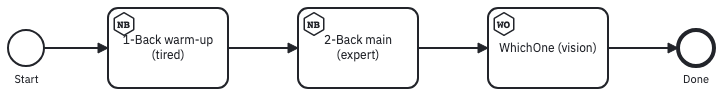
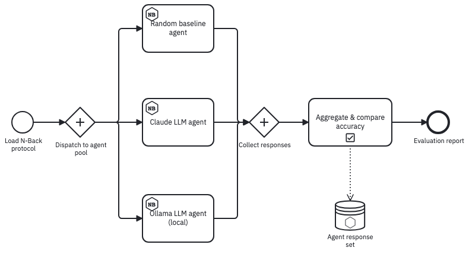
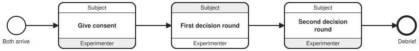

{#fig-bot-study fig-alt="A left-to-right studyflow. A start event named Start leads to 1-Back warm-up (tired), then 2-Back main (expert), then WhichOne (vision), then an end event named Done. The first two tasks carry an NB badge and the third a WO badge."}

Set a Behaverse task's `agentType` to `bot` and a language model plays it. Same instrument, same trials, same recorded data; different respondent.

## Pick who answers

`ResponseSource` in `botConfigurations` decides who answers.

| `ResponseSource` | Who answers | What you learn from it |
|---|---|---|
| `internal` | the task's own built-in bot | that the task runs |
| `external` | a uniform random choice among the response options | a chance-level baseline, and that the flow is wired correctly |
| `llm` | a language model, one trial at a time | how a model performs on the instrument |

: The three response sources. {#tbl-sources}

## Write the persona

`botConfigurations` is YAML on the task:

```yaml
ResponseSource: llm
LLM:
  Provider: claude
  Model: claude-haiku-4-5
Prompt: |
  You are a tired participant near the end of a long 1-back session.
  Aim for about 80% accuracy. Occasionally miss matches when your
  attention drifts. Never explain; reply with exactly Match or NonMatch.
Speed: 20
SkipInstructions: true
```

| Key | What it changes |
|---|---|
| `Prompt` | the persona, in your words. Name the answer format explicitly ("reply with exactly Match or NonMatch") |
| `IncludeScreenshot` | attaches a picture of the screen, for a task whose answer is in the picture rather than the text; pair it with a model that can see |
| `Speed` | how fast the bot plays |
| `SkipInstructions` | skips the instruction screens |
| `MaxResponseTime` | raise it: a request to a model takes far longer than a key press |

: The keys that shape the response. {#tbl-keys}

Each request carries the persona, the task's name and configuration, **every previous trial in this task**, the current stimulus, and the allowed response options. History is kept per task, not per study: a bot moving from a 1-back to a 2-back block starts the second with no memory of the first.

When a reply is an explanation, a refusal, or a timeout, the runner salvages an option the reply mentions or picks one at random, and logs what it did.

::: {.callout-warning appearance="simple"}
## Check the tags before you analyse
Only trials whose reply was exactly one of the options are tagged with the provider and model; every other trial is tagged just `bot`. A run against an unreachable provider produces a complete, plausible-looking dataset that is at chance, so the tags are what tell the two apart.
:::

## Several responders, one protocol

{#fig-pool fig-alt="A left-to-right diagram. A thin start circle labelled Load N-Back protocol leads to a diamond marked with a plus, labelled Dispatch to agent pool. Its three branches reach rounded boxes, each carrying a small hexagonal NB badge: Random baseline agent, Claude LLM agent, and Ollama LLM agent (local). All three rejoin a second plus-marked diamond labelled Collect responses, which leads to a box named Aggregate and compare accuracy carrying a checklist badge. A dotted arrow drops from it into a cylinder labelled Agent response set, and the flow ends at a heavy circle labelled Evaluation report."}

Comparing two responders is only a comparison if both met the same protocol. Describe it twice and you have two protocols — any drift shows up in the results as if it were a real effect. Drawing the arms as branches of one diagram makes the protocol shared by construction.

| What has to hold | Where @fig-pool puts it |
|:--|:--|
| The same stimuli, in the same order | One block definition, `Eval_2Back`, with a fixed sequence of twelve |
| The same task and trial count | The same assessment on all three boxes, `StreamSize: 12` |
| Differences stated in the open | `MaxResponseTime` per arm — 2 s, 30 s, 15 s — because a window a model cannot meet is a confound |
| A floor to compare against | The random baseline arm, which costs one box and fixes what every other number is read against |

All three boxes are the same element with the same block definition. Who answers is one attribute on the box, not a different kind of step: set `agentType` to `bot` and add `botConfigurations`, or leave it at its default and the identical box is administered to a person.

| Your study | Model it as |
|:--|:--|
| One participant working alone through a sequence | An ordinary flow of tasks |
| Several parties meeting the same protocol independently | One branch each off a fan-out, as in @fig-pool |
| Two parties whose turns depend on each other | Interactions, as in @fig-dyad — for when *who initiates* is part of the design |
| A fourth responder | One more branch off the fan-out, carrying the same block definition |
| Parties that need their own lanes | An `Actor` pool per party, with `actorType` saying what it stands for |

Run each arm as its own study and aggregate afterwards; the diagram states the protocol that makes the arms comparable.

## When who initiates matters

{#fig-dyad fig-alt="A left-to-right diagram. A thin circle labelled Both arrive leads into three boxes, each split into three stripes: a Subject band on top, the task name in the middle, and an Experimenter band below. In Give consent the Subject band is white and the Experimenter band grey; in First decision round the Subject band is grey and the Experimenter band white; in Second decision round the Subject band is white again. An arrow leaves the last box." .fig-l}

Take **Choreography Task** from the palette under *Activities* and name the parties on the inspector's **General** tab; *Initiating participant* sits beside them, and belongs on the exchange rather than the study. A study of nothing but exchanges saves as a `bpmn:Choreography`, which any BPMN 2.0 tool recognizes.

## Choose a provider

*Settings* holds the defaults: provider, model, and the local server's address. A task's `botConfigurations` overrides those for that task alone, which is how one study puts two models through the same instrument.

| Provider | Where it runs | What it needs |
|---|---|---|
| Claude | the local development server only | The development server relays the request to the Claude command-line tool on your machine. **Use Claude bots on a local server only** — on the hosted site a Claude bot answers at random. |
| Ollama | anywhere the browser can reach the server | A model server running and reachable at the address in *Settings*, with the model already pulled. Nothing leaves your machine. |

: Which provider runs where; both run on your own machine. {#tbl-providers}

| Example | What it demonstrates | Model it pins |
|---|---|---|
| `bot_claude.studyflow.png` | two personas, plus a vision task via `IncludeScreenshot` | `claude-haiku-4-5` |
| `bot_ollama.studyflow.png` | the same pattern against a local model server | `gemma4:e2b-mlx` |
| `bot_external.studyflow.png` | uniform random responses — the chance baseline | none |

: Three ready-to-run studies in the modeler's *Examples* menu. {#tbl-examples}

Open `bot_external.studyflow.png` first: it needs no provider, so it tells you whether the study is wired correctly before any model is involved.
