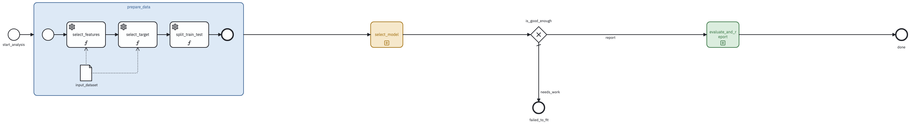

{#fig-sklearn fig-alt="A studyflow. A start event enters an expanded sub-process named prepare_data holding select_features, select_target and split_train_test in sequence, the first two reading a data object named input_dataset. The flow continues to a collapsed sub-process select_model, then to an exclusive gateway named is_good_enough. Its flow labelled report leads to a collapsed sub-process evaluate_and_report and an end event named done; its flow labelled needs_work leads to an end event named failed_to_fit."}

An analysis plan binds only if three things are settled before the first row of data arrives: the exclusions, the derived measures, and the order of the steps. @fig-sklearn settles all three on the canvas — split first, model second, read the held-out quarter only once a stated threshold is cleared.

| What a plan has to fix | The question a reviewer asks | What carries it |
|:--|:--|:--|
| Exclusions | Which observations never reached the model, and at what point? | A step drawn upstream of everything it protects |
| Derived measures | Which quantity came from which, through what function? | A step naming its function, with one arrow per input |
| Order | What was not allowed to see what, and when? | The sequence, and the stage boundaries around it |
| The decision to look | What made you read the held-out sample? | A condition on the arrow that leads there |
| The other outcome | What happens when the answer is no? | An end the run reaches cleanly |

This covers four of the eleven relations a design has to state: [order](relations.qmd#order), [choice](relations.qmd#choice), [repetition](relations.qmd#repetition), and [data dependency](relations.qmd#data).

## What the drawing fixes

*Prepare data* pulls out the feature matrix and the label vector, then holds back a quarter of the rows, stratified. The sub-process boundary is the claim that nothing downstream of it helped choose the model, checkable by looking at where the box ends.

The *report* arrow carries `mean_cv_accuracy >= 0.90`; *needs work* is the gateway's default, so a run that misses the threshold ends at *failed to fit* with the held-out quarter unread. `mean_cv_accuracy` is a value the study itself declares, written by the summarizing step through a second output arrow — so the threshold is stated exactly once, where a reviewer will read it.

A model is never fitted just once, and the second run counts as progress only if it is judged by the same rule as the first. Drawing that rule is what makes the comparison hold.

| What has to survive between runs | Where a runbook keeps it | Where @fig-sklearn keeps it |
|:--|:--|:--|
| The promotion bar | A number in someone's head or a wiki | The condition on the *report* arrow |
| The quantity it is applied to | Whatever column you looked at | A value the study declares, written by a named step |
| The partition | Whatever the seed was that day | The study's `seed`, reaching the split |
| The decision to reject | An abandoned notebook | An end event the run reaches cleanly |
| What was actually run | A commit message, if you are lucky | The record on the archived copy |

## Modeling your own analysis

| What you want to change | Where you change it |
|:--|:--|
| Your own data | The input element's address --- `digits.csv` here, an ordinary CSV table |
| The bar for promotion | The condition on the *report* arrow; leave the other arrow as the default |
| An exclusion | A `Filter` drawn upstream of everything it protects --- before the split is a different study from after it |
| A derived measure | A step naming its software as `<scheme>://<ref>` --- the schemes are in [Data in and out](data.qmd) --- with one dashed arrow per named argument slot |
| Anything the call needs beyond the arrows | Literal YAML on the step (`test_size: 0.25`); supply a name twice and the run stops rather than choosing |
| Which draws reproduce | The study's `seed`, pinned at 42 and reaching the split |
| Whether a result is kept | Give that value an address; without one it only passes in memory |
| The format a result is written in | The extension of that address --- `.csv`, `.png`, `.joblib` |
| Where the analysis runs | The study's `runtime`: `browser`, `cloud`, `local`, or `hpc`. `studyflow run` wires only `local`, and says so |
| What a reader sees on the canvas | Draw the artifacts worth looking at --- here the input table and the five output files; the eleven values that only pass between steps are declared in the file instead |
| What the record of a run holds | Each run gets its own directory with a stamped copy of the study archived inside it; per-step detail needs `git` on the machine, and [Views and the record](../run/provenance.qmd) says what survives without it |

## When improvement is part of the run

Some pipelines retry until a score clears a bar. Drawn, the exit rule and the budget are visible rather than buried in a retry setting.

{#fig-agent-eval fig-alt="A BPMN diagram. A start event named Start eval leads to a collapsed sub-process named Eval-optimize round, then to an exclusive gateway named Good enough? whose good enough branch reaches an end event named Eval complete and whose refit branch loops back to the sub-process. Below, unconnected on this plane, sit four data objects -- Agent instructions, Per-item scores, Mean judge score, Scoring rubric -- and a data store named Eval set."}

Copy the exit rule and the budget rather than the round count. Both live in one condition on the back-edge, evaluated against the run's own history, so "three rounds" is a fact you read off the diagram. The exit is the gateway's default, so a spent budget ends the run cleanly rather than looping forever.

## Running it

@fig-sklearn says `local`, so the CLI hands the picture — source and all — to the Python runner:

```bash
studyflow run sklearn_pipeline.studyflow.png
```

Each step that names a Python callable is imported and called like any other ([Execution](../run/execution.qmd#what-each-program-actually-runs)).
