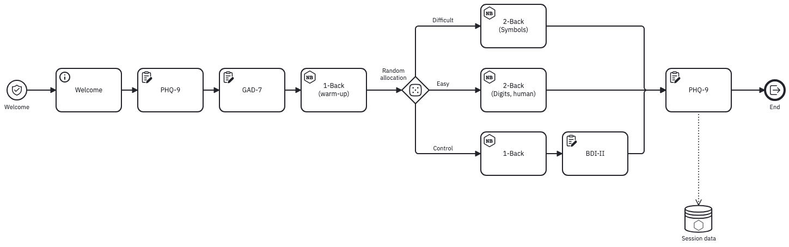

{#fig-hero fig-alt="A left-to-right diagram. A start circle marked with a shield, labelled Welcome, leads through an instruction step, two questionnaire steps named PHQ-9 and GAD-7, and a task named 1-Back (warm-up) to a diamond marked with dice labelled Random allocation. Its three branches -- Difficult, Easy, Control -- run 2-Back (Symbols), 2-Back (Digits, human), and a 1-Back followed by BDI-II. All three rejoin a final PHQ-9 before the end event, and a dotted arrow drops from it into a cylinder labelled Session data."}

Every `.studyflow.png` below carries its own source inside the image, so each picture **is** the study — ready to read, run, or adapt.

Two ways to open one: choose *Examples...* from the File group of the command palette, or download a PNG and reopen it with *File &rarr; Open File...*. The canonical text form of any of them is [`.studyflow.yaml`](../reference/file-format.qmd).

## Running a study with people

| Example | What it shows | Read more |
|:--|:--|:--|
| [EPSYLON LabLink - Study orchestration](../assets/img/examples/lablink_demo1.studyflow.png)  `lablink_demo1` | A full session: consent, questionnaires, a warm-up, random allocation across three N-back arms, and one dataset at the end (@fig-hero). | — |
| [EPSYLON LabLink - Build a study from scratch](../assets/img/examples/lablink_demo0.studyflow.png)  `lablink_demo0` | A start event, an end event, and the flow between them --- the blank page a session is built on. | — |
| [Within-subject cognitive battery](../assets/img/examples/cognitive_battery.studyflow.png)  `cognitive_battery` | N-Back, Digit Span, SART, and Which One chained with a timed break and a NASA-TLX survey, from a consented start to one dataset. | [Trials and protocols](protocols.qmd), [Cognitive tasks](tasks.qmd) |
| [CONSORT 2025](../assets/img/examples/consort2025.studyflow.png)  `consort2025` | A participant flow from enrollment to analysis in four bands, with every exclusion drawn as an exit on the step it leaves, carrying its reason. | [Trials and protocols](protocols.qmd), [Keep, share, and publish](../run/share.qmd) |
| [SPIRIT 2025 trial protocol](../assets/img/examples/spirit2025.studyflow.png)  `spirit2025` | A trial protocol in lanes from enrolment to close-out, carrying per-visit SPIRIT checklist items inside the file. | [Reporting checklists](protocols.qmd#reporting-checklists), [Keep, share, and publish](../run/share.qmd) |
| [Dyadic decision study](../assets/img/examples/choreography_demo.studyflow.png)  `choreography_demo` | Participant and experimenter exchange consent and two decision rounds, drawn as an exchange between two people rather than as one person's flow. | [Models as participants](agents.qmd#several-responders-one-protocol) |

## Evaluating models

| Example | What it shows | Read more |
|:--|:--|:--|
| [Agent evaluation harness](../assets/img/examples/agent_eval.studyflow.png)  `agent_eval` | A fixed fan-out, guard, judge, and collect round around an agent whose own step order is decided at run time, with a `refit` back-edge that reworks the prompt until the mean judge score clears the bar. | [Analysis pipelines](analysis.qmd) |
| [LLM evaluation --- agent actor pool](../assets/img/examples/agent_eval_pool.studyflow.png)  `agent_eval_pool` | One 2-back protocol run on random, Claude, and Ollama agents in parallel, then compared on accuracy. | [Models as participants](agents.qmd#several-responders-one-protocol) |
| [LLM bot (Claude Code)](../assets/img/examples/bot_claude.studyflow.png)  `bot_claude` | A Claude-driven participant plays a tired 1-back warm-up, an expert 2-back block, and a vision-based Which One task. | [Models as participants](agents.qmd) |
| [LLM bot (Ollama)](../assets/img/examples/bot_ollama.studyflow.png)  `bot_ollama` | The same personas against a local Ollama server instead of a hosted model. | [Models as participants](agents.qmd) |
| [Random bot](../assets/img/examples/bot_external.studyflow.png)  `bot_external` | A 1-back warm-up and a 2-back block answered by an externally driven random-response bot --- no model involved. | [Models as participants](agents.qmd) |

## Analysis pipelines

| Example | What it shows | Read more |
|:--|:--|:--|
| [EPSYLON LabLink - Modeling pipeline](../assets/img/examples/lablink_demo2.studyflow.png)  `lablink_demo2` | Reads a BIDS dataset, preprocesses fMRI and EEG on parallel branches, fits a model, and renders manuscript outputs. | [Analysis pipelines](analysis.qmd), [Data in and out](data.qmd) |
| [sklearn_pipeline](../assets/img/examples/sklearn_pipeline.studyflow.png)  `sklearn_pipeline` | A scikit-learn classification workflow drawn split-first, report-last, where every step names the Python callable it runs and a gateway decides whether the held-out quarter is ever read. | [Analysis pipelines](analysis.qmd) |

## Learning the notation itself

| Example | What it shows | Read more |
|:--|:--|:--|
| [Studyflow element catalog (kitchen sink)](../assets/img/examples/kitchensink.studyflow.png)  `kitchensink` | One live instance of every element the palette offers, in a labelled band per schema. | [The element catalog](#the-element-catalog), [Elements](../reference/elements.qmd) |
| [Function calls demo](../assets/img/examples/function_call_demo.studyflow.png)  `function_call_demo` | The two ways a step names the software that runs it: a `functional:Map` bound to a Python callable, and a script fetched by URL. | — |
| [drawn loop (eight turns, edges only)](../assets/img/examples/drawn_loop.studyflow.png)  `drawn_loop` | The smallest repeat the notation can draw, bounded by the run's own history: `state.trace.count('Gate') < 8` takes the back-edge seven times, so the one step runs eight and the default edge exits. | [Execution](../run/execution.qmd) |

## The element catalog

{#fig-kitchensink fig-alt="A tall diagram of dashed labelled bands, one per schema, read top to bottom: BPMN events, BPMN gateways, BPMN activities, BPMN data and artifacts, studyflow core data elements, exec execution and scope, cognitive domain activities and research gateways, eeg biosignals, agentic LLM and agent workflows, and functional function composition beside a smaller band of data IO presets. Each band holds one instance of every element it contributes, each drawn with its own shape and icon and labelled underneath."}

Read @fig-kitchensink from top to bottom and the bands are the layers of the notation: the BPMN 2.0 base Studyflow inherits, then the core and domain extensions that specialize it.

Every Studyflow element is a standard BPMN element with study settings attached. The BPMN element gives it its shape and its behaviour in the flow; the settings give it its meaning in the study.

| Band | What it draws |
|:--|:--|
| BPMN · Events | Start, End, Intermediate throw, Intermediate catch, Boundary |
| BPMN · Gateways | Exclusive, Parallel, Inclusive, Event-based, Complex |
| BPMN · Activities | Task, User task, Service task, Script task, Manual task, Send task, Receive task, Business rule task, Call activity, Sub-process, Transaction, Ad-hoc sub-process |
| BPMN · Data & artifacts | Data object, Data store, a free-form note --- and the labelled bands themselves, which are groups |
| studyflow · Core data elements | Dataset, Schema, Table, Timeseries, Event marker |
| exec · Execution & scope | Parameters |
| cognitive · Domain activities & research gateways | Cognitive task, Rest, Questionnaire, Instruction, Behaverse task, Random gateway, Stratified allocation, Eligibility gateway |
| eeg · EEG biosignals | EEG recording |
| agentic · LLM & agent workflows | Agent, Router, LLM call, Tool, Human approval, Prompt, Memory |
| functional · Function composition | Transform, Map, Reduce, Filter --- drawn beside For-each (fan-out), Retry-until-good, and the read and write data presets |

*For-each* is a sub-process carrying BPMN's own repeat-per-item marker and *Retry-until-good* is a task carrying BPMN's loop marker, so neither is a new kind of element.
