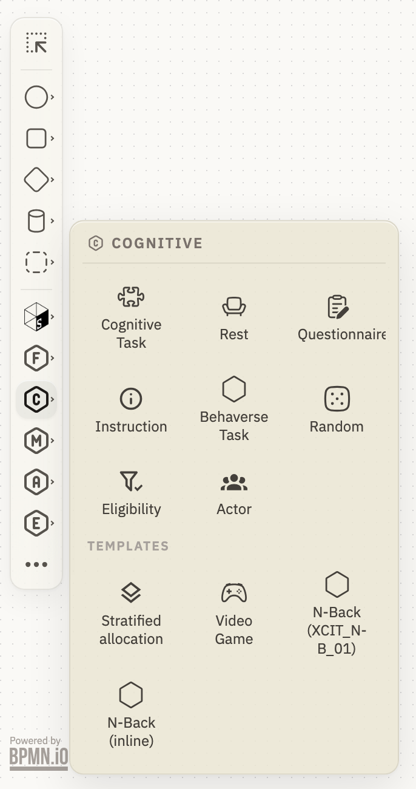
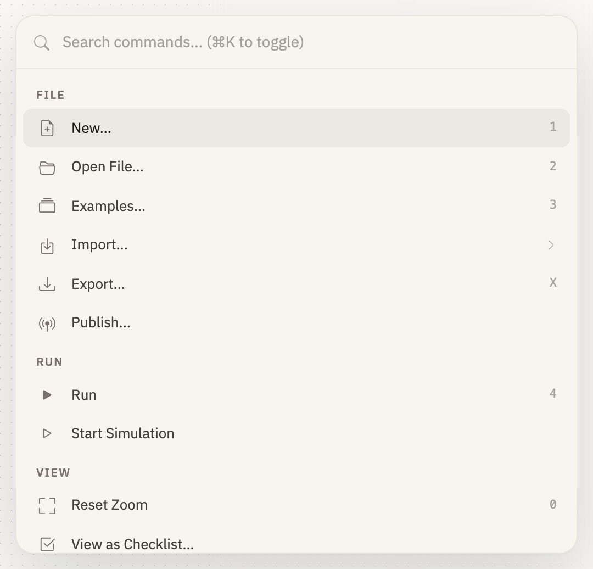

{#fig-shell fig-alt="The Studyflow Modeler window. A vertical strip of icon buttons runs down the left edge, an empty dotted canvas holds a single circular start event, and a panel on the right is headed Study, studyflow:Study, with General, Documentation, and Execution tabs above ID, Name, Authors, and Version fields. A floating toolbar at the top centre holds a menu button, the name Untitled Diagram, a magenta Simulate button, and a purple Run button."}

| Region | What you use it for |
|---|---|
| Palette, left edge | every step, branch, and data element you can add to the study |
| Canvas, middle | the study itself, and the small toolbar of whichever element you select |
| Inspector, right | the parameters of the selected element; with nothing selected, the study's own |
| Toolbar, top centre | the study's name, *Simulate*, *Run*, and the button that reaches every command |

: The four regions of the editor. {#tbl-regions}

Click the name in the toolbar to rename the study; an export is named after it.

## Draw the study

{#fig-palette fig-alt="The modeler with a palette flyout headed COGNITIVE open beside the left edge. It shows tiles for Cognitive Task, Rest, Questionnaire, Instruction, Behaverse Task, Random, Eligibility, and Actor, then a TEMPLATES heading with further tiles including Stratified allocation and two N-Back variants."}

Open a palette flyout and drag a tile onto the canvas. Tiles under *Templates* are the same elements with their parameters prefilled.

{#fig-drag fig-alt="The modeler canvas with a start event and a task-shaped outline being dropped to its right, a horizontal blue alignment guide running through both."}

Double-click a shape to name it. Use the name you would write in the methods section.

There is no connect tool. Select the step the participant is leaving, and a small toolbar (its *context pad*) appears beside it. Drag the arrow icon from that toolbar onto the next step.

{#fig-connect fig-alt="The modeler canvas showing a circular start event joined by a straight arrow to a rounded task shape labelled Flanker with a puzzle-piece icon."}

{#fig-complete fig-alt="A finished small studyflow named Minimal study: a start event labelled Enrolled and consented, an arrow to a task labelled Flanker, and an arrow to an end event labelled Done, with the inspector on the right showing the study's ID and Name."}

Add an end event the same way. The [BPMN mapping](../reference/bpmn.qmd) explains events, gateways, and flows.

## Set a step's parameters

{#fig-inspector fig-alt="The modeler with a task selected on the canvas, its context pad of small icons beside it, and the inspector on the right headed Flanker, cognitive:CognitiveTask, with General, Documentation, Gantt, and Execution tabs above ID, Name, and an Instrument dropdown set to jsPsych."}

The inspector follows what you select; with nothing or several elements selected it shows the study's own name, authors, and version.

| Tab | What it holds |
|---|---|
| General | what the element is -- a cognitive task's instrument, a gateway's allocation |
| Documentation | the prose you would put in a protocol |
| Gantt | when the step happens |
| Data | how a value is laid out |
| Execution | what actually runs |

: The inspector's tabs. {#tbl-tabs}

## Reach any command

{#fig-command-palette fig-alt="A search box reading Search commands, Command-K to toggle, above a grouped list: FILE with New, Open File, Examples, Import, Export, and Publish; RUN with Run and Start Simulation; VIEW with Reset Zoom and View as Checklist. Single-key hints sit at the right of several rows."}

Press <kbd>&#8984;K</kbd> (<kbd>Ctrl+K</kbd> on Windows and Linux), press <kbd>/</kbd>, or click the menu button.

| Group | Commands | Single-key |
|---|---|---|
| File | New..., Open File..., Examples..., Import..., Export..., Publish... | 1, 2, 3, --, X, -- |
| Run | Run, Start Simulation | 4, -- |
| View | Reset Zoom, View as Checklist..., View as Gantt..., View Provenance... | 0, --, --, P |
| App | Settings..., Docs, GitHub | 5, --, -- |

: Every command, and its single key while the search box is empty. {#tbl-commands}

*New...* and *Examples...* replace what is on the canvas; *Import...* reads a jsPsych timeline saved as JSON.

## Simulate before anyone runs it

{#fig-simulate fig-alt="A start, task, end flow during simulation, with a magenta token filling the start event."}

Click **Simulate**, and click again to stop. A *token* — one dot per participant — travels the arrows from each start event.

A token reaching a step with no outgoing arrow stops there and stays visible, which is how a forgotten connection shows up.

Simulation checks the path, not the study. Nobody is shown anything, no data is produced, and branch conditions are ignored ([Execution](../run/execution.qmd#simulating-is-not-running)). To see actual screens, use *Run*, which opens the [browser runner](../run/participants.qmd).

## Export

{#fig-export fig-alt="A dialog headed Export with a Format dropdown reading Studyflow, dot studyflow dot yaml, the filename Minimal study.studyflow.yaml beneath it, and an Export button."}

`.studyflow.yaml` is the canonical source ([File format](../reference/file-format.qmd)).

For SVG and PNG, leave **Embed** on — it is what puts the study inside the image file, and therefore what makes an exported picture openable again with *Open File...*. [Keep, share, and publish](../run/share.qmd) covers which format to hand to whom.

*Publish...* uploads to the Behaverse Data Server instead; see [Publish](../run/share.qmd#publish-to-the-behaverse-data-server).

## Set your defaults

| Section | What it holds |
|---|---|
| Account | sign in with Google, and the API key that sign-in stores in this browser |
| Editor | the canvas grid, and auto-save into this browser |
| Extensions | which element sets load, several of them always on; a change takes effect after the page reload the panel offers |
| Privacy | run recording, clearing all local data, and resetting settings |
| About | the app version, and links to the source and these docs |

: The settings sections. {#tbl-settings}

Everything works signed out; only publishing and recording run data need an account.

::: {.callout-warning}
Auto-save is a crash guard, not a save; exporting is what keeps a study ([Keep, share, and publish](../run/share.qmd#what-the-app-keeps)).
:::
