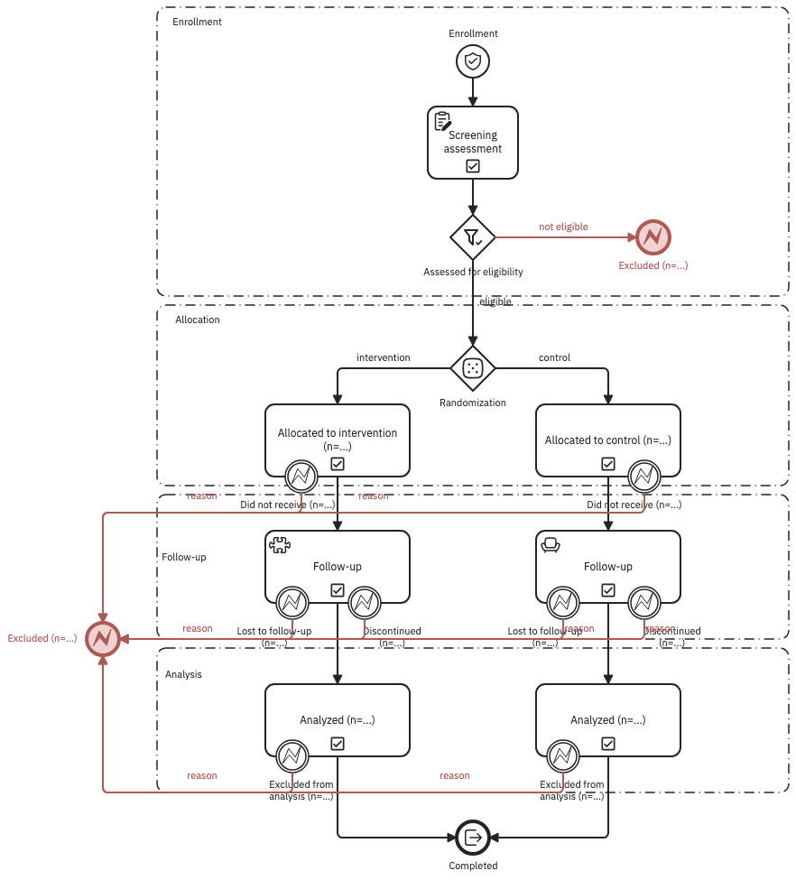
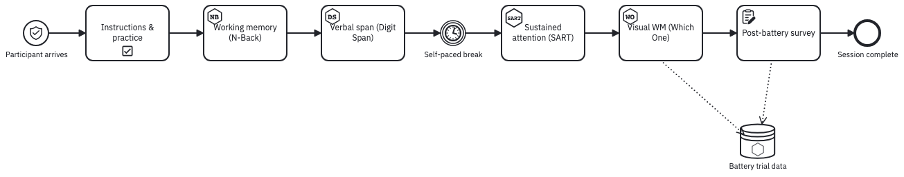
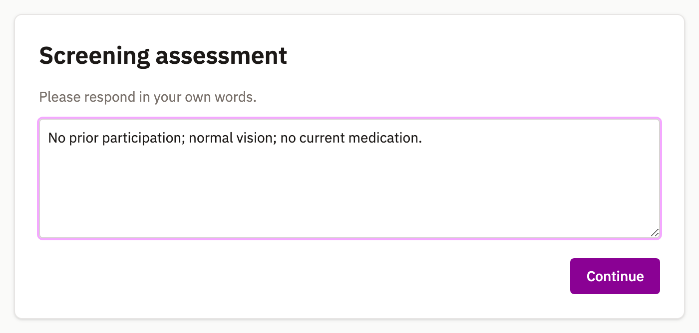
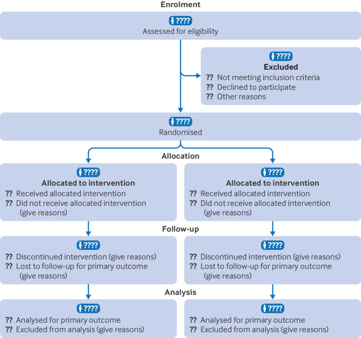
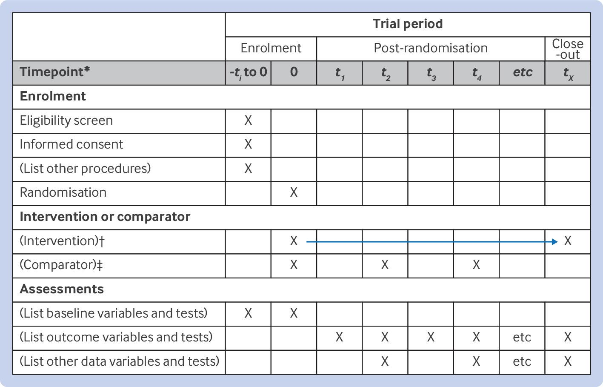

{#fig-consort width="520" fig-alt="A top-down diagram in four dashed bands. Enrollment: a shield-marked start circle, a Screening assessment box, then a diamond marked with a filter icon labelled Assessed for eligibility, whose not-eligible branch runs to a red end circle labelled Excluded. Allocation: a diamond marked with dice labelled Randomization splits into Allocated to intervention and Allocated to control. Follow-up and Analysis: each arm has a Follow-up box and an Analyzed box. Small circles sit on the borders of the allocation, follow-up and analysis boxes, carrying participants out to one shared red Excluded end circle on the left. Both arms converge on an end circle labelled Completed."}

The exits are the hard half, and the ones a reviewer asks about: a dropout you cannot locate is a denominator you cannot defend.

| The participant's arc | The decision it poses | What models it |
|:--|:--|:--|
| Consent | May anything run at all? | The start event, carrying `consentFormUri` |
| Eligibility | Does this person meet the protocol? | `EligibilityGateway`, criteria stated on it |
| Allocation | Which arm, and decided how? | `RandomGateway`, a draw rather than a condition |
| Administration | What is delivered, in what order? | `BehaverseTask`, `Questionnaire`, a timer event |
| Leaving early | Where can someone drop out, and why? | A boundary event on the step they leave |
| Completion | What proves they finished? | The end event, carrying `redirectTo` |

Between them, these draw on four of the [eleven relations](relations.qmd): [choice](relations.qmd#choice) at screening, [chance](relations.qmd#chance) at allocation, [interruption](relations.qmd#interruption) wherever someone leaves, and [schedule](relations.qmd#schedule) across visits.

## What to copy

### Consent rides on the start event

{#fig-consent width="640" fig-alt="A browser panel headed Enrollment, subtitled Informed consent, with the consent text in a scrolling box covering voluntary participation, what you will do, how your data is stored, and who to contact. Two buttons at the bottom read Decline and I consent."}

Put the approved form's address on the start event, not on a first task, so *nothing runs before consent* follows from the structure rather than from a convention a later edit could break.

### Screening and allocation are different diamonds

These look similar and are not. Eligibility turns on criteria a reviewer should be able to read; allocation turns on a draw nobody should be able to predict, so each gets its own element type. The draw is uniform, and a pinned seed replays it ([Execution](../run/execution.qmd#seeds-what-replays-and-what-does-not)).

::: {.callout-note appearance="simple"}
For an allocation the runner performs, keep the defaults, or allocate outside the study and pass the arm in ([Randomize and counterbalance](randomization.qmd)).
:::

### Leaving early is drawn on the step it leaves

In @fig-consort, eight small circles sit on the borders of the boxes people leave from, each interrupting its step and carrying its reason, all routed to one shared error end.

## Modeling your own protocol

| What you want to change | Where you change it |
|:--|:--|
| Your approved consent form | `consentFormUri` on the start event; a plain-text form reads verbatim |
| Your eligibility rules | `inclusionCriteria` and `exclusionCriteria`, one sentence per entry (`Age between 18 and 65`) --- blank in @fig-consort, and the blank is what your protocol fills |
| A third arm | One more outgoing arrow off the allocation diamond |
| Balanced allocation | `stratifyBy` on that same diamond, plus one `strata` entry per stratum |
| Your instruments | `behaverseScene` on a task, `instrument` on a questionnaire |
| A drop-out route of your own | A boundary error event on the step, arrow to the shared excluded end |
| A paid study | `redirectTo` and `completionCodeType` on the end event |
| A multi-visit design | `onset` and `duration` on each step, so the same file also reads as a schedule |
| Assignment and ordering across arms | [Randomize and counterbalance](randomization.qmd) works through the patterns these compose into |

## The session

{#fig-battery fig-alt="A left-to-right diagram. A thin circle marked with a shield, labelled Participant arrives, leads through Instructions and practice, Working memory (N-Back), Verbal span (Digit Span), a circle marked with a clock labelled Self-paced break, Sustained attention (SART), Visual WM (Which One), and Post-battery survey, ending at a heavy circle labelled Session complete. Dotted arrows drop from the last two boxes into a cylinder labelled Battery trial data."}

| Step | Element | Setting |
|:--|:--|:--|
| Instructions & practice | `bpmn:Task` | a three-item checklist in its documentation |
| Working memory (N-Back) | `BehaverseTask` | `behaverseScene: NB` --- one of the 22 assessments the `Cognitive` schema ships |
| Verbal span (Digit Span) | `BehaverseTask` | `behaverseScene: DS` |
| Self-paced break | `bpmn:IntermediateCatchEvent`, timer | a pause the protocol states, not one left to judgement |
| Sustained attention (SART) | `BehaverseTask` | `behaverseScene: SART` |
| Visual WM (Which One) | `BehaverseTask` | `behaverseScene: WO` |
| Post-battery survey | `Questionnaire` | `instrument: nasa-tlx` |

### Questionnaires without items

{#fig-freetext width="620" fig-alt="A browser panel headed Screening assessment, subtitled Please respond in your own words, with a text area containing 'No prior participation; normal vision; no current medication.' and a Continue button."}

`instrument` accepts any name; [Run with participants](../run/participants.qmd) says which item sets ship.

### Proof of completion

{#fig-completion width="620" fig-alt="A browser panel headed Study complete. A highlighted box reads 'Your completion code' above a large monospaced code, KG8WA4V5, with a note to copy it back into the page that sent you here. Below, a line says the participant will be sent back in 5s to a Prolific submissions URL carrying that code, beside a Go back now button."}

`completionCodeType` has three values ([Elements](../reference/elements.qmd#entry-and-exit)); @fig-battery sets none, so its session ends there.

### Where the data lands

| Field | In @fig-battery | What it means |
|:--|:--|:--|
| `format` | `bdm` | Which data model the dataset follows: `bdm`, `bids`, `psych-ds`, or `kedro` |
| `bdmDataLevel` | `trials` | For BDM, the level of the rows: `events`, `trials`, or `models` |
| `schema` | unset | A `Schema` element naming the columns --- see [Data in and out](data.qmd#say-what-the-columns-hold) |
| `catalog` | unset | The catalog the dataset is published in |
| `storage` | unset | Where the bytes physically live |

## Compared with the printed CONSORT diagram

The [CONSORT 2025 statement](https://www.nature.com/articles/s41591-025-03635-5) asks a randomized trial to report where every participant went. The printed flow diagram is the usual answer.

::: {layout-ncol=2}
{#fig-consort-original fig-alt="The published CONSORT 2025 flow diagram: shaded boxes for Assessed for eligibility, Excluded with three reasons, Randomised, two Allocated boxes, two Follow-up boxes and two Analysis boxes, with counts left blank."}

{#fig-consort-studyflow fig-alt="A top-down studyflow in four dashed bands. Enrollment: a shield-marked start circle named Enrollment, a Screening assessment box, and a diamond marked with a filter labelled Assessed for eligibility whose not-eligible branch reaches a red Excluded end circle. Allocation: a diamond marked with dice labelled Randomization splits into Allocated to intervention and Allocated to control. Follow-up and Analysis: each arm has a Follow-up box and an Analyzed box, and small circles on the borders of those boxes carry participants out to one shared red Excluded end circle on the left. Both arms converge on an end circle labelled Completed."}
:::

Both read top to bottom through the same four stages and leave the counts blank. The difference is the exits: the printed diagram collects losses into side boxes, while the studyflow puts each loss on the step it happened at, with its reason on the arrow leaving it. That makes the diagram queryable — a reader, or the software that generates the counts, can point at any activity and see every way a participant could have left it.

### You can keep CONSORT's own boxes

{#fig-consort-annotated fig-alt="An annotated CONSORT studyflow with orange margin notes. A start circle leads to Assess for eligibility, which carries a boundary error event routing to an Excluded end circle listing three reasons. A diamond labelled Randomize splits into group 1 on the left and group 2 on the right. The left column runs Allocate to intervention, Follow-up and Analysis as small boxes, each with boundary circles carrying participants out to a shared Excluded end circle. The right column states the same content as three wide boxes of CONSORT text. Margin notes explain the boundary event, the error end event, the conditional path marker, the default-path slash, and the grouping bands." .fig-l}

The two styles can sit in the same file; [BPMN mapping](../reference/bpmn.qmd) covers every mark in the margin notes. Either way one source file produces the methods figure, the schedule of visits, and the coverage table below, so the three cannot drift apart.

## Reporting checklists

| Topic | Guideline | Description |
|-------|-----------|-------------|
| Randomised trials | CONSORT | Consolidated Standards of Reporting Trials |
| Study protocols | SPIRIT | Standard Protocol Items: Recommendations for Interventional Trials |
| Observational studies | STROBE | Strengthening the Reporting of Observational Studies in Epidemiology |
| Systematic reviews | PRISMA | Preferred Reporting Items for Systematic Reviews and Meta-Analyses |
| Diagnostic/prognostic studies | STARD | Standards for Reporting Diagnostic Accuracy |
| Case reports | CARE | CAse REport guidelines |
| Clinical practice guidelines | AGREE | Appraisal of Guidelines for Research & Evaluation |
| Qualitative research | SRQR | Standards for Reporting Qualitative Research |
| Animal pre-clinical studies | ARRIVE | Animal Research: Reporting In Vivo Studies |
| Quality improvement studies | SQUIRE | Standards for Quality Improvement Reporting Excellence |
| Economic evaluations | CHEERS | Consolidated Health Economic Evaluation Reporting Standards |

: From the [EQUATOR library](https://www.equator-network.org/library/). {tbl-colwidths="[26,16,58]"}

One of these almost certainly applies to what you are running. Tracking it in a spreadsheet beside the protocol means a second document to keep in sync, and one that quietly falls behind.

Most items are about a specific step — *informed consent obtained* belongs on the consent step, and attaching it there moves its coverage with the step. Any element can carry a `checklist:` entry, written as ordinary markdown task items:

```yaml
Visit_Screening:
  type: bpmn:SubProcess
  name: Screening visit (t = -t1)
  onset: T0
  duration: 1 week
  checklist: |
    - [ ] SPIRIT 11a: eligibility screen
    - [ ] SPIRIT 11b: who recruits
    - [ ] SPIRIT 14: settings and locations
    - [ ] SPIRIT 26a: informed consent obtained
    - [ ] SPIRIT 27: confidentiality & data handling
```

{#fig-checklist fig-alt="A dialog titled Checklist View reading 0 of 52 items complete, followed by one card per element -- Screening visit, Baseline visit, Intervention: cognitive training, Control: active sham -- each listing unticked SPIRIT items such as eligibility screen, who recruits, baseline demographics, and adherence monitoring." .fig-l}

That is the protocol's own coverage, not a copy of it, so a supplementary annex or a compliance table can be generated from the study rather than written out a second time.

{#fig-spirit fig-alt="The SPIRIT schedule table. Rows grouped as Enrolment, Intervention or comparator, and Assessments; columns are timepoints from minus t1 through close-out. Crosses mark which procedure happens at which timepoint, and an arrow spans the intervention row." .fig-l}

[SPIRIT 2025](https://www.consort-spirit.org/) recommends 34 items across 9 topics, several of them about *when* things happen. A studyflow builds @fig-spirit out of the `onset` and `duration` values already on its visits, so the timetable is a reading of the protocol rather than a second document. The trial protocol behind @fig-checklist ships under *File &rarr; Examples...*.
