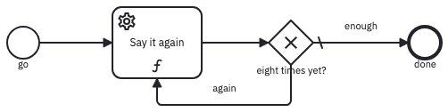
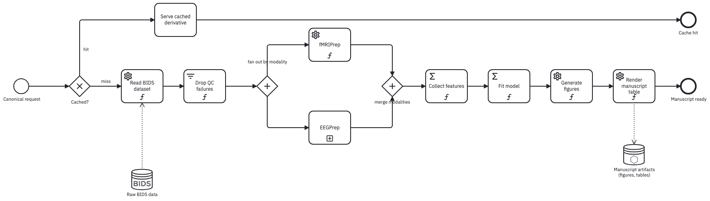
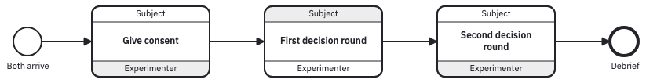

Ignore what happens *inside* each step — the stimuli, the timings, the model being fitted. What is left is the design: how the steps relate to each other.

That set is small and closed: eleven relations, and every design combines some of them.

| What a design has to say | The shape that says it | Seen in |
|:--|:--|:--|
| **[Order](#order)** — practice before the test | an arrow from one step to the next | [`cognitive_battery`](../assets/img/examples/cognitive_battery.studyflow.png) |
| **[Choice](#choice)** — carry on only if they qualify | a diamond, with the rule written on each arrow out of it | [`consort2025`](../assets/img/examples/consort2025.studyflow.png) |
| **[Chance](#chance)** — whichever arm they draw | a diamond marked with dice, and one seed on the study | [`consort2025`](../assets/img/examples/consort2025.studyflow.png) |
| **[Repetition](#repetition)** — forty trials, three blocks | a repeat mark on the step, or an arrow drawn back upstream | [`drawn_loop`](../assets/img/examples/drawn_loop.studyflow.png) |
| **[Waiting](#waiting)** — six weeks until the follow-up | a clock event between two steps | [`cognitive_battery`](../assets/img/examples/cognitive_battery.studyflow.png) |
| **[Interruption](#interruption)** — they stopped halfway | a small circle on the step's own border, with its own way out | [`consort2025`](../assets/img/examples/consort2025.studyflow.png) |
| **[Independence](#independence)** — these two in no fixed order | a diamond marked `+` that splits, and one that rejoins | [`lablink_demo2`](../assets/img/examples/lablink_demo2.studyflow.png) |
| **[Hand-off](#hand-off)** — participant and experimenter take turns | one box per exchange, banded by who acts | [`choreography_demo`](../assets/img/examples/choreography_demo.studyflow.png) |
| **[Data dependency](#data)** — the analysis needs the trial table | a dashed line between a step and the data it reads or writes | [`sklearn_pipeline`](../assets/img/examples/sklearn_pipeline.studyflow.png) |
| **[Scope](#scope)** — a counter that exists only during practice | a named value declared on the block that owns it | [`agent_eval`](../assets/img/examples/agent_eval.studyflow.png) |
| **[Schedule](#schedule)** — week 4, week 12, week 24 | a start time and a length written on the visit itself | [`spirit2025`](../assets/img/examples/spirit2025.studyflow.png) |

: The eleven relations a study design is made of. {#tbl-patterns}

## Order {#order}

Which step comes before which — the most basic thing a design states, and the easiest to leave implicit.

{#fig-order fig-alt="A left-to-right diagram. A shielded start circle labelled Participant arrives leads through Instructions and practice, Working memory (N-Back), Verbal span (Digit Span), a clock-marked event labelled Self-paced break, Sustained attention (SART), Visual WM (Which One), and Post-battery survey, to an end circle labelled Session complete. Dotted lines drop from the last two steps into a cylinder labelled Battery trial data."}

Swap two boxes in @fig-order and the protocol, the experiment the runner administers, and the figure in the paper all change together — they are this one file.

## Choice {#choice}

A branch taken by a rule you can state in advance. Screening is the usual case: whoever fails the criteria leaves before allocation, with the reason recorded there and then.

Mark one arrow as the default, which catches whatever the other rules miss. An `EligibilityGateway` also carries `inclusionCriteria` and `exclusionCriteria` as readable lists, so the screening rule sits in the protocol instead of in a script.

## Chance {#chance}

A branch taken at random rather than by a rule. The draw must be unpredictable to whoever runs the study and reproducible for whoever checks it afterwards.

{#fig-consort fig-alt="A CONSORT diagram in four dashed bands — Enrollment, Allocation, Follow-up, Analysis. Screening assessment leads to a filter-marked diamond, Assessed for eligibility, whose not-eligible branch reaches a red Excluded end. A dice-marked diamond, Randomization, splits into Allocated to intervention and Allocated to control; each of those and each later step carries small circles on its lower border labelled Did not receive, Lost to follow-up, Discontinued, and Excluded from analysis, whose arrows are all labelled reason and all land on one shared Excluded end." .fig-l}

A `RandomGateway` draws an arm instead of evaluating rules, and the study's `seed` makes that draw replayable. Adding `?seed=` to the runner's address overrides it, giving each participant a different draw ([Randomize and counterbalance](randomization.qmd)).

## Repetition {#repetition}

A step or a block that runs more than once. One word covers three different things:

{#fig-loop fig-alt="A small left-to-right diagram. A start circle labelled go leads to a box labelled Say it again, then to a diamond labelled eight times yet?. One arrow leaves the diamond to the right, labelled enough and marked with a slash, ending at a circle labelled done; a second arrow, labelled again, curves back underneath into the box." .fig-m}

| Shape | What it says |
|---|---|
| A repeat mark on one step | keep going while a rule holds, capped by `loopMaximum` — [`kitchensink`](../assets/img/examples/kitchensink.studyflow.png) retries while `score < 0.9`, at most five times |
| A per-item mark on a sub-process | run one instance of the enclosed steps per item in the collection wired to it — this is how `agent_eval` runs one round per evaluation item |
| An arrow drawn back upstream | a diamond whose exit is its default — in `drawn_loop`, `state.trace.count('Gate') < 8` counts the passes, so the step runs eight times (@fig-loop) |

Most repetition should not be drawn: trial counts belong in the task's own settings. Draw a repeat only when something meaningful sits *between* the repeats — a break, a progress check, a decision about whether to run another block.

## Waiting {#waiting}

A delay the design imposes between two steps. A 2.2-second inter-stimulus interval belongs in the task's settings; six weeks before a follow-up belongs in the diagram, where a reviewer can see it and a scheduler can act on it. Three attributes say which kind of wait it is:

| Attribute | What it means |
|---|---|
| `timeDuration` | a delay in ISO 8601 — `P6W` for six weeks |
| `timeDate` | a fixed wake-up time |
| `timeCycle` | on a start event, a recurring launch schedule |

To wait on a state rather than on the clock, use a conditional catch event instead.

## Interruption {#interruption}

A participant leaving a step without completing it: dropout, withdrawal, a trial past its deadline. An exit has to be counted rather than lost, because the denominator depends on it — which is what CONSORT asks a trial to account for. Every attrition point in @fig-consort leaves this way ([BPMN mapping](../reference/bpmn.qmd#boundary-events), [Trials and protocols](protocols.qmd)).

## Independence {#independence}

Two steps with no required order between them. EEG and fMRI preprocessing do not depend on each other, and drawing them in a row states an order the design does not require — no later reader can tell whether it mattered.

{#fig-parallel fig-alt="A left-to-right pipeline. A diamond labelled Cached? sends a hit branch to Serve cached derivative and a miss branch through Read BIDS dataset and Drop QC failures. A plus-marked diamond labelled fan out by modality splits into fMRIPrep on the upper branch and EEGPrep on the lower; a second plus-marked diamond labelled merge modalities rejoins them into Collect features, Fit model, Generate figures, and Render manuscript table. Dotted lines connect a BIDS cylinder into the reader and the last step into a Manuscript artifacts cylinder." .fig-l}

In @fig-parallel, `lablink_demo2` splits by modality and rejoins before the steps that need both.

## Hand-off {#hand-off}

Two parties taking turns. In a dyadic task the unit of analysis is the exchange, not one person's path, so the design is drawn as an interaction.

{#fig-choreography fig-alt="A left-to-right row of three wide boxes between a start circle labelled Both arrive and an end circle labelled Debrief. Each box has a band labelled Subject across the top and a band labelled Experimenter across the bottom; the shaded band marks the initiator. The boxes read Give consent (Subject shaded), First decision round (Experimenter shaded), and Second decision round (Subject shaded)." .fig-l}

The shaded band marks who initiates. A party need not be a person: an `Actor`'s `actorType` can be a human, a language model, a software agent, or an instrument ([Models as participants](agents.qmd)).

## Data dependency {#data}

A step needing data that an earlier step produced. Left in a file path inside a script it breaks silently: rename the file and nothing complains until the analysis runs on stale data.

The line's direction says read or write. These lines *are* the step's inputs and outputs, not a description of them ([Data](../reference/data.qmd)).

## Scope {#scope}

Where a named value lives, and how long it survives. The allocated arm has to reach the analysis; a practice-trial counter must not, or somebody eventually analyses it by mistake.

Declare each value on the block that owns it: `arm` on the study, `failed_trials` on the practice sub-process. Reading a name looks outward from the innermost block; writing to a name lands on the block that declares it.

## Schedule {#schedule}

When each step happens in calendar time, and how long it lasts. No arrangement of arrows states that the primary endpoint visit falls in week 12 and takes a week.

{#fig-schedule fig-alt="A Gantt View dialog with rows grouped under Enrolment, Post-allocation, and Close-out. Each row is a labelled bar on a shared horizontal time axis: Recruitment and Screening visit at the left, Baseline visit shortly after, two long part-filled bars for Intervention and Control, then Follow-up, Primary endpoint, and Close-out bars placed progressively further right." .fig-l}

Any element carrying `onset`, `duration`, or `progress` becomes a row on the Timeline view (@fig-schedule); `spirit2025` lays five visits across 26 weeks. Two studies can be drawn identically — one an afternoon, the other half a year — and differ only in these attributes ([Views and the record](../run/provenance.qmd)).
