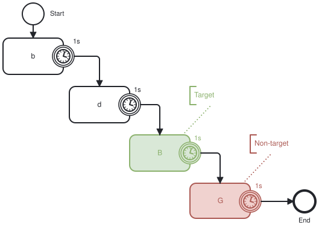
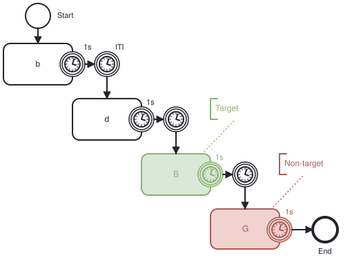
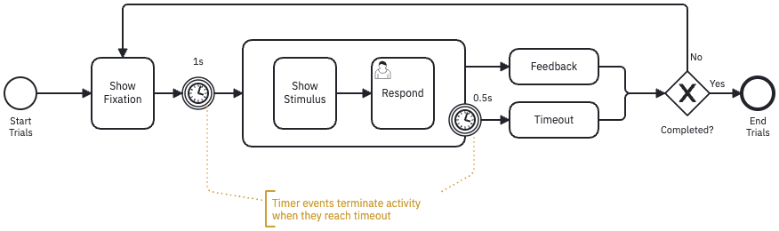

{#fig-slides fig-alt="A storyboard of four overlapping slides running left to right along a Time arrow, showing the letters b, d, B and G. Labels on the left read stimulus presentation equals 0.5 s, ISI equals 1 s, and stimuli bBdDgGtTvV. The B is green and marked Target, the G red and marked Non-target. A row of keycaps B D G T V with a pointing hand sits at the top right."}

@fig-slides is readable but not runnable. What is missing is not *detail* — the timings are all there — but *coordination*: what follows what, under which conditions. Hand it to two colleagues and they fill the gaps differently.

| The unanswered question | What it really is |
|:--|:--|
| What if nobody responds? | An interruption --- something has to end the trial |
| When does the next letter arrive? | A second duration, separate from the first |
| Is the participant told they were right? | A choice between two outcomes |
| How many trials are there? | A repetition, with a stated stopping rule |

None of these gaps is exotic. Each is one of the [eleven relations](relations.qmd) — here [interruption](relations.qmd#interruption), [choice](relations.qmd#choice), and [repetition](relations.qmd#repetition) — and the storyboard has no way to write any of them down.

## Four levels of detail

### Level 1 — one box per stimulus

{#fig-flow fig-alt="A studyflow reading top-left to bottom-right. A thin start circle labelled Start leads into four rounded boxes in a descending staircase, holding the letters b, d, B and G. Each box carries a clock icon on its right border labelled 1s, and an arrow runs from that clock to the next box. The B box is green and bracketed Target, the G box red and bracketed Non-target. The last arrow reaches a thick End circle."}

Nothing has been invented here. @fig-flow just draws the arrows the storyboard already implied.

### Level 2 — the response window, and the gap between trials

{#fig-two-clocks fig-alt="The same staircase of four lettered boxes, but each box now carries two clocks: one on its right border and a second free-standing clock in the arrow that leaves it. The first free-standing clock is labelled ITI. The B box stays green and bracketed Target, the G box red and bracketed Non-target."}

The inter-trial interval is now a stated part of the design rather than a side-effect of however the code happens to be written.

### Level 3 — fixation, timeout, feedback, and the trial loop

{#fig-logic fig-alt="A left-to-right studyflow. A start circle labelled Start Trials leads to a box named Show Fixation, then through a clock labelled 1s into a bordered group containing Show Stimulus followed by Respond. A clock on the group's border labelled 0.5s routes to a box named Timeout, while the group's own exit routes to a box named Feedback. Both reach a diamond marked X labelled Completed. Its Yes branch reaches a thick End Trials circle, its No branch loops back above the flow to Show Fixation. An annotation reads: timer events terminate activity when they reach timeout."}

*Feedback* and *Timeout* answer the last two open questions, and the **No** branch is the repetition.

This version is complete and honest. It is also far more diagram than a reader wants if the N-back is only one step of a longer session.

### Level 4 — one element, the numbers as settings

{#fig-task fig-alt="A thin start circle, one rounded box labelled N-back carrying a small hexagonal NB badge in its top-left corner, and a thick end circle, connected by two arrows."}

Nothing has been dropped. Every number from @fig-slides is still stated — as settings on the element rather than as shapes on the canvas.

## Which level to ship

These four are levels of description, not four stages of finishing a diagram. The right one depends on what your study is actually about.

| If your contribution is | Draw |
|:--|:--|
| A new paradigm, or a timing manipulation | The trial structure in full, as in @fig-logic |
| A reviewer's question about exactly when the response window closed | The same, and point at the clock |
| A study that uses a standard task among others | One element, as in @fig-task |
| A battery whose point is the order of the tasks | One element each, and put the effort into the session |

Default to the last two rows. A trial loop drawn inside a session diagram buries the thing the session diagram exists to show.

::: {.callout-note appearance="simple"}
The software a task names is what enforces its timings.
:::

## Modeling your own task

From the *N-Back (inline)* preset, abridged:

```yaml
Blocks:
  LabLink_InlineBlock:
    Inherits: Default
    Parameters:
      NValue: 1                      # the N in N-back
      Feature: Letters               # what the stimuli are
      StreamSize: 8                  # trials in this block
      MaxResponseTime: 3             # response window, seconds
      StimulusDisplayDuration: 0.5   # the 0.5 s from the storyboard
      InterStimulusInterval: 2.2     # the gap between letters
```

Set these in the modeler's inspector, on the task's *Execution* tab, or in the `.studyflow.yaml` file --- the same study as text, so it is something you diff, review, and cite a version of.

### A task the battery does not ship

`BehaverseTask` covers the 22 assessments the `Cognitive` schema names; for anything else, reach for `CognitiveTask`.

| What you set | What it says |
|:--|:--|
| `instrument` | The software that delivers the task: `psychopy`, `jspsych`, `labjs`, `opensesame`, or `behaverse` |
| `implementation` | Where that software lives, as `<scheme>://<ref>` --- the schemes are in [Data in and out](data.qmd) |
| `configurations` | The settings that software reads, in YAML --- trial counts, durations, block structure |
