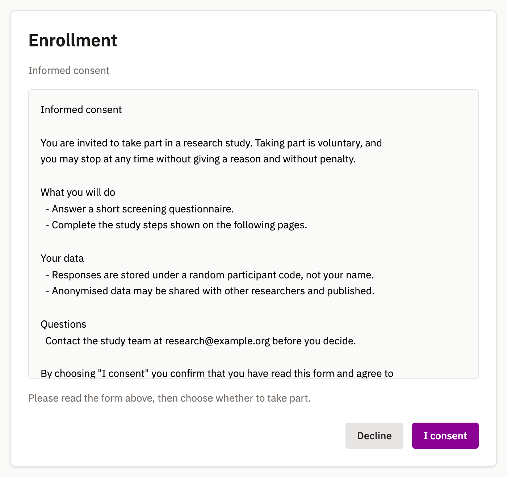
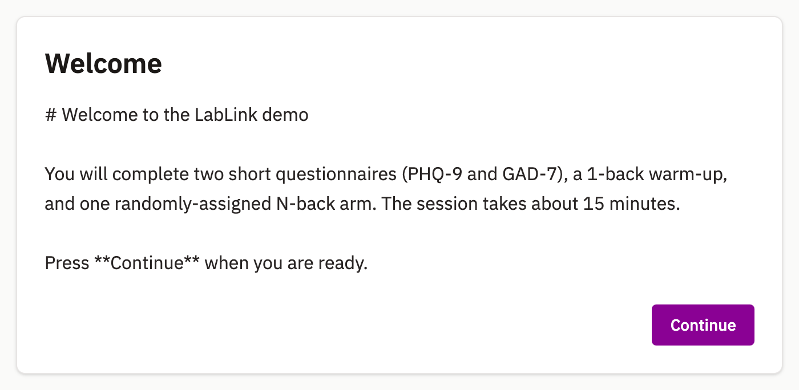
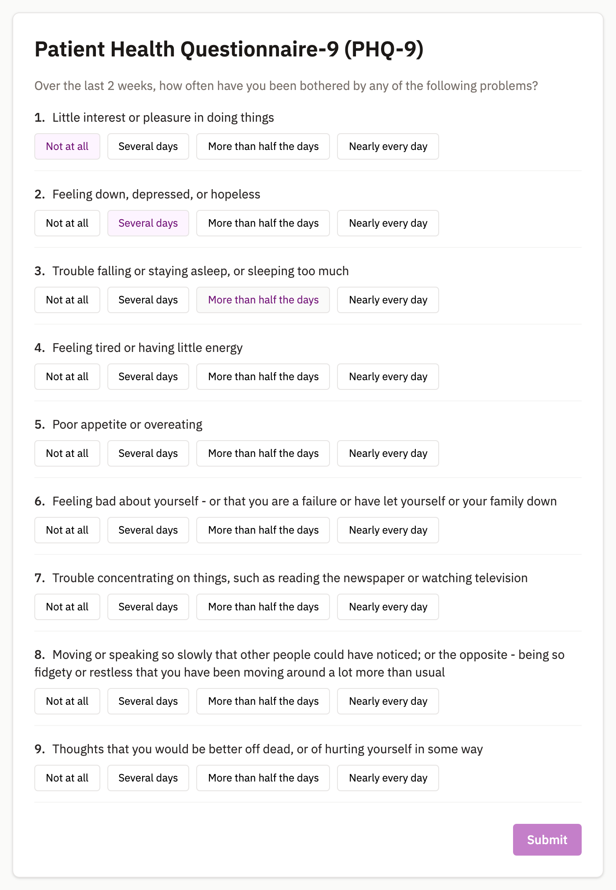
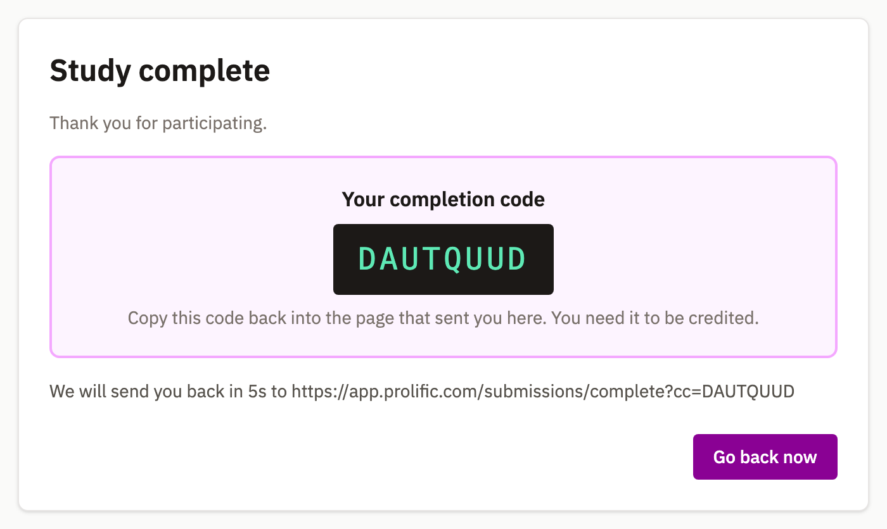

| Program | Does | Lives in |
|:--|:--|:--|
| the modeler | authoring: edit, validate, import and export a studyflow | [`packages/modeler`](https://github.com/behaverse/studyflow-modeler/tree/main/packages/modeler) |
| the browser runner | runs the participant-facing steps, served at `./run/` | [`packages/runner`](https://github.com/behaverse/studyflow-modeler/tree/main/packages/runner) |
| the local runners | run the data-facing steps: one walks and records, *partial runners* execute the elements they claim | [`packages/cli`](https://github.com/behaverse/studyflow-modeler/tree/main/packages/cli) |
| the command line | `studyflow` with `convert`, `validate`, `info`, and `run` | [`packages/cli`](https://github.com/behaverse/studyflow-modeler/tree/main/packages/cli) |
| the core | the object model they all share: YAML to BPMN and back, element access | [`packages/core`](https://github.com/behaverse/studyflow-modeler/tree/main/packages/core) |
| the schemas | the vocabulary every program loads at boot | [`assets/schemas`](https://github.com/behaverse/studyflow-modeler/tree/main/assets/schemas) |


Install the command line with Homebrew:

```bash
brew tap behaverse/studyflow https://github.com/behaverse/studyflow-modeler
brew install studyflow
```


The command line is extensible. If `<name>` is not one of the builtin commands, `studyflow <name>` looks for a `studyflow-<name>` on your PATH.

## How to build and run

```bash
git clone https://github.com/behaverse/studyflow-modeler
cd studyflow-modeler
npm run dev          # the modeler and the browser runner
npm run test:unit    # unit tests only
npm test             # all tests, e2e included
```


## The same study in three formats

A studyflow diagram can be stored as YAML (the canonical format), as BPMN 2.0 XML (what other BPMN tools read), or as a PNG or SVG with the diagram embedded in it. Conversion between the three is lossless:

```bash
studyflow validate study.studyflow.yaml --strict
studyflow convert study.studyflow.yaml study.bpmn
studyflow convert study.studyflow.yaml study.studyflow.png
studyflow info study.studyflow.yaml --json
```

## Running a study

{#fig-lifecycle fig-alt="A flowchart. An author saves a studyflow, validation gates it, and the run goes to the browser runner when runtime is browser or to the Python runner when runtime is local. The browser runner posts sessions and events, opt-in. The Python runner archives the plan into a run repository with one commit per checkpoint; per-element records let untouched steps skip on a partial re-run, and an invalidated record branches the repository at that step's parent."}

`studyflow run` reads the `runtime` attribute on the study and decides where to send it: a `browser` study runs from the published `./run/` URL, and a `local` one goes to the local runners on your machine. An AI evaluation is the same walk with a model in the participant's seat (set `agentType` to `bot` on the task), so the same two runners execute it and you do not need a separate harness.

::: {layout-ncol=4}
{#fig-run-consent fig-alt="A browser screen presenting a consent document with an accept button."}

{#fig-run-instruction fig-alt="A browser screen showing instruction text and a continue button."}

{#fig-run-questionnaire fig-alt="A browser screen presenting questionnaire items with response options."}

{#fig-run-completion fig-alt="A browser screen thanking the participant and showing a completion code."}
:::

Gateways decide which branch a run takes, and each kind decides differently:

| Gateway | Rule |
|:--|:--|
| An exclusive gateway, and `cognitive:EligibilityGateway` | the first outgoing edge whose condition holds, otherwise the edge marked `default` |
| `cognitive:RandomGateway` | a seeded uniform draw over the outgoing edges |
| A parallel gateway | every outgoing edge; the matching join waits for all of them |
| An inclusive gateway | every outgoing edge whose condition holds |
| `agentic:Router` | a label chosen by a model |

- A runner that cannot evaluate a condition stops the run, rather than quietly taking the other branch.
- A condition that names a value which is not in scope reports an exception, rather than evaluating to `false`.
- Setting a `seed` on the study makes every gateway draw replay exactly.

| Element | Checked before the run | Browser runner | Python runner |
|:--|:--|:--|:--|
| `bpmn:StartEvent`, `bpmn:EndEvent` | consent link shape; completion-code coherence | consent screen; completion screen, code, redirect | reached and recorded, no screen |
| `cognitive:Instruction`, `cognitive:Questionnaire` | empty content or instrument blocks the run | renders; writes the answer into scope | - |
| `cognitive:BehaverseTask` | checked against the assessment build's manifest | runs the assessment in the page | - |
| `cognitive:CognitiveTask`, `cognitive:Rest`, plain `bpmn:Task` | - | generic screen, and a way forward | - |
| Any activity carrying `implementation` | reference grammar; literal arguments must be a mapping | shows the call it names | imports and calls it, binding the drawn data associations |
| `bpmn:SubProcess` | - | descends; opens its own scope | walks one level in; no separate scope |
| `bpmn:ExclusiveGateway`, `cognitive:EligibilityGateway` | - | conditions, then `default` | the same rule, in Python |
| `cognitive:RandomGateway` | warns where allocation attributes cannot be honored | seeded uniform draw | treated as exclusive |
| `studyflow:Dataset`, `studyflow:Table`, `studyflow:Timeseries`, `studyflow:Schema`, `studyflow:EventMarker` | - | - | loaded and saved wherever they carry a `uri` |
| `studyflow:Parameters` | reports overridden, undeclared, and unbound names | bound before the walk | - |
| Timers, and multi-instance markers | - | not executed | not executed |

: What each runner does with each family of elements, and what is checked before the run starts. A dash means the runner passes that step over. {#tbl-support}


## What a run leaves behind

{#fig-provenance-model fig-alt="Flowchart. The studyflow document carries a flat provenance trail on its root element and per-element records in each element's extension elements. The modeler appends to the trail and voids records; the Python runner appends to the trail, stamps records on the archived copy, and commits every checkpoint into a run repository. Each commit restates the trail's attributes as trailers and keeps that checkpoint's step records in its body. No sidecar record file is written."}

Before it runs, a studyflow is a plan. As it runs, the record of what actually happened accumulates in the same file (this follows W3C PROV, which separates the prospective plan from the retrospective record). So "did the study deviate from the plan?" is a question you answer by diffing one file against an earlier version of itself, and there is no separate log to keep alongside it.

| Attribute | Holds | | Action | Records |
|:--|:--|:-:|:--|:--|
| `action` | what happened, in one word | | `created`, `modified` | the file was authored, or edited and exported again |
| `when` | an ISO 8601 timestamp; ties break by position | | `imported` | an artifact was staged in from outside |
| `who` | a name, an email, or an ORCID | | `executed` | the document ran, or one element did |
| `with` | the tool that acted, as `name/version` | | `invalidated` | a marker voiding a named execution record |
| `what` | element ids, or the `when` of the entry referred to | | `reused` | a step was skipped and an earlier record trusted |
| `run`, `seed` | the run's identifier, and its root seed | | | |

These records are also what makes a partial re-run possible: the runner skips a step when its record still stands, nothing it reads was re-made during this run, and its outputs are still there. Invalidating a record cascades to everything downstream of the outputs that step re-makes.

## Extending the notation

{#fig-schema-map fig-alt="A flowchart. The four core sets, studyflow, prov, functional, and cognitive, always load into the catalog. The three optional sets, ml, agentic, and eeg, load only when enabled in Settings, Extensions. The ml set declares no types of its own and roots its twelve presets at the functional set. The catalog compiles every enabled set into the palette, the inspector tabs, and the namespaces the XML may use."}

You can add your own vocabulary as an extension set. Each new type extends an existing one and adds its own attributes, so files that use it stay well formed and still open in generic BPMN tools. Before you declare a type, it is worth checking whether you need one at all. An attribute on an existing type is often enough.

Declaring a type buys a limited amount:

| Declaring a type gives it | It does not give it |
|:--|:--|
| a place in the palette, a shape, and an icon | a screen or a call in either runner |
| fields in the inspector | pre-flight checks over the values an author types |
| storage and retrieval through every file format | a way for a run to do anything at that step |

To make a new type do something during a run, you have to teach a runner about it, either to render it on screen or to execute it. @tbl-support is the current list of what the two runners handle. A set's namespace carries its format version.

For a `local` run, executing new elements needs no changes to the runner itself. A *partial runner* is any executable named `studyflow-<name>` that claims a subset of the diagram's elements and executes them one hand-off at a time: state in as a JSON file, updated state out. The full contract, and `studyflow-python` and `studyflow-reachy` as working examples, are in the [CLI README](https://github.com/behaverse/studyflow-modeler/tree/main/packages/cli).

## Contributing

How to set up, test, and propose a change is in [`CONTRIBUTING.md`](https://github.com/behaverse/studyflow-modeler/blob/main/CONTRIBUTING.md).
