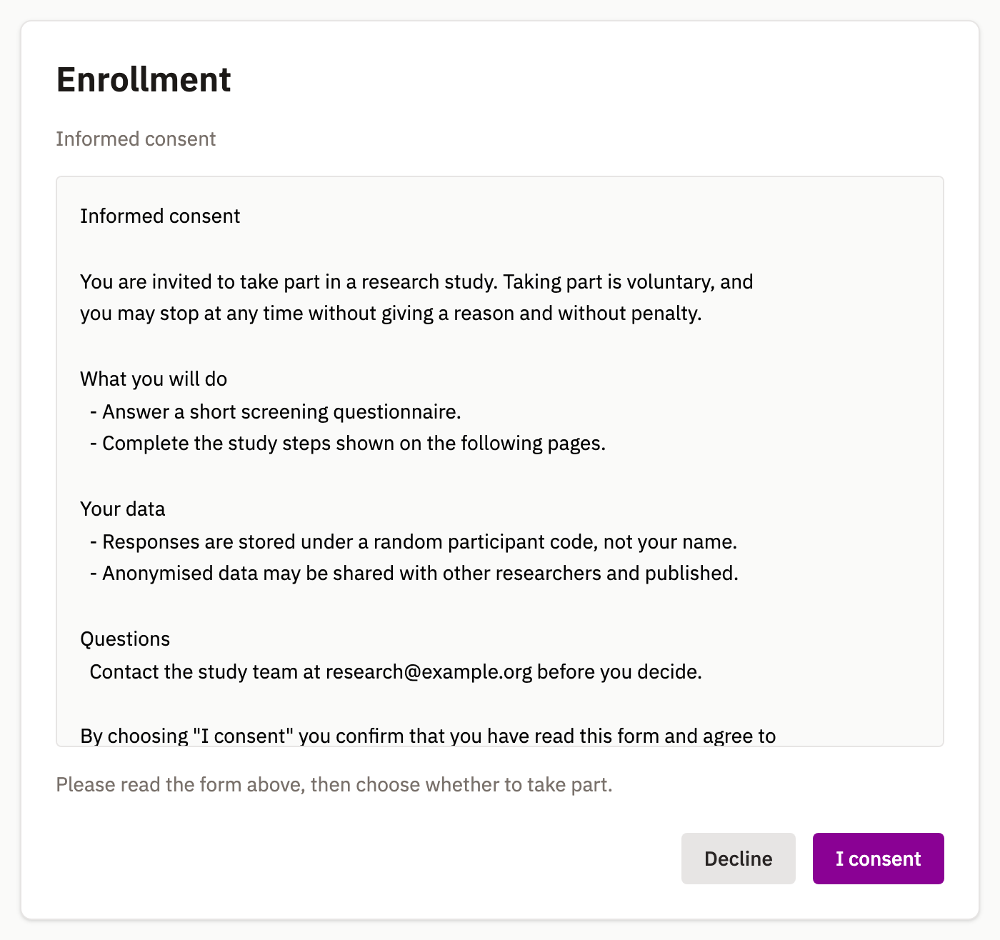
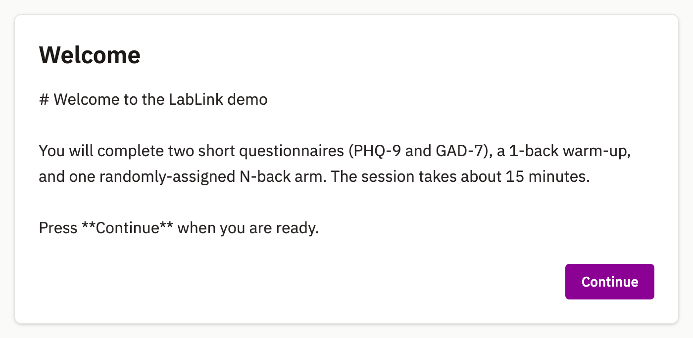
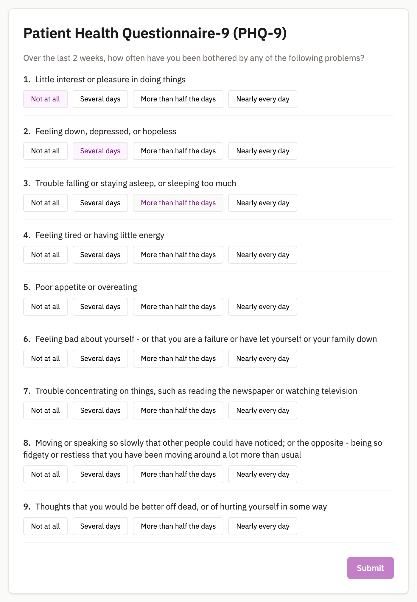
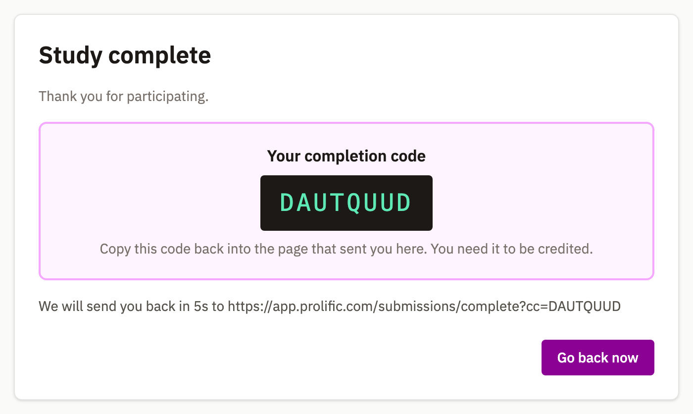
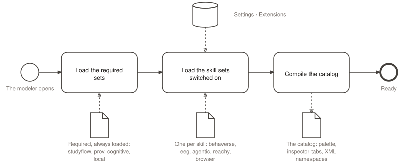

| Program | Does | Lives in |
|:--|:--|:--|
| the modeler | authoring: edit, validate, import and export a studyflow | [`packages/modeler`](https://github.com/behaverse/studyflow-modeler/tree/main/packages/modeler) |
| the browser runtime | hosts the walk for one participant and shows each step as a screen, served at `./run/` | [`packages/runtime-browser`](https://github.com/behaverse/studyflow-modeler/tree/main/packages/runtime-browser) |
| the local runtime | hosts the walk on your machine, records, and hands each element to the skill that claims it | [`packages/runtime-local`](https://github.com/behaverse/studyflow-modeler/tree/main/packages/runtime-local) |
| the command line | `studyflow` with `convert`, `validate`, `info`, and `run` | [`packages/cli`](https://github.com/behaverse/studyflow-modeler/tree/main/packages/cli) |
| the core | the object model they all share: YAML to BPMN and back, element access, and the walk, the one engine both runtimes and the modeler's simulation host | [`packages/core`](https://github.com/behaverse/studyflow-modeler/tree/main/packages/core) |
| the skills | one folder each, declared by its `SKILL.md`: a BPMN extension (vocabulary), runners that execute it per runtime, a modeler module (exports, imports), examples, tests; any part may be missing | [`skills`](https://github.com/behaverse/studyflow-modeler/tree/main/skills) |


Install the command line with Homebrew:

```bash
brew trust https://github.com/behaverse/studyflow-modeler   # Homebrew 6 loads a third-party tap only once trusted
brew tap behaverse/studyflow https://github.com/behaverse/studyflow-modeler
brew install studyflow
```

## How to build and run

```bash
git clone https://github.com/behaverse/studyflow-modeler
cd studyflow-modeler
npm install
npm run dev          # the modeler and the browser runner, at http://localhost:5173
npm run typecheck && npm run lint && npm run test:unit   # what CI and a release check
npx playwright install chromium   # once, before the browser tests
npm test             # all tests, e2e included
```

A local run (`studyflow run --runtime local`) needs [`uv`](https://docs.astral.sh/uv/); the site is built with [Quarto](https://quarto.org) (`npm run docs`). Its figures are Studyflow diagrams in `docs/assets/img/diagrams/`: edit a figure's `.studyflow.yaml`, then, after `npm run build`, redraw the picture beside it with `node packages/cli/dist/studyflow.mjs convert <figure>.studyflow.yaml <figure>.studyflow.svg --modeler`.


## The same study in three formats

A studyflow diagram can be stored as YAML (the canonical format), as BPMN 2.0 XML (what other BPMN tools read), or as a PNG or SVG with the diagram embedded in it. Conversion between the three is lossless:

```bash
studyflow validate study.studyflow.yaml --strict
studyflow convert study.studyflow.yaml study.bpmn
studyflow convert study.studyflow.yaml study.studyflow.png   # into that picture; --modeler draws a new one (in a checkout)
studyflow info study.studyflow.yaml --json
studyflow edit study.studyflow.png              # the desktop app: the modeler served from this machine, opened on that file
```

## Running a study

{#fig-lifecycle fig-alt="A Studyflow diagram. The author saves the study, it is validated, and a gateway asks which runtime. On browser, the participant's steps run in the page, optionally posting sessions and events to a data server, until the session is over. On local, the plan is archived into runs/STAMP/, and the steps are walked, each checkpoint committed into the run repository, until the run finishes. A second start, running again after an edit, asks whether a record was invalidated: if so, the repository branches at that step's parent before the walk; if not, the walk resumes in place. A note says a later run skips each step whose record still stands."}

`studyflow run` reads the `runtime` attribute on the study (`local` unless set) and decides where to send it, and a local run installs the study's `dependencies` into every partial runner's environment (`uv run --with`), so a runner script declares only what it needs itself: a `browser` study runs from the published `./run/` URL, and a `local` one goes to the local runners on your machine. An AI evaluation is the same walk with a model in the participant's seat (a pool whose `studyflow:Actor` has `actorType: llm`), so the same two runners execute it and you do not need a separate harness.

::: {layout-ncol=4}
{#fig-run-consent fig-alt="A browser screen presenting a consent document with an accept button."}

{#fig-run-instruction fig-alt="A browser screen showing instruction text and a continue button."}

{#fig-run-questionnaire fig-alt="A browser screen presenting questionnaire items with response options."}

{#fig-run-completion fig-alt="A browser screen thanking the participant and showing a completion code."}
:::

Gateways decide which branch a run takes, and each kind decides differently:

| Gateway | Rule |
|:--|:--|
| An exclusive gateway, and `cognitive:EligibilityGateway` | the first outgoing edge whose condition holds, otherwise the edge marked `default`, otherwise the one edge without a condition; with none of these the run stops |
| `cognitive:RandomGateway` | a draw seeded from the study's `seed`, the gateway, the participant and its visit, weighted by `allocationRatio`; `algorithm: block` deals permuted blocks over the participants by number (a browser session is the participant its link's `participant` names) |
| A parallel gateway | every outgoing edge, each walked as a path of its own at once; as a join, it waits for a token along each incoming edge |
| An inclusive gateway | every outgoing edge whose condition holds, otherwise the edge marked `default`; as a join, it waits for the tokens that can still come |
| An activity or event with several outgoing edges | each edge without a condition, each whose condition holds, and the `default` edge when none holds |

- A runner that cannot evaluate a condition stops the run, rather than quietly taking the other branch.
- A condition that names a value which is not in scope reports an exception, rather than evaluating to `false`.
- Setting a `seed` on the study makes every gateway draw replay exactly, and both runtimes draw the same branches from it: they host one walk.

| Element | Checked before the run | Browser runtime | Local runtime |
|:--|:--|:--|:--|
| `bpmn:StartEvent`, `bpmn:EndEvent` | consent link shape; completion-code coherence | consent screen; completion screen, code, redirect | reached and recorded, no screen |
| `cognitive:Instruction`, `cognitive:Questionnaire` | empty content or instrument blocks the run | renders; writes the answer into scope | - |
| `behaverse:Task` | checked against the assessment build's manifest | runs the assessment in the page | claimed by the `behaverse` skill's partial runner, which plays it in the Unity build |
| `cognitive:CognitiveTask`, `cognitive:Rest`, plain `bpmn:Task` | - | generic screen, and a way forward; one that exchanges messages has none, and the walk sends and receives for it | - |
| Any activity carrying `implementation` | reference grammar; literal arguments must be a mapping | shows the call it names | imports and calls it, binding the drawn data associations |
| `bpmn:SubProcess` | - | walked one level in, its properties a scope of its own, re-entered on each pass | the same |
| `bpmn:ExclusiveGateway`, `cognitive:EligibilityGateway` | - | conditions (FEEL), then `default`, then the one edge without a condition | the same rule |
| `cognitive:RandomGateway` | warns where allocation attributes cannot be honored | the seeded draw, weighted by the ratio | the same draw; permuted blocks over the cohort |
| `studyflow:Dataset`, `studyflow:Table`, `studyflow:Timeseries`, `studyflow:Schema`, `studyflow:EventMarker` | - | - | loaded and saved wherever they carry a `uri` |
| `studyflow:Parameters` | reports overridden, undeclared, and unbound names | bound before the walk | - |
| Timers | the time is ISO 8601 | a timer event waits for its time; one at a boundary event ends the step when it runs out, and its screen is dropped | the same, and the step's runner is stopped |
| Loop and multi-instance markers | - | one pass after another: while `loopCondition` holds, `loopCardinality` times, or once per item of `loopDataInputRef` | the same |
| Boundary events | - | an error boundary event takes a step the participant refuses; a conditional one reads the finished step | those, and a message boundary event |
| Message flows between pools | a browser run refuses a flow to a pool no one in the page plays (a model, a device), and one from a screen | carried by the walk between the pools it walks; a pool with no process and a human actor is the person at the page, who answers each message on a screen | carried by the walk, pool to pool; a pool with no process is played by the runner that claims it |

: What each runtime does with each family of elements, and what is checked before the run starts. Both host the same walk, so they differ only in what executes a step: a screen in the page, a partial runner on your machine. A dash means the runtime passes that step over. {#tbl-support}


## What a run leaves behind

{#fig-provenance-model fig-alt="A Studyflow diagram in two lanes. In the Modeler lane, exporting a study stamps created and modified into the trail, and marking a step stale voids its record. In the Local runtime lane, executing a step appends its events to the record, events.jsonl, each checkpoint is committed into the run repository, runs/STAMP/.git, and when the run ends the trail, the records and the state are read off the record. A dashed group, the studyflow document, holds the trail on the study's root, whose entries carry action, when, who, with, what, run, seed and note, and the records, one per element. A note says each commit's trailers restate the step and the record is committed with the run's started and finished commits; another says there is one record, events.jsonl, and what the study keeps of a run is read off it."}

Before it runs, a studyflow is a plan. As it runs, what actually happened accumulates in the same file (this follows W3C PROV, which separates the prospective plan from the retrospective record). So "did the study deviate from the plan?" is a question you answer by diffing one file against an earlier version of itself.

What the file keeps is read off one record. A run's record is its events, in order: a run started, a token reached a node or took a flow, a pool's instance or a loop's pass began, a property was written, a step ran or failed or was reused, a gateway took a flow and how (by its condition, its default, a draw, a message, a replay), a message was sent or answered, an artifact was made or staged in, the run finished. The walk tells its host each event as it happens (`RunEvent` in `packages/core/src/engine/record.ts`). A local run appends them to `events.jsonl` in its run directory, one JSON object a line, never rewritten, run after run, and commits it with the run's `started` and `finished` commits; `stateOf` and `recordOf` read the state and each element's record off it, so what the file holds can be recomputed from `events.jsonl` alone.

The `prov:` names a study carries (`prov:Activity`, `_meta.prov`) are Studyflow's own vocabulary, `https://w3id.org/studyflow/prov`, not W3C PROV. `studyflow prov <run> [out.ttl]` writes a run's record in W3C's terms, as PROV-O in Turtle (`packages/runtime-local/src/w3c.ts`): the run is a `prov:Activity` associated with who ran it and the tool, under the study as its `prov:Plan` (named by its protocol digest); each step that ran, gateway that decided, answer a pool gave or step reused is a `prov:Activity` part of the run, whose plan is its element (`<plan>#<id>`); and each value written, message sent and file made is a `prov:Entity` the run generated. What PROV has no term for (a step's status, the flow a gateway took) keeps a Studyflow term, `sf:`.

The retrospective part lives under `state`, a tree keyed by element id (`state:` in the YAML file, a JSON string in `<studyflow:state>` in the XML). Everything the runner owns sits under `state._meta` (`META_KEY` in `@core/document`): `_meta.prov`, the run records, oldest first, and `_meta.reached.<element_id>`, incremented every time a token reaches an element or follows a sequence flow. A run that redoes an earlier one starts from the state that run started from, so its counts are not added twice. Per-element records stay on the elements. Everything else in the tree is a `bpmn:Property` value under `state.<scope_id>`, written only by data output associations. Keys starting with `_` cannot be declared.

| Attribute | Holds | | Action | Records |
|:--|:--|:-:|:--|:--|
| `action` | what happened, in one word | | `created`, `modified` | the file was authored, or edited and exported again |
| `when` | an ISO 8601 timestamp; ties break by position | | `imported` | an artifact was staged in from outside |
| `who` | a name, an email, or an ORCID | | `executed` | the document ran, or one element did |
| `with` | the tool that acted, as `name/version` | | `invalidated` | a marker voiding a named execution record |
| `what` | element ids, or the `when` of the entry referred to | | `reused` | a step was skipped and an earlier record trusted |
| `run`, `seed` | the run's identifier, and its root seed | | | |
| `plan` | for `executed`, the digest of the protocol the run walked, which `studyflow validate` recomputes | | | |
| `commit` | the commit an `executed` step's state is in | | | |

These records are also what makes a partial re-run possible: the runner skips a step when its record still stands, nothing it reads was re-made during this run, its outputs are still there, and the `commit` its record names still holds what it ran with — every artifact it reads or makes, compared by git itself, and its own drawing, read back out of the plan that commit carries. So editing a step, a gateway's condition or an input file re-runs that step, and an output the worktree has lost comes back from the commit that made it rather than being recomputed. Invalidating a record cascades to everything downstream of the outputs that step re-makes.

## Extending the notation

{#fig-schema-map fig-alt="A Studyflow diagram. When the modeler opens, it loads the required sets, studyflow, prov, cognitive and local; then the skill sets switched on in Settings, Extensions, one per skill: behaverse, eeg, agentic, reachy and browser; then compiles the catalog, which gives the palette, the inspector tabs and the XML namespaces."}

You can add your own vocabulary as an extension set. Each new type extends an existing one and adds its own attributes, so files that use it stay well formed and still open in generic BPMN tools. Before you declare a type, it is worth checking whether you need one at all. An attribute on an existing type is often enough.

Declaring a type buys a limited amount:

| Declaring a type gives it | It does not give it |
|:--|:--|
| a place in the palette, a shape, and an icon | a screen or a call in either runner |
| fields in the inspector | pre-flight checks over the values an author types |
| storage and retrieval through every file format | a way for a run to do anything at that step |

To make a new type do something during a run, you have to teach a runner about it, either to render it on screen or to execute it. @tbl-support is the current list of what the two runners handle. A set's namespace carries its format version.

For a `local` run, executing new elements needs no change to the local runtime: a skill pairs its schema with a *partial runner*, which claims the elements it executes and takes them one hand-off at a time, a JSON digest of the plan and the state in, updated state out, the diagram itself never opened. The next section walks through it.

## Writing a partial runner

A tool joins Studyflow through a skill, never through Studyflow itself. The skill is the boundary between the two, what domain-driven design calls an anti-corruption layer: its vocabulary gives study authors the domain's elements in the domain's own words, and its runners translate between Studyflow's runner contract and each tool's own protocol. Studyflow names no tool, and a tool never reads a plan. In the `behaverse` skill, for example, authors draw `behaverse:Task`s, and the skill's local runner speaks the Unity build's protocol; another build of the same tasks gets a runner in the same skill ([#105](https://github.com/behaverse/studyflow-modeler/issues/105)), so a study moves between builds without being redrawn.

The contract is the local runtime's [`SKILL.md`](https://github.com/behaverse/studyflow-modeler/blob/main/packages/runtime-local/CONTRACT.md), and [`skills/python`](https://github.com/behaverse/studyflow-modeler/tree/main/skills/python) and [`skills/reachy`](https://github.com/behaverse/studyflow-modeler/tree/main/skills/reachy) are working runners. This section explains it from the runner's side.

### Placing a tool's step

A study places a step that a tool performs in one of two ways:

| Placed as | What says what runs | Who runs it |
|:--|:--|:--|
| a typed task, such as `behaverse:Task` | its own attributes (`instrument`, `timeline`) | the runner of the skill that declares the type |
| a service task | its `implementation`, `<scheme>://<ref>[@<version>]`, with its arguments and the Parameters wired into it | the runner of the skill the scheme names: `python://` is the python skill's |

A typed task gives authors a palette entry and fields in the inspector; a service task needs no vocabulary at all. The `behaverse` skill takes typed tasks only, for now ([#115](https://github.com/behaverse/studyflow-modeler/issues/115)).

### Where a runner lives

The local runtime finds runners in these places, and asks each which elements it takes:

| Found as | Meant for |
|:--|:--|
| `runtimes.local` in a skill's `SKILL.md`, run in that skill's folder (the checkout's `skills/`, or a directory on `STUDYFLOW_SKILLS`) | a domain's runner, which ships and is tested with the vocabulary it reads |
| an executable named `studyflow-<name>` on `PATH` | a runner that belongs to no skill here, installed for every run on that machine |
| `--runner NAME=COMMAND` on `studyflow run` | trying a runner, or replacing one, for a single run |

A domain with a skill keeps its runners in that skill. Its claims are settled in one place, since two runners claiming one element stop the run; one contract covers every tool the domain uses; and a runner changes with the schema it reads. Its name also ends up in the record: a claimed element with no `implementation` is recorded as run by `runner://<name>`.

### A run, from the runner's side

{#fig-runner-contract fig-alt="A Studyflow collaboration diagram in three pools. The top pool, the local runtime, starts a run and asks every runner for its claims; if a runner does not answer, the run stops before any step. Otherwise it hands over the next claimed element, adopts what it hands back and commits the run directory, repeats while elements remain, removes .cache/ and finishes. The middle pool, the partial runner in its skill, answers initialize with the ids it takes, and on execute reads the plan and the run's values, runs the element with its tool, and hands back its result, record and files. Dashed message flows join the two pools. The bottom pool is the tool, reached only through its own protocol."}

@fig-runner-contract draws the steps below.

A runner is one process for the whole run, and the walk speaks to it in JSON-RPC 2.0 on its stdin and stdout, one message a line. [`packages/runtime-local/CONTRACT.md`](https://github.com/behaverse/studyflow-modeler/blob/main/packages/runtime-local/CONTRACT.md) is the contract, and `packages/runtime-local/python/runner.py` speaks it for a runner written in Python, which is then two functions: `claims(plan)` and `execute(step)`.

1. **Claims.** Before the first step, each runner is started and sent `initialize`, with the path of `plan.json` and the run directory; it answers with the ids of the elements it takes. They are *live* unless it says otherwise: they run every time. `"live": false` makes them *replayable*: a re-run skips one whose record still stands. A runner that answers with an error stops the run before anything happens, and its message is shown; that is how a runner refuses a machine that cannot run its elements, such as one missing a build or a device. A runner whose command is not on the machine claims nothing, and one that claims nothing is shut down at once. An element no runner claims is passed over with a warning, unless it carries an `implementation`, which stops the run.
2. **Hand-offs.** Each claimed element is handed over on every visit, as an `execute` request carrying the run's values; a skill's runner runs in the skill's folder. Because the process lives as long as the run, what it loads or connects to once (a library, a model, a robot) stays for the next hand-off, and `shutdown` is where it lets go. `STUDYFLOW_RUN_PID` is the walk's pid, for a process a runner starts beside itself and leaves to follow the run.
3. **What comes back.** The answer says what the step binds: its `result`, under the element's id for later steps (`{Play.trials}`); `values`, by the id each is bound under; `state`, the properties it wrote, scope by scope; and a `record` of what it ran with (a version, a digest, a build). A failure is an error answer, and what the runner had bound before it failed rides along and is kept.
4. **Files.** The run directory is a git repository: whatever a runner leaves there is committed at the next checkpoint. `.cache/` in it is never committed and is removed when the run ends, so a report, a log or a resume point goes in the run directory, or at the `uri` of an output the step writes.
5. **Messages.** A step with message flows sends a `message` notification naming the flow, and each message along a flow into it arrives as one; the walk carries each along its flow.
6. **Stopping.** A timer at a boundary event, or `--step-timeout`, sends `cancel` for the hand-off in progress. A runner that has not answered two seconds later has its process ended, and is started again for its next hand-off.

What a runner returns is what the rest of the study reads. A runner that claims a gateway returns, as its `result`, the bindings the gateway's conditions read (`{"canRun": false}`). A conditional boundary event reads a step's result, so `{Play.failedTrialRate} > 0.2` leaves a task when too many of its trials failed; a condition that cites a name the result does not carry fails the run, rather than reading as false.

### What a runner gets, and what it does not yet

| A runner reads | In |
|:--|:--|
| the study's `id`, `name`, `seed` and `dependencies` | `plan.json`, under `study` |
| each element's type, attributes, extensions, wired `parameters`, inputs, outputs and message flows | `plan.json`, under `elements` |
| the run's values, how often each element was reached (`_meta.reached`), and which pass a repeating activity is on (`_meta.instance`) | `execute`'s `values` |

The root seed drives the random gateways, and the python runner seeds each of its steps with it; a runner that needs randomness of its own mints a seed and reports it in `record`. These are not there yet, each with its issue:

- the participant, the session, and a step's position in the participant's walk ([#108](https://github.com/behaverse/studyflow-modeler/issues/108));
- a `version` on `plan.json`, and a JSON Schema for it ([#107](https://github.com/behaverse/studyflow-modeler/issues/107));
- an interrupted element's state, handed back on its next attempt so a runner can resume inside it ([#110](https://github.com/behaverse/studyflow-modeler/issues/110));
- questionnaires, instructions, breaks and consent in local runs ([#109](https://github.com/behaverse/studyflow-modeler/issues/109)).

### Trying a runner

```bash
studyflow run study.studyflow.yaml --runner mytool="uv run --script ./local.py" --debug
```

Try a runner with `--runner`, not by putting a `studyflow-<name>` executable on `PATH`:

- **It is scoped to one run.** Every local run asks every runner it discovers for its claims before its first step, whatever the study. A `studyflow-<name>` left on `PATH` is asked by every run on that machine: if it refuses to start, every run stops, and if it claims an element another runner claims, that run stops too.
- **It is explicit.** The command names the runner and the program behind it. What `PATH` supplies depends on the machine: which executables are installed, in which order, and at which version.
- **It shadows nothing by accident.** A `PATH` executable named after a skill replaces that skill's runner without a word; `--runner` replaces one only when you name it, and only for that run.
- **It needs no install,** and leaves nothing behind.

A runner given this way gets exactly its command, and reads the run's `options` (`--option sim`, `--option auto`) from `plan.json`. `--debug` keeps `.cache/`, with `plan.json` and the run's values after each element (`<id>.state.json`), so you can read exactly what a step was handed and what it left.

## Contributing

How to set up, test, and propose a change is in [`CONTRIBUTING.md`](https://github.com/behaverse/studyflow-modeler/blob/main/CONTRIBUTING.md).
