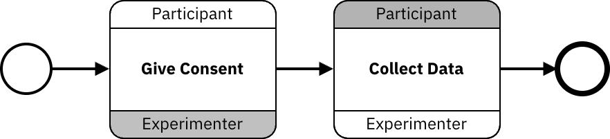

Rather than modeling what each participant does internally, BPMN2 introduced choreography tasks that can be used to model multi-agent collaborative experiments, i.e., the interaction between agents. A choreography task is a specialized task that represents a sequence of interactions between some participants, which one initiates, and what is sent in each direction. Here is an example of a choreography task:

In the example above, we see choreography tasks that involve two participants: "Subject" and "Experimenter". In the first task, "Subject" performs an activity called "Give Consent". The same color is used for the task and the "Subject" band to indicate that the task is initiated by the "Subject".
