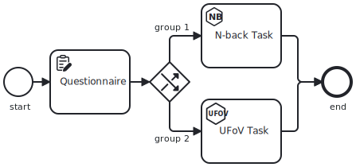
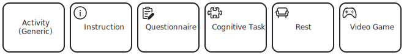

Studyflow is a visual language for defining research workflows and scientific experiments. It builds on <abbr title="Business Process Model and Notation">BPMN</abbr> and adds research-focused components for experiments, data, analysis, and reporting.

This page is a quick path to your first useful diagram. If you want the formal language reference, jump to the [Specification](../reference/spec.qmd) after you complete the steps below.

## Requirements

- [Studyflow Modeler](https://behaverse.org/studyflow-modeler/) (web-based, no installation required)
- [List of Studyflow elements](../reference/elements.qmd)
- A BPMN cheat sheet (optional, but helpful)

## What a studyflow diagram contains

A studyflow diagram is composed of a set of elements that define the structure and flow of the study. To get started, it's important to understand the core elements of the studyflow language:

**<i class="bi bi-circle"></i>&nbsp; Event**: circles represent the start and end of a study, as well as intermediate events that can trigger actions.

**<i class="bi bi-square"></i>&nbsp; Activity**: rectangles represent activities or steps in the study, such as cognitive tests, questionnaires, or instructions.

**<i class="bi bi-diamond"></i>&nbsp; Gateway**: diamonds represent decision points that can alter the flow of the study based on conditions or randomization.

**<i class="bi bi-file-earmark"></i>&nbsp; Data Object**: file-like shapes represent transient data produced or consumed by other elements.

**<i class="bi bi-database"></i>&nbsp; Data Store**: cylinders represent persistent data storage, such as databases. Unlike data objects, data stores retain information beyond the scope of a single study instance.

**<i class="bi bi-arrow-return-right"></i>&nbsp; Sequence Flow**: arrows connect events, activities, and gateways to define the order of elements.

Here is an example diagram:

<figure class="centered max-w-2xl">
  
  <figcaption>
    A simple studyflow diagram showing the experimental design of a study as a series of activities, events, and gateways.
  </figcaption>
</figure>

::: {.callout-tip}
For a detailed overview of the studyflow language, refer to the [***Reference***](../reference/spec.qmd).
:::

## Graphical notation

Studyflow uses a specific graphical notation to convey the semantics of each element. Different types of activities, for example, can have different icons to indicate their type:

<figure class="centered max-w-2xl">
  
  <figcaption>
    Icons represent different types of activities in studyflow.
  </figcaption>
</figure>

These icons extend the standard BPMN icons. For a complete list, see [*Reference &rsaquo; Elements*](../reference/elements.qmd).

## Build your first diagram

Follow this minimal workflow to create and export a studyflow diagram:

1. Open the [Modeler app](https://behaverse.org/studyflow-modeler/app) in your browser.
2. Start a new diagram or open the default template.
3. Drag a start event and a task from the left palette onto the canvas.
4. Connect the elements with a sequence flow.
5. Select the task and edit its properties in the inspector on the right.
6. Add an end event so the flow has a clear completion point.
7. Save the diagram as a `.studyflow` file or export it as SVG or PNG.

If you want to understand what each action means, use the sidebar pages in this order:

- [Modeler App](modeler-app.qmd) for the UI workflow.
- [Elements](../reference/elements.qmd) for the supported diagram elements.
- [Specification](../reference/spec.qmd) for the formal language model.
