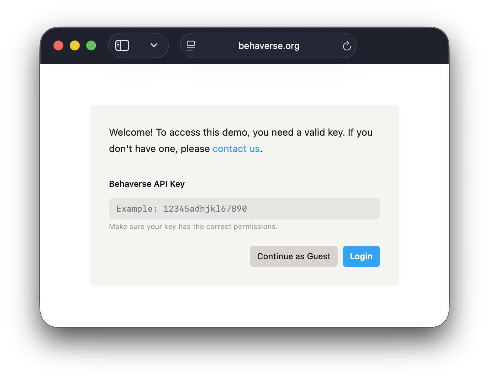
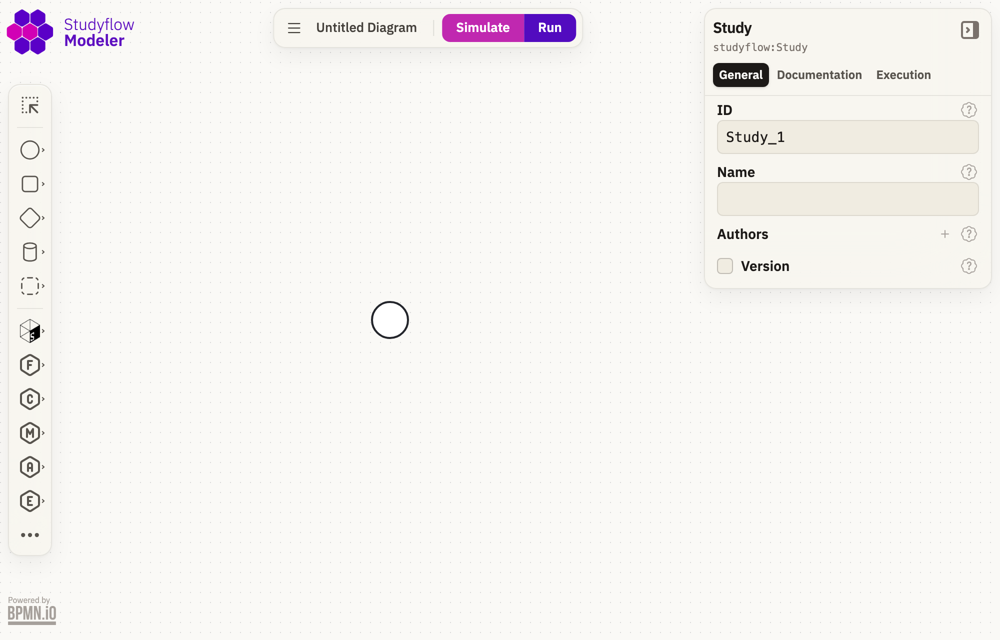
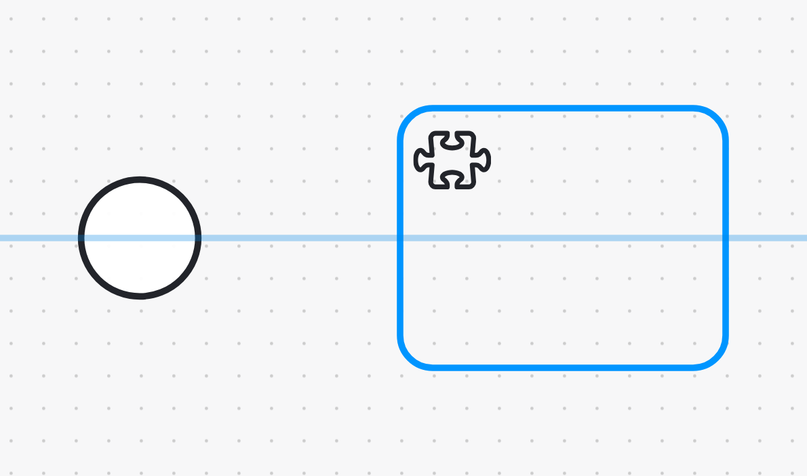
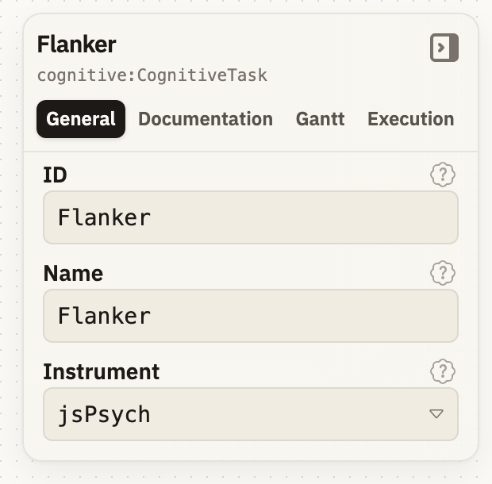
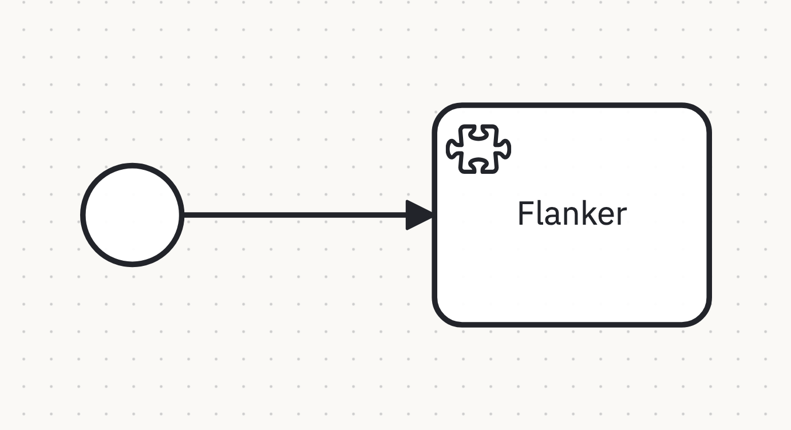
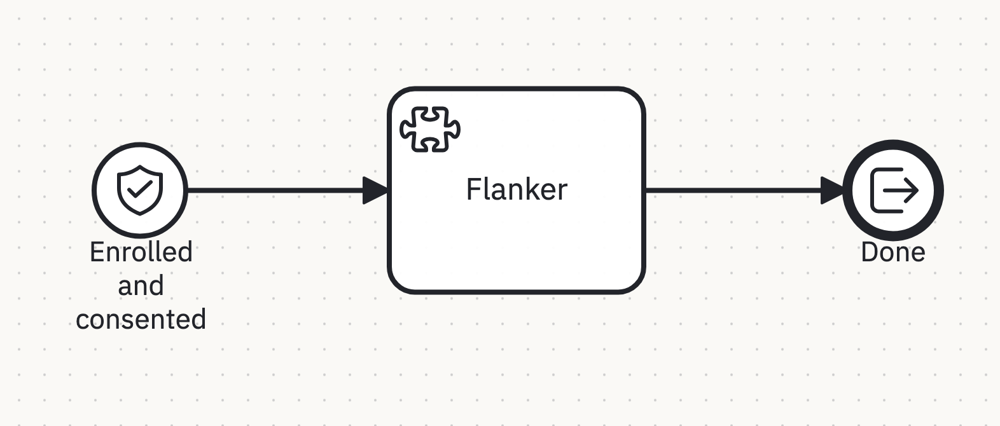
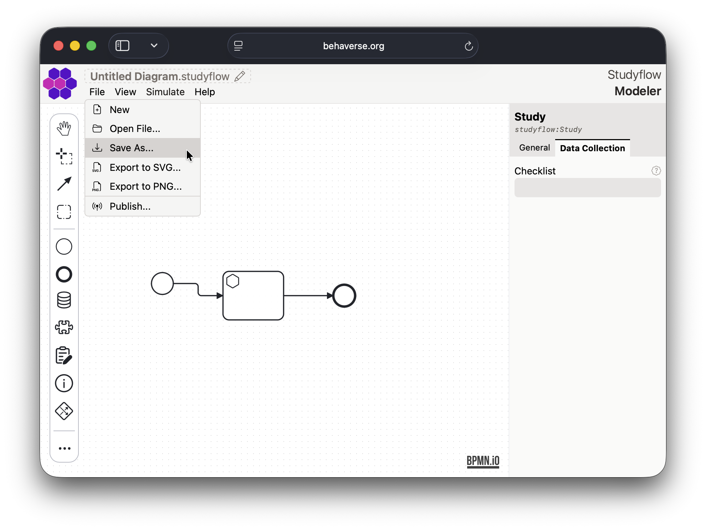
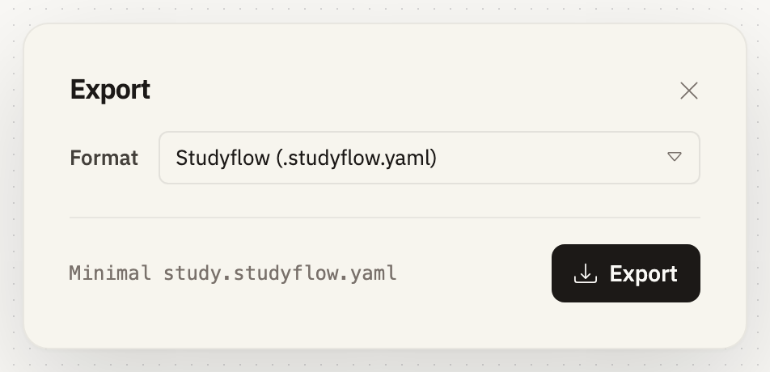
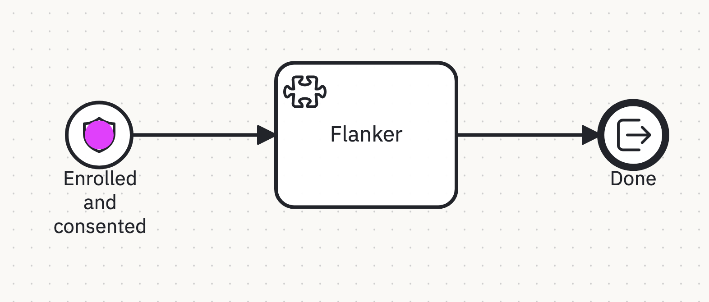
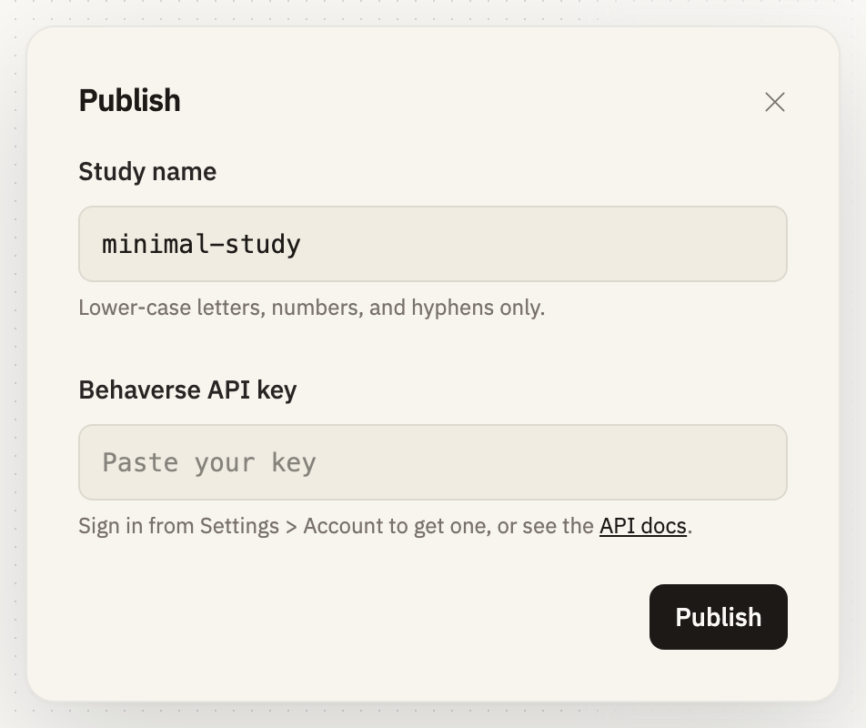

[*Modeler*](https://behaverse.org/studyflow-modeler/) is a webapp for designing and running studyflow diagrams. Its drag-and-drop interface helps you to visually define every step of your study, from initial conception, subject recruitment, data collection, and analysis pipelines to final reporting.

## Key features

- Drag-and-drop interface.
- Predefined node types for common research elements (e.g., cognitive tests, video games, questionnaires, and instructions).
- Export studyflow diagrams as BPMN 2.0 XML, PNG, SVG, or draw.io -- exported images stay editable in both this modeler and draw.io.
- Integration with *Behaverse Data Server* to execute diagrams directly from the modeler.
- Simulation mode to test and debug diagrams.

## Creating a diagram

1. Open the [Modeler app](https://behaverse.org/studyflow-modeler/app) in your web browser.

2. Enter your Behaverse API key and click Login to access additional features, or click Continue as guest to use the app in guest mode. The only limitation is that you cannot publish studies to the Behaverse Data Server.

<figure class="centered max-w-md">
  
  <figcaption>Login screen</figcaption>
</figure>

<figure class="centered max-w-md">
  
  <figcaption>Initial screen</figcaption>
</figure>

3. Use the left palette to drag and drop elements onto the canvas.

<figure class="centered max-w-md">
  
  <figcaption>Drag and drop elements</figcaption>
</figure>

4. Select an element to configure its properties in the right inspector sidebar.

<figure class="centered max-w-md">
  
  <figcaption>Inspector sidebar</figcaption>
</figure>

5. Connect elements by selecting the connect tool in the left palette. First select the source element and then the target element. The type of the connection will depend on the selected elements.

<figure class="centered max-w-md">
  
  <figcaption>Connect tool</figcaption>
</figure>

6. Add additional elements and connections to complete your diagram.

<figure class="centered max-w-md">
  
  <figcaption>Completed diagram</figcaption>
</figure>

7. Save your diagram with the "Export..." command in the "File" menu. Saving and exporting are the same dialog: pick a format, and for images set what gets embedded. "Studyflow" writes the native YAML file (`*.studyflow`) and is the one to keep as your source of truth.

<figure class="centered max-w-md">
  
  <figcaption>File menu options</figcaption>
</figure>

<figure class="centered max-w-md">
  
  <figcaption>Export options</figcaption>
</figure>

## Command palette and shortcuts

Press <kbd>Cmd</kbd>/<kbd>Ctrl</kbd>+<kbd>K</kbd> to open the command palette, a searchable list of every modeler action (run, file operations, exports, views, settings). While the search box is empty, common commands have single-key shortcuts:

| Key | Command |
|---|---|
| 1 | New |
| 2 | Open File |
| 3 | Export |
| 4 | Run |
| 5 | Settings |
| 0 | Reset Zoom |

The palette also hosts the *View as Checklist* and *View as Gantt* commands -- see [Views](../reference/views.qmd).

## Autosave

The modeler can save the current diagram to the browser's local storage as you edit, so the diagram survives reloads. Toggle this under *Settings &rarr; Editor &rarr; Auto-save diagram* (off or on for this browser). Autosave is local-only; use *File &rarr; Export &rarr; Studyflow* to keep a `.studyflow` file alongside your code and data.

## Settings

The *Settings* view (palette shortcut <kbd>6</kbd>) groups configuration into sections:

- **Account** -- the Behaverse API key used to publish studies and record run data.
- **Editor** -- canvas preferences and the autosave toggle.
- **Extensions** -- the schema palette (see below).
- **LLM** -- default provider (`claude` or `ollama`), model, and endpoint for [bot-driven tasks](llm-bots.qmd).

## Schema palette

Element types ship in layered schemas. `core` and `cognitive` are always loaded (Behaverse assessment tasks are part of `cognitive`); the domain extensions -- *OmniProcess*, *DataTrove*, *OpenBCI* -- can be enabled or disabled under *Settings &rarr; Extensions*. Disabled schemas are excluded from the palette and not recognized when opening diagrams (reload the page to apply changes). See [Extensions](../reference/extensions.qmd) for what each extension provides.

## Export formats

Every way a diagram leaves the app is one dialog -- *File &rarr; Export...* -- with the native `.studyflow` file as the default format rather than a separate "save" menu (see `src/modeler/export/`):

| Format | What it is for |
|---|---|
| Studyflow (YAML) | The native source file. Diffs cleanly in Git; keep this one. |
| BPMN 2.0 XML | The same diagram as standard BPMN XML, for interop with other BPMN tooling. |
| SVG | Vector figure of the diagram, for manuscripts and web pages. |
| PNG | Raster figure, for slides and quick sharing. |
| draw.io | The diagram as editable draw.io shapes (see below). |
| LinkML | The diagram's data elements as a LinkML schema, for data engineers and validation tooling. |
| NIDM-Results (Turtle) | Analysis metadata as NIDM-Results RDF, for neuroimaging provenance tooling. |
| ARTEM-IS (JSON) | EEG methods descriptor following the ARTEM-IS template, for EEG reporting. |

### Editing a diagram in draw.io

An exported image is not a flat picture. Both SVG and PNG carry two payloads, toggled under *Embed* in the Export dialog and both on by default: the **studyflow source**, so *File &rarr; Open* brings the figure straight back into the modeler, and a **draw.io diagram**, so the very same file opens in [draw.io](https://www.drawio.com) -- desktop or [app.diagrams.net](https://app.diagrams.net) -- as editable BPMN shapes. That is the route to take when a figure needs annotating for a paper or reshaping for a slide, and it means one file in your repository serves both purposes. Exporting the `draw.io` format writes the same diagram as a plain `.drawio` file, without the picture.

Two things to know before going down that route. draw.io renders standard BPMN notation, so studyflow's own element icons become the plain BPMN shape they specialize -- a *Cognitive task* arrives as a task, an *Eligibility gateway* as an exclusive gateway. And the edit is one-way: re-saving from draw.io writes a draw.io file, which the modeler cannot reopen. Keep the `.studyflow` file as the source of truth and treat the draw.io copy as a figure.

## Simulation mode

Once your diagram is complete, you can test it using the simulation mode. Click the "Simulate" button in the top toolbar to start the simulation. This will allow you to interact with the studyflow as if it were running in a real study.

<figure class="centered max-w-md">
  
  <figcaption>Simulation mode</figcaption>
</figure>

## Publishing studies

If you have a Behaverse API key, you can publish your studyflow diagram directly to the Behaverse Data Server. Use the "Publish" option in the "File" menu to upload your diagram.

<figure class="centered max-w-md">
  
  <figcaption>Publish option</figcaption>
</figure>

Once published, you can run the study on the Behaverse platform and collect data from participants.
