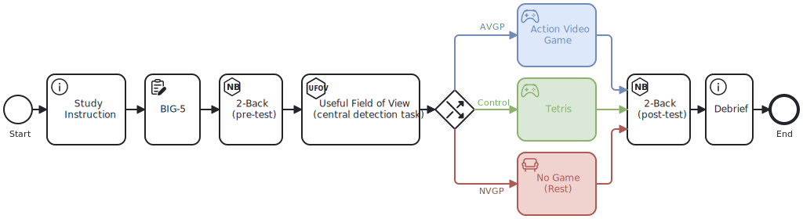

Describing experimental research can be complex and ambiguous. Studyflow is a visual language for describing scientific workflows in a way that is both human-readable and machine-readable. It extends [<abbr title="Business Process Model and Notation">BPMN</abbr>](https://en.wikipedia.org/wiki/BPMN) so researchers can model experiments, data collection, analysis, and reporting in a single formal diagram.

The core idea is simple: represent a study as connected elements such as events, activities, decisions, and data. That gives you a diagram that is easier to discuss with collaborators, easier to serialize for tools, and easier to reuse across studies.

Here is an example:

<figure class="centered max-w-2xl">
  
  <figcaption>
    A simple studyflow diagram can show the experimental design of a study as a series of tasks and events.
  </figcaption>
</figure>

## What you can do with Studyflow

Studyflow diagrams are human-friendly, machine-readable, and executable. They can be used for various purposes, including:

- **Designing experiments**: plan and visualize the steps of your study before conducting it.
- **Documenting protocols**: create clear and detailed representations of your experimental procedures.
- **Communicating methodologies**: share your workflows with collaborators, reviewers, funders, and other stakeholders in varying degrees of detail.
- **Automating workflows**: integrate with tools to automate data collection, analysis, and reporting.
- **Reproducing studies**: facilitate replication of experiments by providing a structured representation of the study design and analysis. Parts of existing studyflows can be adapted for new experiments, improving reuse.
- **Reporting and publication**: include studyflows in research papers to enhance transparency and understanding.

## Start Here

If you are new to the project, use one of these paths:

- **Build your first diagram**: start with [Getting Started](guides/getting-started.qmd) and follow a short, task-based walkthrough.
- **Learn the modeler UI**: read [Modeler App](guides/modeler-app.qmd) to understand palette actions, inspector editing, save/export, and simulation.
- **Understand the language**: read the [Specification](reference/spec.qmd) and [Elements](reference/elements.qmd) pages for the formal model and supported element types.
- **Explore real use cases**: browse [Examples](examples/analysis.qmd) for study designs, reporting patterns, and domain-specific workflows.

## Why Studyflow?

Trusting science requires rigor and reproducibility, hence clear communication of the scientific experiments has become one of the cornerstones of good scientific practices.

Following the need for clear communication, many scientists rely on detailed description of data and protocols in manuscripts, diagrams, reporting guidelines, checklists, and more-or-less standard softwares; all to provide enough details to reproduce the findings.

In parallel, as we increasingly rely on machines to facilitate research, trust in code and data are becoming more and more critical. The need for reproducibility has become essential for building trust in automated processes, especially at scale when using various large models.

The context for Studyflow is scientific workflows and everything related to them: study protocols, experimental designs, data, analysis, reporting, and execution. Studyflow provides a formal domain-specific language for representing research processes and data in one cohesive diagram. Those diagrams help communicate with participants, researchers, systems, and other stakeholders.

## Next steps

The documentation is structured as follows:

- **Guides**: tutorials and how-tos for creating studyflows.
- **Specifications**: fundamental concepts and design decisions for effective communication of scientific experiments.
- **Use cases**: examples of studyflows for different scenarios.

You can also find information about:

- **Modeler**: webapp to create and simulate studyflows.
- **Runner** (experimental): deploy and execute studyflows.

## Get in touch

Studyflow is an open source project, and everyone is welcome to contribute. If you have any questions or suggestions, please [visit our GitHub](https://github.com/behaverse). You can also reach out to us by email at [contact@xcit.org](mailto:contact@xcit.org).
