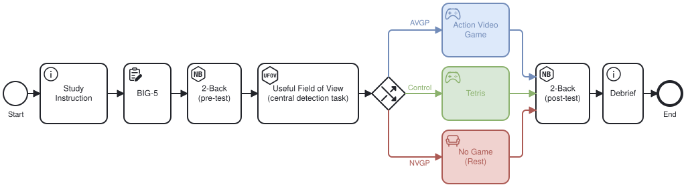

{#fig-studyflow fig-alt="A left-to-right diagram. A plain circle labelled Start leads through Study Instruction, BIG-5, 2-Back (pre-test), and Useful Field of View. A diamond then splits the path three ways -- the branches labelled AVGP, Control, and NVGP -- into Action Video Game, Tetris, and No Game (Rest). All three rejoin at 2-Back (post-test), then Debrief, then a heavy-outlined circle labelled End."}

Studyflow is a coordination notation for experimental research: a process standard for the cognitive sciences and adjacent fields, in the role BPMN 2.0 plays for business processes. Your tools compute; Studyflow coordinates them.

## The gap it closes

A study is written down once per audience, and nothing checks the copies against each other.

| Who reads it | What they are handed |
|:--|:--|
| The ethics board | a protocol document |
| The public record | a preregistration |
| The participant, or the model | an experiment script |
| The analyst | a notebook |
| The reader | a Methods section and a figure |
| The replicator | whatever survived |

A decade of standardization has given the *data* of a study a shared form. The *process* that produced it still lives in prose, slides, and glue code, where nothing can validate it and every copy drifts from the others. That is why standardized data alone has not made studies reproducible.

## The claim

One file, and every other document is a reading of it.

| The same file is | Serving |
|:--|:--|
| a protocol | a colleague, a reviewer, an ethics board |
| a runnable study | participants, or a model in the participant's seat |
| an analysis specification | the pipeline that ran, not a description of it |
| a figure | the Methods section of a paper |

Each is a [projection](concepts/projections.qmd) of one object, so there is no second copy to fall out of step.

## What this site specifies

| Page | What it establishes |
|:--|:--|
| [Computation and coordination](concepts/coordination.qmd) | why the process needs a notation of its own, and why that notation extends BPMN rather than replacing it |
| [The studyflow object](concepts/object.qmd) | the typed graph a studyflow is, and the conditions that make one well formed |
| [Projections](concepts/projections.qmd) | how every view is derived, and why none can contradict its source |
| [Execution and provenance](concepts/execution.qmd) | what a run is, what it fixes, and what it records |
| [Extending the notation](concepts/extending.qmd) | how the vocabulary grows without the notation changing |
| [Elements](reference/elements.qmd), [File format](reference/file-format.qmd), [Glossary](reference/glossary.qmd) | the shipped vocabulary, the files it is stored in, and the terms |

The [modeler](https://behaverse.org/studyflow-modeler/app.html) runs in a browser and needs no account; the notation, the schemas, and the four programs that read them are open source on [GitHub](https://github.com/behaverse/studyflow-modeler).
