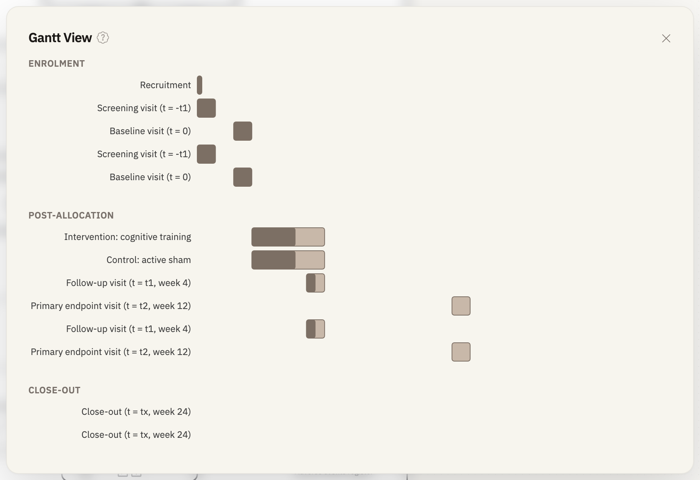
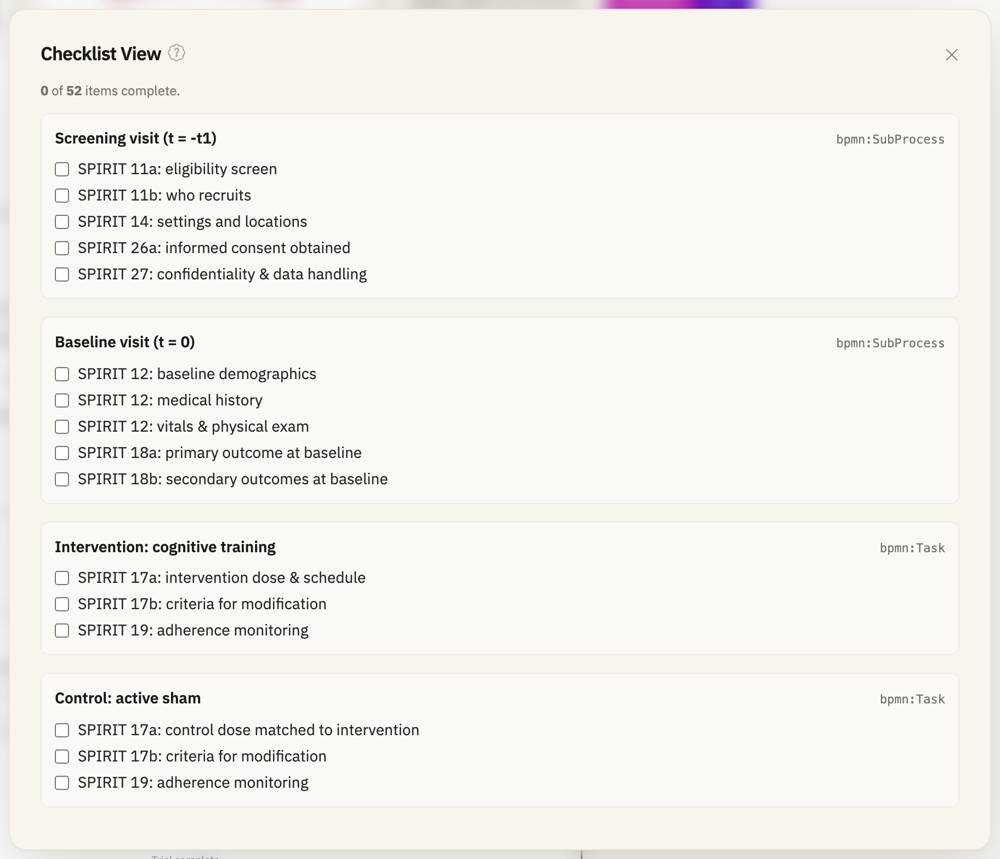
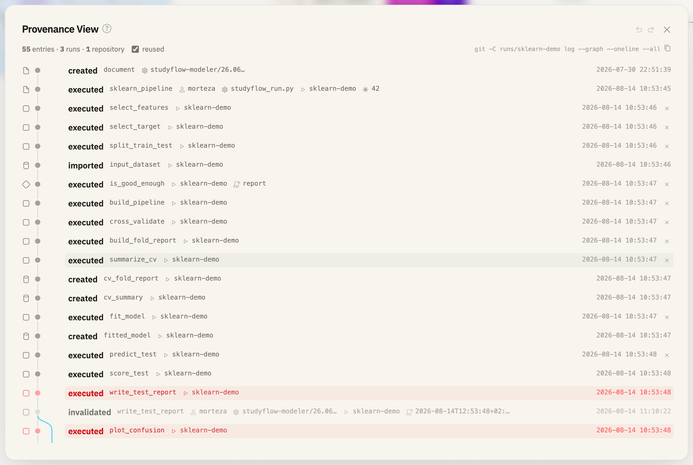

Studyflow is a graphical notation for describing and coordinating experiments: AI evaluations, behavioral research, clinical studies. Think of a workflow language: your codes compute, studyflow coordinates them[^gelernter]. A diagram is the single source of truth needed to recreate an experiment, and both machines and humans can read it. You draw the experiment once, and the result is one file that is at once the protocol, the runnable code, the analysis specification, the final report, and the manuscript figure.

A studyflow is a valid [BPMN 2.0](https://www.omg.org/spec/BPMN/2.0/) file, extended with domain-specific elements through BPMN's own extension mechanisms.

 app, you can see the details, edit it, or run it.](assets/img/studyflow_example_1.svg){#figs-studyflow}

## Why

Today an experimental study is described many times: a protocol in PDF for the ethics board, a preregistration form, a script for the data collection, a notebook for the analysis, a figure for the manuscript, and it continues. Each copy is maintained separately, and nothing checks them against each other, so they drift apart (we are not anymore surprised when the preregistration says four conditions, the data collection script implements five, the analysis code uses three, and the figure only shows two).

Replications usually stop on exactly this gap between what was described and what actually ran[^hardwicke] [^variability]. AI research has the same gap under different names: the eval described in the paper, the harness that actually ran it, and the config that drifted somewhere in between.

A studyflow diagram replaces all these copies with one file. Each document you need is produced, or more precisely *projected*, from this file.

## How it works

You build a study in the [*Modeler app*](https://behaverse.org/studyflow-modeler/app) (open source, in browser) or any other compatible app. The elements you can use are the same as in BPMN: tasks, events, gateways, and flows. You can also add your own domain-specific elements (questionnaire, cognitive tasks, brain imaging sessions, data analysis functions in Python). Then you attach metadata to each element (e.g., a script to run, a data file to read, or a figure to produce).

The file saves as YAML (or as a PNG with embedded YAML). *Runners* can read the file and execute it in many environments: a web browser, a Python script, or a containerized workflow. Or *projections* can read the file and produce a protocol document, a Gantt chart, a figure, or a checklist.

::: {layout-ncol=3}
{#figs-timeline fig-alt="A Gantt View dialog with rows grouped under Enrolment, Post-allocation, and Close-out, each a labelled bar on a shared horizontal time axis."}

{#figs-checklist fig-alt="A dialog titled Checklist View reading 0 of 52 items complete, with one card per element listing unticked SPIRIT reporting items."}

{#figs-provenance fig-alt="A dialog titled Provenance View listing entries across three runs, each row naming an action, an element, an actor, a tool, and a timestamp."}
:::

To try it, [open the modeler](https://behaverse.org/studyflow-modeler/app) and load an example from its gallery.

[^gelernter]: Gelernter, D., & Carriero, N. (1992). Coordination languages and their significance. *Communications of the ACM*, 35(2), 97-107.

[^hardwicke]: Hardwicke, T. E., et al. (2018). Data availability, reusability, and analytic reproducibility. *Royal Society Open Science*, 5(8), 180448.

[^variability]: Botvinik-Nezer, R., et al. (2020). Variability in the analysis of a single neuroimaging dataset by many teams. *Nature*, 582, 84-88.
