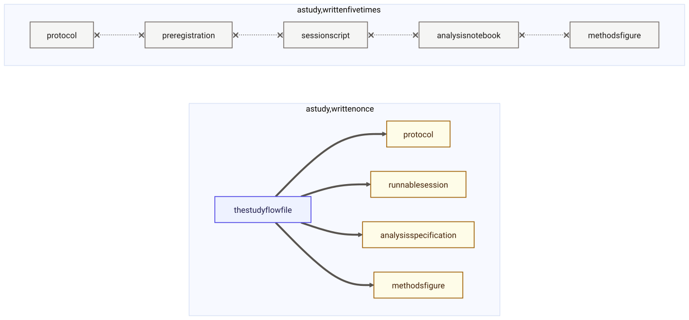

Studyflow is a graphical notation for describing experimental research (e.g., behavioral experiments, clinical studies, AI evaluations) as a single flowchart file with machine-readable and human-understandable semantics. You draw the experiment once, what data each step produces, and which analyses run on that data. The result is one file that is simultaneously the protocol, the runnable code, the analysis specification, and the final report. Your codes compute; Studyflow coordinates them.[^gelernter]

{#fig-studyflow fig-alt="A left-to-right diagram. A plain circle labelled Start leads through Study Instruction, BIG-5, 2-Back (pre-test), and Useful Field of View. A diamond then splits the path three ways -- the branches labelled AVGP, Control, and NVGP -- into Action Video Game, Tetris, and No Game (Rest). All three rejoin at 2-Back (post-test), then Debrief, then a heavy-outlined circle labelled End."}

## Why

Today an experimental study is written down many times: a protocol for the ethics board, a preregistration, a script for the data collection, a notebook for the analysis, a figure for the manuscript. Each copy is maintained separately, and nothing checks them against each other, so they drift apart (we are not anymore surprised when the preregistration says three conditions, the script implements four, the analysis expects two, and the figure still shows three). Replications usually stop on exactly this gap between what was described and what actually ran.[^hardwicke] [^variability] AI research has the same gap under different names: the eval described in the paper, the harness that actually ran it, and the config that drifted somewhere in between.

{#fig-gap fig-alt="Two panels. Above, five boxes — protocol, preregistration, session script, analysis notebook, methods figure — joined by crossed-out dashed lines: nothing keeps them in step. Below, one box labelled the studyflow file, with solid arrows out to protocol, runnable session, analysis specification, and methods figure."}

A studyflow diagram replaces all these copies with one file. Each document you need is produced, or more precisely projected, *from* this file.

## How it works

You build a study in the *studyflow modeler* (open source, nothing to install). Drag elements from the palette (instructions, questionnaires, cognitive tasks, breaks), connect them with arrows, and fill in each step's details in the inspector. Gateways defines the decisions, e.g., an eligibility gateway states your screening criteria; a random gateway allocates participants to different conditions. Data elements record what each elements reads and writes.

The file saves as YAML (or as a PNG that shows your figure and contains the machine-readable diagram). Different **runners** can read the file and execute it in different environments: a web browser, a Python or R script, or a containerized workflow. And different **projections** can read the file and produce different outputs like a protocol document, Gantt chart, a figure, or a checklist.

The same file also answers questions directly in the modeler, as views:

::: {layout-ncol=3}
{#fig-timeline fig-alt="A Gantt View dialog with rows grouped under Enrolment, Post-allocation, and Close-out, each a labelled bar on a shared horizontal time axis."}

{#fig-checklist fig-alt="A dialog titled Checklist View reading 0 of 52 items complete, with one card per element listing unticked SPIRIT reporting items."}

{#fig-provenance fig-alt="A dialog titled Provenance View listing entries across three runs, each row naming an action, an element, an actor, a tool, and a timestamp."}
:::

To try it, [open the modeler](https://behaverse.org/studyflow-modeler/app.html) and load an example from its gallery.

## Built on BPMN

A studyflow is a valid [BPMN 2.0](https://www.omg.org/spec/BPMN/2.0/) and extend it with domain-specific vocabulary through the BPMN's own extension mechanisms.

[^gelernter]: Gelernter, D., & Carriero, N. (1992). Coordination languages and their significance. *Communications of the ACM*, 35(2), 97–107.

[^hardwicke]: Hardwicke, T. E., et al. (2018). Data availability, reusability, and analytic reproducibility. *Royal Society Open Science*, 5(8), 180448.

[^variability]: Botvinik-Nezer, R., et al. (2020). Variability in the analysis of a single neuroimaging dataset by many teams. *Nature*, 582, 84–88.
