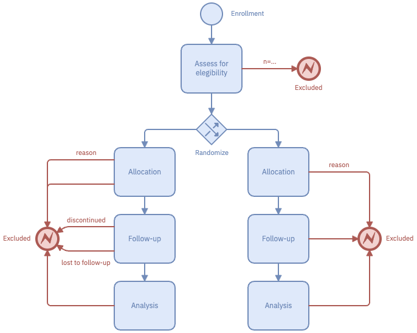

Reporting specific types of research (e.g., in science and health) requires structured formats to ensure the quality and transparency of research studies. Those structured formats also guide the authors while writing manuscripts.

CONSORT is a reporting guideline, consisting of a checklists and a flow diagram, for randomized controlled trials (RCTs). It is designed to improve the quality of reporting in RCTs and to help readers understand the design of experiments.

Studyflow diagrams can be used to create a full CONSORT report in a more concise and readable format than traditional box-and-arrow figure.

The following figure compares traditional CONSORT diagrams against the same CONSORT described in studyflow language. The studyflow diagram (Right) reads from top to bottom and uses similar content as in the original CONSORT.

  <figure className="centered">
    
    <figcaption>
      **Figure 1.** CONSORT 2025 flow diagram (see [CONSORT 2025 statement](https://www.nature.com/articles/s41591-025-03635-5) for details).
    </figcaption>
  </figure>

  <figure className="centered">
    
    <figcaption>
      **Figure 2.** CONSORT as a studyflow diagram.
    </figcaption>
  </figure>

The annotated studyflow below uses even more concise elements and iconography to describe the the same flow using error handling feature. The left path (group 1) is enhanced with studyflow elements. The right path (group 2) uses a more traditional approach with texts, boxes, and arrows.

  <figure className="centered">
    
    <figcaption>
      **Figure 3.** Annotated studyflow diagram showing two representations of CONSORT (left path: Studyflow, right path: traditional).
    </figcaption>
  </figure>

Note how *boundary error events* describe the flow of participants through the trial. Because of that, the diagram is more compact and easier to read than the original format.

The studyflow diagram can also include additional metadata such as colors, checklists, and timelines to enhance readability. Since the diagram is machine-readable, it can also can be used to generate reports or simulate the flow of participants through the experiment (see the supplementary video for a simulation).
