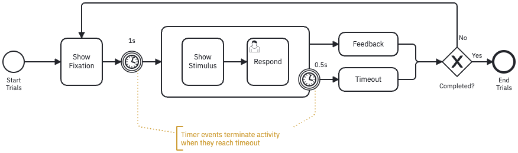

One common way to describe cognitive assessment tasks and their trial structures is to visualize different stages of a trial as slides annotated them with timing parameters (see for example N-back task in figure below). However, this approach is not always reproducible, not machine-readable, and does not provide a formal and complete description of the experiment.

Studyflow can describe cognitive tests and their trial structures in a more precise and machine-readable way.
