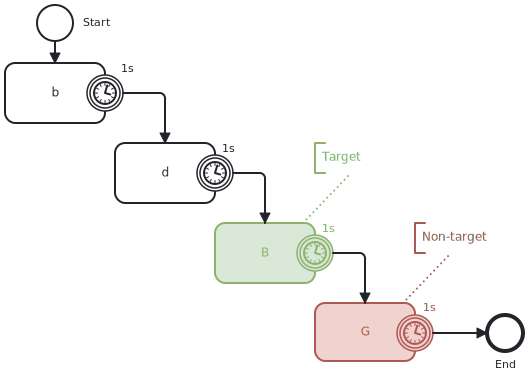

One common way to describe cognitive assessment tasks and their trial structures is to visualize different stages of a trial as slides, and then annotate them with parameters (e.g., timing, stimulus, etc.).

For example, the N-back task is a common test that assesses working memory. It typically involves presenting a sequence of stimuli (e.g., letters, numbers) and asking participants to indicate when the current stimulus matches the one from N steps earlier in the sequence.

This trial structure can be visualized as a set of slides, where each slide represents a different trial:

<figure className="centered max-w-2xl">
  
  <figcaption className="">
    Trial structure of the N-back task, showing the parameters and stages as slides. This is a common way to visualize cognitive tasks, but it can be difficult to understand the flow of the task and the timing.
  </figcaption>
</figure>

Studyflow diagrams can also be used to represent the trial structure of cognitive tasks, showing the flow of different stages and parameters in a more structured way:

<figure className="centered max-w-2xl">
  
  <figcaption className="">
    The same N-back task represented as a studyflow diagram.
  </figcaption>
</figure>

In the figure above, we can see the the stimulus presented in each trial (boxes), and the timing of each stage (timer events). Timer events are used to indicate the duration of each stage, such as the presentation time of the stimulus and the response window. The flow of the trial is represented by arrows connecting the different stages, showing how participants move through the task.

However, this does not yet provide a formal and complete description of the experiment. For example, we actually have two timers in the trial, one for the ITI (Inter Trial Interval), and one for maximum response time. This can be simply two interrupting timers events (circles with solid borders) that stops the flow of the activity at the appropriate times:

<figure className="centered max-w-2xl">
  
  <figcaption className="">
    The N-back task with interrupting timers for ITI and response time. This is a more complete representation of the trial structure, but it can be difficult to understand the parameters and logic of the task.
  </figcaption>
</figure>

We also overlooked the logic of the task, e.g., whether the current stimulus matches the one from N steps earlier, whether the response is correct, and to provide feedback to the participant. BPMN can help here by providing a standard way to represented the process flow and decision points in the task, like this:

<figure className="centered max-w-2xl">
  
  <figcaption className="">
    An example of how BPMN can be used to represent the logic of the N-back task.
  </figcaption>
</figure>

This looks complicated! Studyflow diagrams also provides a more intuitive way to model standard cognitive tasks for cognitive scientists:

<figure className="centered max-w-2xl">
  
  <figcaption className="">
    An activity with NB icons represents the N-back task, with parameters for stimulus type, N level, timing, etc. The flow of the task is represented by arrows connecting the different stages, showing how participants move through the experiment.
  </figcaption>
</figure>

The parameters of the N-back task can be modified using the Modeler app (in the inspector sidebar) or directly in the Studyflow XML file. Since the diagram is generated from the XML file, any changes to the parameters will automatically update the diagram, and it can be version controlled too!