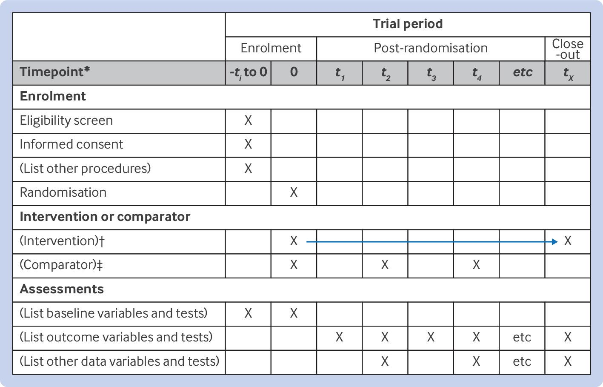

Reporting specific types of research (e.g., in science and health) requires structured formats to ensure the quality and transparency of research studies, and to guide authors while writing manuscripts [^1].

[^1]: https://www.equator-network.org/about-us/what-is-a-reporting-guideline/

To this end, several [reporting guidelines](https://www.equator-network.org/library/) are proposed to help researchers report their studies in a a structured and standardized way. These guidelines are usually a set of checklists, flow diagrams, and structured texts that are developed using specific methodologies. They provide a framework for reporting various types of studies, including randomized trials, observational studies, systematic reviews, and more. The following table lists some of the most commonly used guidelines in science and health and their corresponding checklists.

| Topic | Guideline | Description |
|-------|-----------|-------------|
| Randomised trials | CONSORT | Consolidated Standards of Reporting Trials |
| Study protocols | SPIRIT | Standard Protocol Items: Recommendations for Interventional Trials |
| Observational studies | STROBE | Strengthening the Reporting of Observational Studies in Epidemiology |
| Systematic reviews | PRISMA | Preferred Reporting Items for Systematic Reviews and Meta-Analyses |
| Diagnostic/prognostic studies | STARD | Standards for Reporting Diagnostic Accuracy |
| Case reports | CARE | CAse REport guidelines |
| Clinical practice guidelines | AGREE | Appraisal of Guidelines for Research & Evaluation |
| Qualitative research | SRQR | Standards for Reporting Qualitative Research |
| Animal pre-clinical studies | ARRIVE | Animal Research: Reporting In Vivo Experiments |
| Quality improvement studies | SQUIRE | Standards for Quality Improvement Reporting Excellence |
| Economic evaluations | CHEERS | Consolidated Health Economic Evaluation Reporting Standards |

As an example, the [SPIRIT 2025](https://www.consort-spirit.org/) checklist recommends a set of 34 items across 9 topics to describe an interventional trial. It includes items such as the administrative information, open science, methods, ethics, outcomes, and statistical methods that should be included when reporting the protocol of an intervention.

Studyflow can be used to create checklists that adhere to these guidelines, making it easier to ensure that all necessary information is included in the diagram. The following figure shows the SPIRIT 2025 checklist in studyflow format.

 SPIRIT checklist in studyflow format can be used to ensure that all necessary information for reporting is included in the diagram. The checklist is formatted as a markdown list with checkboxes, and each item can be linked to a specific section in SPRIT and an element in the studyflow. The checklist is designed to be machine-readable and can be used to generate reports.
 

<!--  -->

