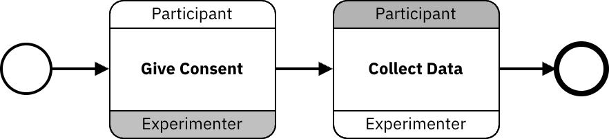

BPMN2 introduced choreography tasks that can be used to model multi-agent collaborative experiments. The choreography task is a specialized task that represents a sequence of interactions between two or more participants. Here is an example of a BPMN2 choreography task:

In the example above, we see choreography tasks that involve two participants: "Participant" and "Experimenter". The first task represents the "Participant" performing a task called "Give Consent". The same color is used for the task and the "Participant" to indicate that the task is initiated by the "Participant".

Studyflow extends this concept to allow for the modeling of human studies and multi-agent experiments in a more intuitive way. The following example shows how to model a multi-agent experiment using studyflow.
