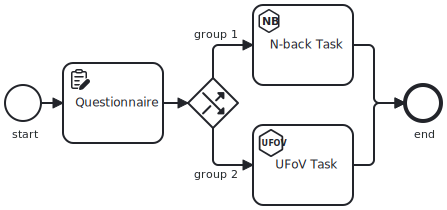
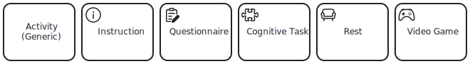

Studyflow is a visual language for defining research workflows and scientific experiments. It builds on <abbr title="Business Process Model and Notation" className="initialism">BPMN</abbr> and adds research-focused components to make it accessible to scientists.

This page is a quick, streamlined path to creating your first studyflow diagram. After completing this guide, you can explore more advanced topics in the [reference](../reference/) section.

## Requirements

- [Studyflow Modeler](https://behaverse.org/studyflow-modeler/) (web-based, no installation required)
- [List of Studyflow elements](reference/2-elements.mdx)
- A BPMN cheat sheet (optional, but helpful)

## Basic elements

A studyflow diagram is composed of a set of elements that define the structure and flow of the study. To get started, it's important to understand the core elements of the studyflow language:

**<i className="icon-[bi--circle]"></i>&nbsp; Event**: circles represent the start and end of a study, as well as intermediate events that can trigger actions.

**<i className="icon-[bi--square]"></i>&nbsp; Activity**: rectangles represent activities or steps in the study, such as cognitive tests, questionnaires, or instructions.

**<i className="icon-[bi--diamond]"></i>&nbsp; Gateway**: diamonds represent decision points that can alter the flow of the study based on conditions or randomization.

**<i className="icon-[bi--file-earmark]"></i>&nbsp; Data Object**: file-like shapes represent transient data produced or consumed by other elements.

**<i className="icon-[bi--database]"></i>&nbsp; Data Store**: cylinders represent persistent data storage, such as databases. Unlike data objects, data stores retain information beyond the scope of a single study instance.

**<i className="icon-[bi--arrow-return-right]"></i>&nbsp; Sequence Flow**: arrows connect events, activities, and gateways to define the order of elements.

Here is an example diagram:

<figure class="centered max-w-2xl">
  
  <figcaption>
    A simple studyflow diagram showing the experimental design of a study as a series of activities, events, and gateways.
  </figcaption>
</figure>

import Admonition from '@theme/Admonition';

<Admonition type="tip" icon="" title="">
For a detailed overview of the studyflow language, refer to the [***Reference***](../reference).
</Admonition>

## Graphical notation

Studyflow uses a specific graphical notation to convey the semantics of each element. Different types of activities, for example, can have different icons to indicate their type:

<figure class="centered max-w-2xl">
  
  <figcaption>
    Icons represent different types of activities in studyflow.
  </figcaption>
</figure>

These icons extend the standard BPMN icons. For a complete list, see [*Reference &rsaquo; Elements*](reference/2-elements.mdx).
