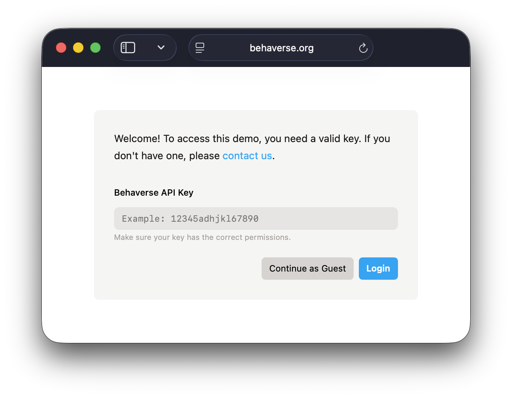
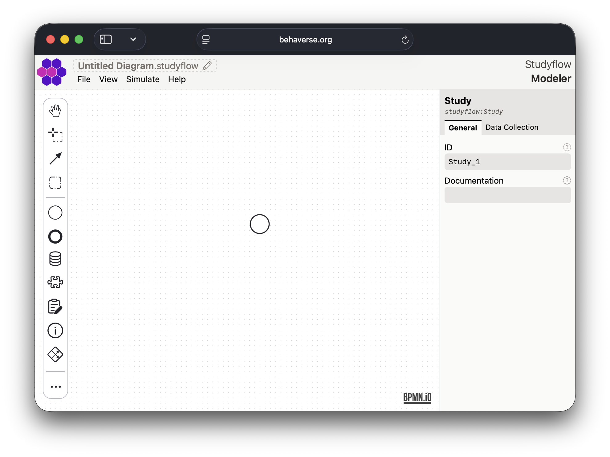
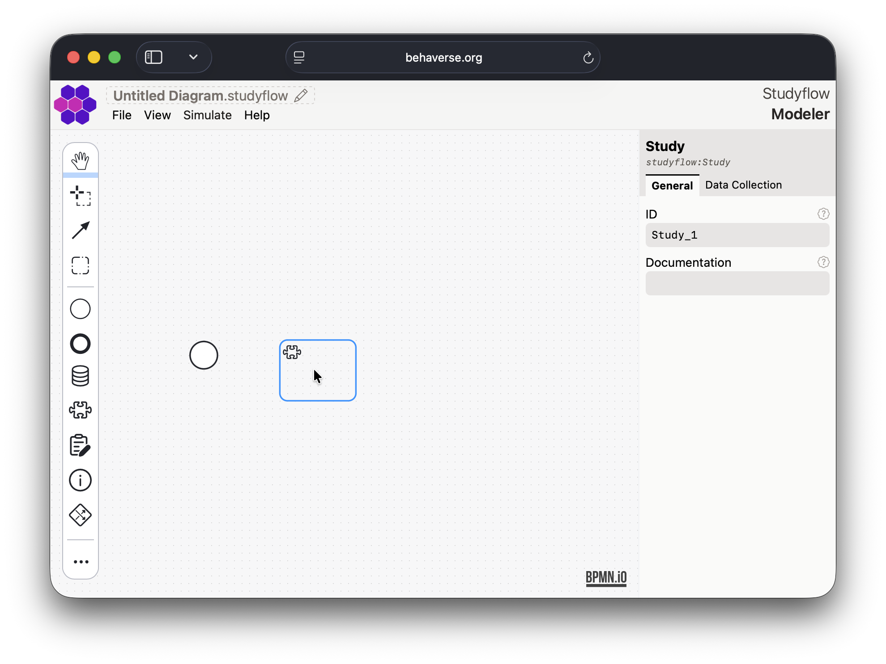
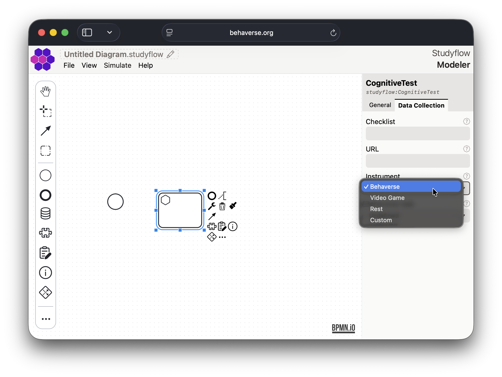
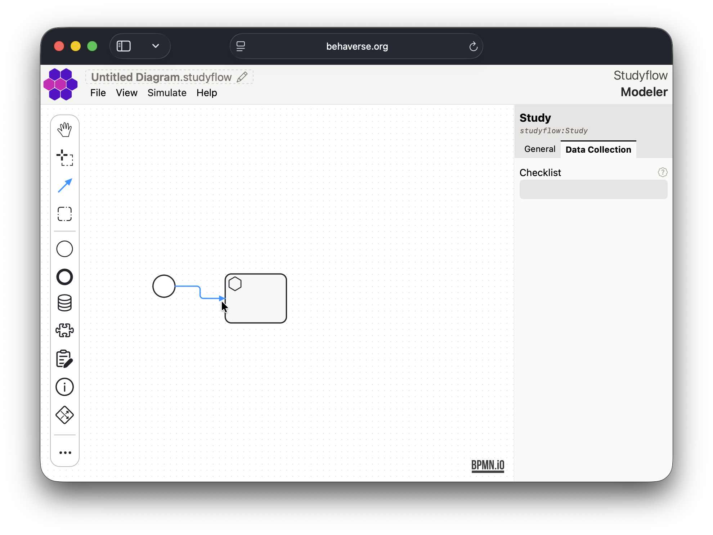
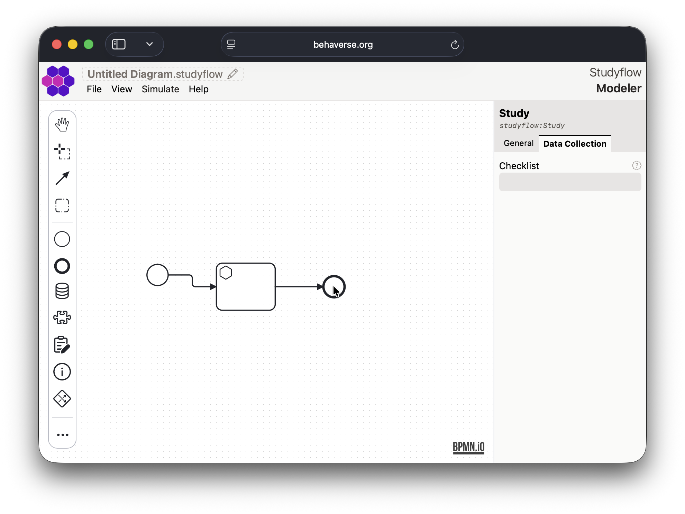
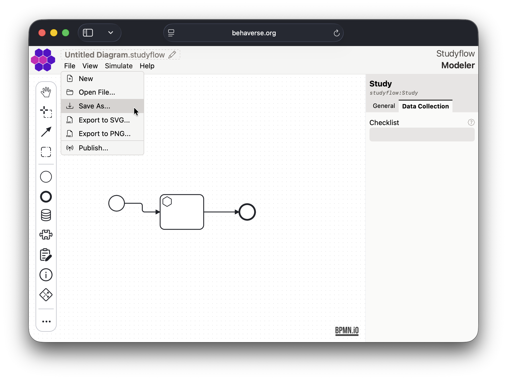
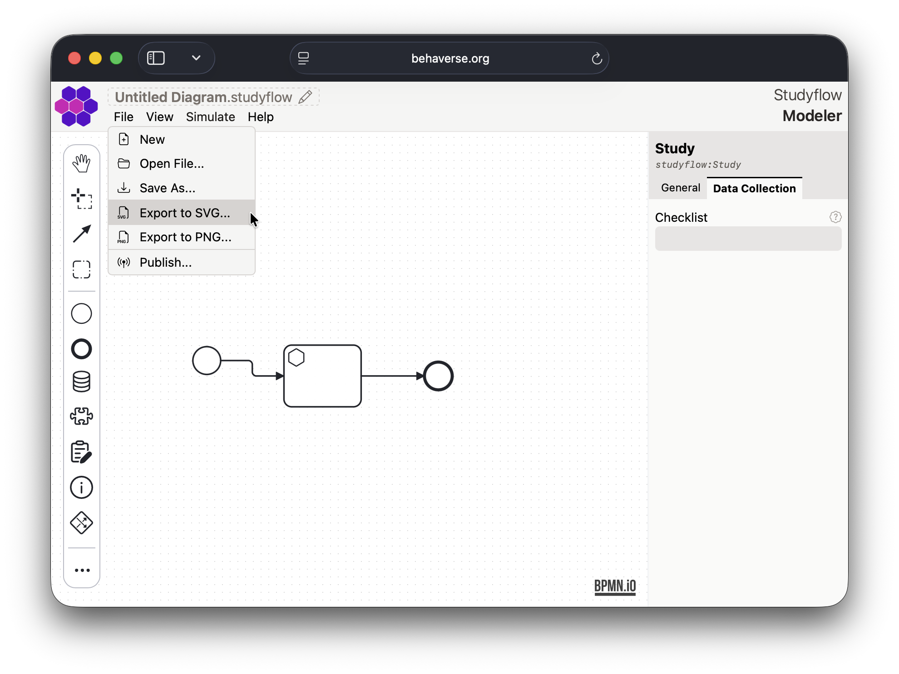
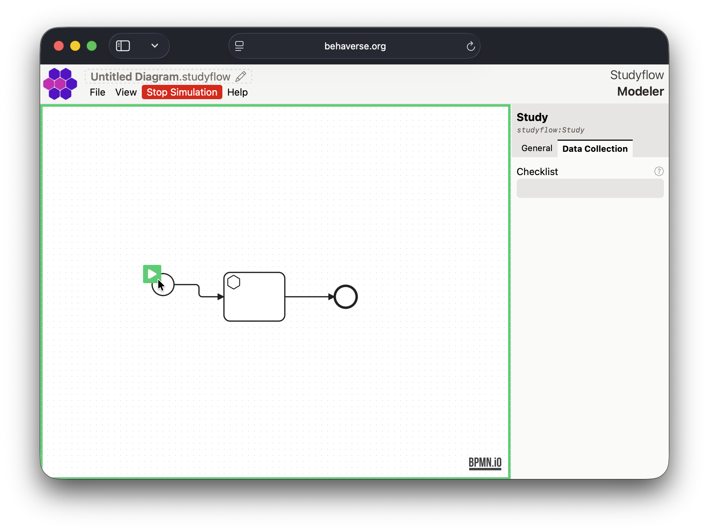
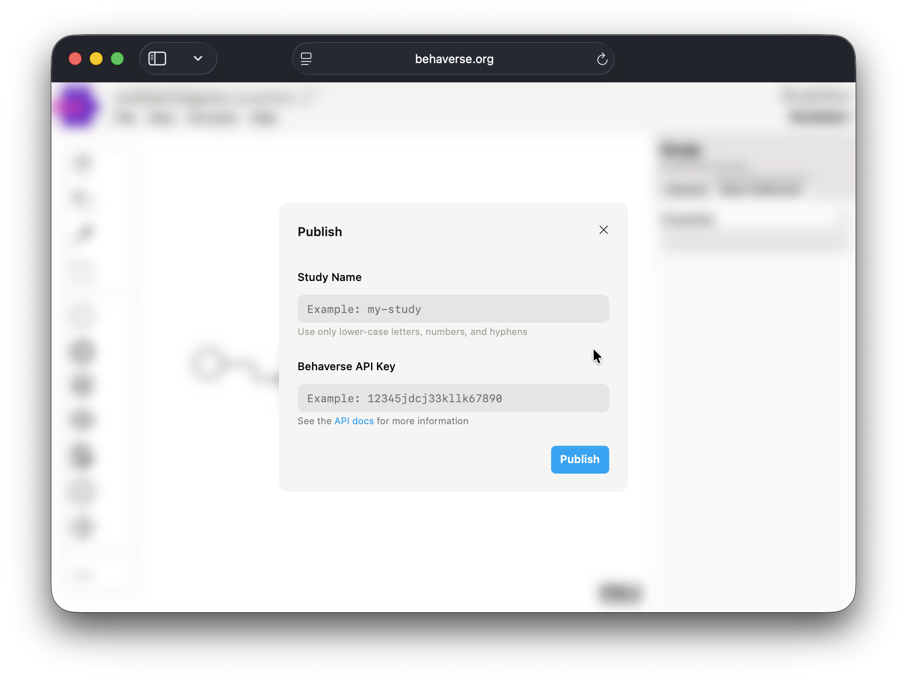

[*Studyflow Modeler*](https://behaverse.org/studyflow-modeler/) is a webapp to design and execute studyflow diagrams. With modeler, you can visually define every step of your study, from initial conception to subject recruitment, data collection, analysis pipelines, and final reporting.

## Key Features

- Drag-and-drop interface to create studyflow diagrams with nodes representing different studyflow elements.
- Predefined node types for common studyflow components such as cognitive tests, video games, questionnaires, and instructions.
- Export studyflow diagrams as XML, PNG, or SVG.
- Integration with Behaverse Data Server to run studies directly from the modeler app.
- Simulation mode to test and debug diagrams before deployment.

## Getting Started

1. Open the [Modeler app](https://behaverse.org/studyflow-modeler/app) in your web browser.

2. Enter your Behaverse API key and "Login" to access additional features, or just click "Continue as guest" to use the app in guest mode. The only limitation is that you cannot publish studies to the Behaverse Data Server.

3. Use the left palette to drag and drop elements onto the canvas.

4. Select an element to configure its properties in the right inspector sidebar.

5. Connect elements by selecting the connect tools in the left palette. First select the source element and then target element. The type of the connection will depend on the selected elements.

6. Add additional elements and connections to complete your diagram.

7. Save your diagram using the "Save As..." option in the "File" menu. The diagram will be saved as XML file (`*.studyflow`). Alternatively, you can export the diagram as an image using the export options.

## Simulation Mode

Once your diagram is complete, you can test it using the simulation mode. Click the "Stimulate" button in the top toolbar to start the simulation. This will allow you to interact with the studyflow as if it were running in a real study.

## Publishing Studies

If you have a Behaverse API key, you can publish your studyflow diagram directly to the Behaverse Data Server. Use the "Publish" option in the "File" menu to upload your diagram.

Once published, you can run the study on the Behaverse platform and collect data from participants.
