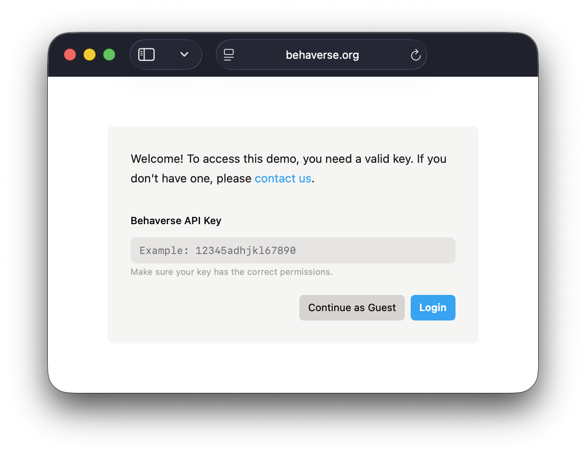
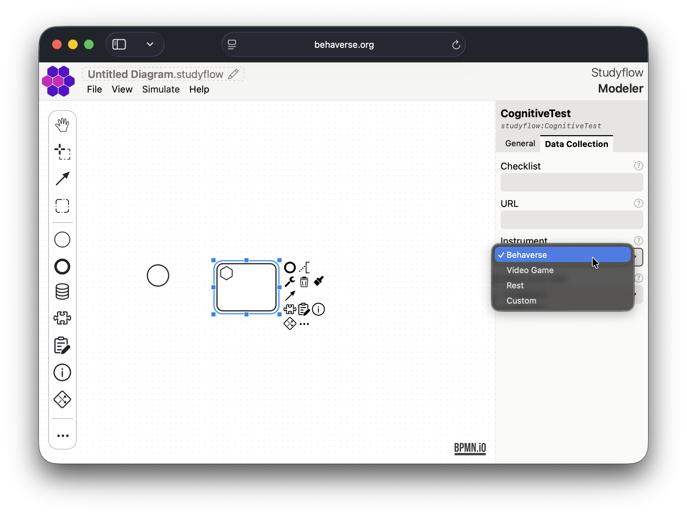
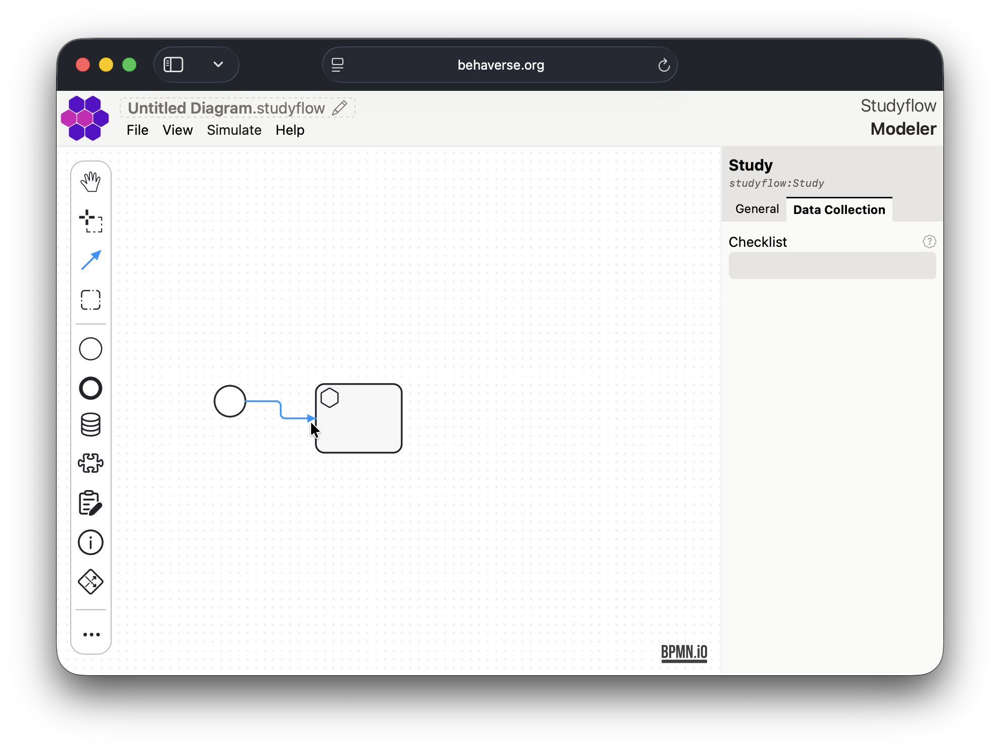
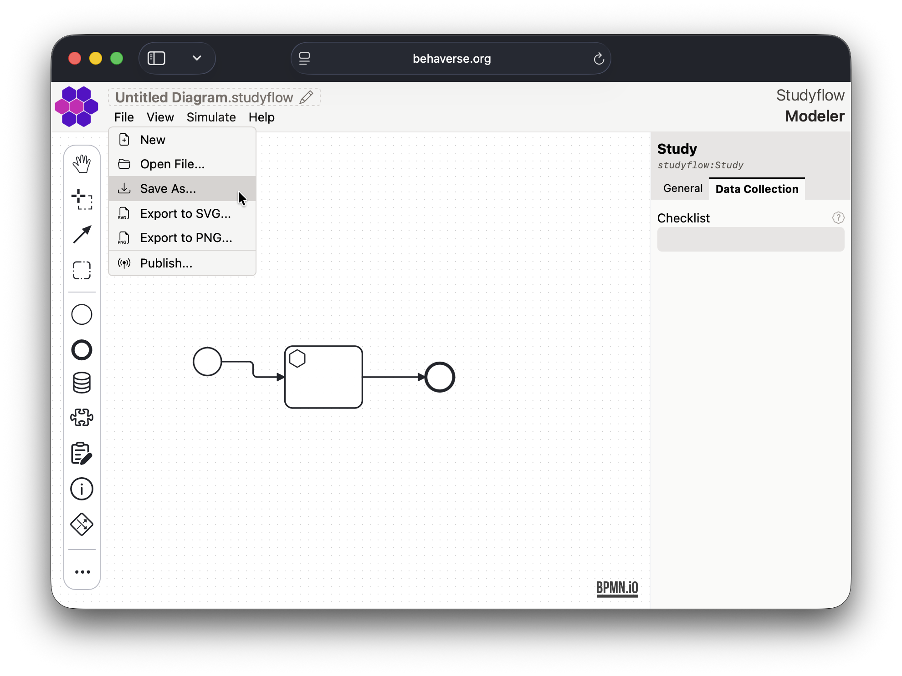

[*Modeler*](https://behaverse.org/studyflow-modeler/) is a webapp for designing and running studyflow diagrams. Its drag-and-drop interface helps you to visually define every step of your study, from initial conception, subject recruitment, data collection, and analysis pipelines to final reporting.

## Key features

- Drag-and-drop interface.
- Predefined node types for common research elements (e.g., cognitive tests, video games, questionnaires, and instructions).
- Export studyflow diagrams as XML, PNG, or SVG.
- Integration with *Behaverse Data Server* to execute diagrams directly from the modeler.
- Simulation mode to test and debug diagrams.

## Creating a diagram

1. Open the [Modeler app](https://behaverse.org/studyflow-modeler/app) in your web browser.

2. Enter your Behaverse API key and click Login to access additional features, or click Continue as guest to use the app in guest mode. The only limitation is that you cannot publish studies to the Behaverse Data Server.

<figure class="centered max-w-md">
  
  <figcaption>Login screen</figcaption>
</figure>

<figure class="centered max-w-md">
  
  <figcaption>Initial screen</figcaption>
</figure>

3. Use the left palette to drag and drop elements onto the canvas.

<figure class="centered max-w-md">
  
  <figcaption>Drag and drop elements</figcaption>
</figure>

4. Select an element to configure its properties in the right inspector sidebar.

<figure class="centered max-w-md">
  
  <figcaption>Inspector sidebar</figcaption>
</figure>

5. Connect elements by selecting the connect tool in the left palette. First select the source element and then the target element. The type of the connection will depend on the selected elements.

<figure class="centered max-w-md">
  
  <figcaption>Connect tool</figcaption>
</figure>

6. Add additional elements and connections to complete your diagram.

<figure class="centered max-w-md">
  
  <figcaption>Completed diagram</figcaption>
</figure>

7. Save your diagram using the "Save As..." option in the "File" menu. The diagram will be saved as an XML file (`*.studyflow`). Alternatively, you can export the diagram as an image using the export options.

<figure class="centered max-w-md">
  
  <figcaption>File menu options</figcaption>
</figure>

<figure class="centered max-w-md">
  
  <figcaption>Export options</figcaption>
</figure>

## Simulation mode

Once your diagram is complete, you can test it using the simulation mode. Click the "Simulate" button in the top toolbar to start the simulation. This will allow you to interact with the studyflow as if it were running in a real study.

<figure class="centered max-w-md">
  
  <figcaption>Simulation mode</figcaption>
</figure>

## Publishing studies

If you have a Behaverse API key, you can publish your studyflow diagram directly to the Behaverse Data Server. Use the "Publish" option in the "File" menu to upload your diagram.

<figure class="centered max-w-md">
  
  <figcaption>Publish option</figcaption>
</figure>

Once published, you can run the study on the Behaverse platform and collect data from participants.
