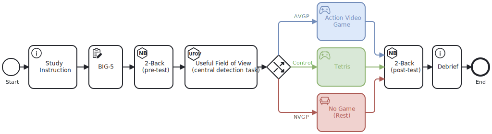

Describing experimental research can be complex and ambiguous.

*Studyflow* is a visual language to communicate research experiments in an unambiguous way. It extends <abbr title="Business Process Model and Notation" class="initialism">BPMN</abbr>**BPMN**: Business Process Model and Notation. [https://en.wikipedia.org/wiki/BPMN](https://en.wikipedia.org/wiki/BPMN) to describe scientific research in a more concise way than texts or static graphics.

At studyflow's core is the idea that scientific experiments can be represented as a series of basic elements (events, activities, decisions, and data). These elements can be organized into a flowchart-like diagram, which can be easily understood by humans (because it is visual) and machines (because it is formal and serializable).

Studyflow diagrams are human-friendly, machine-readable, and executable. Here is an example:

## What can I do with studyflow?

Studyflow diagrams can be used for various purposes, including:

- **Designing experiments**: plan and visualize the steps of your study before conducting it.
- **Documenting protocols**: create clear and detailed representations of your experimental procedures.
- **Communicating methodologies**: share your workflows with collaborators, reviewers, funders, and other stakeholders in varying degrees of detail.
- **Automating workflows**: integrate with tools to automate data collection, analysis, and reporting.
- **Reproducing studies**: facilitate replication of experiments by providing a structured representation of the study design and analysis. Parts of existing studyflows can be adapted for new experiments, promoting reusability.
- **Reporting and publication**: include studyflows in research papers to enhance transparency and understanding.

## Why studyflow?

Trusting science requires rigor and reproducibility, hence clear communication of the scientific experiments has become one of the cornerstones of good scientific practices.

Following the need for clear communication, many scientists rely on detailed description of data and protocols in manuscripts, diagrams, reporting guidelines, checklists, and more-or-less standard softwares; all to provide enough details to reproduce the findings.

In parallel, as we increasingly rely on machines to facilitate research, trust in code and data are becoming more and more critical. The need for reproducibility has become essential for building trust in automated processes, especially at scale when using various large models.

The context of studyflow is how scientific workflows and everything related to that (study protocols, experimental designs, data, analysis, reporting, etc) can be communicated for rigor and reproducibility. Studyflow is a formal domain-specific language to represent research processes (and data) for various stakeholders using a single cohesive diagram. Studyflow diagrams facilitate communication with participants (e.g., by automatically running a study), researchers (e.g., by reproducible protocols and analyses), systems (e.g., by automated data processing), and other stakeholders.

## Next steps

The [*Getting Started*](getting-started.md) page is a good place to start if you are new to studyflow. It provides an overview of the main concepts and available tools.

The remaining documentation is structured as follows:

- **Guides**: tutorials and how-tos for creating studyflows.
- **Specifications**: fundamental concepts and design decisions for effective communication of scientific experiments.
- **Use cases**: examples of studyflows for different scenarios.

You can also find information about:

- **Modeler**: webapp to create and simulate studyflows.
- **Runner** (experimental): deploy and execute studyflows.

## Get in touch

Studyflow is an open source project, and everyone is welcome to contribute. If you have any questions or suggestions, please [visit our GitHub](https://github.com/behaverse). You can also reach out to us by email at [contact@xcit.org](mailto:contact@xcit.org).
