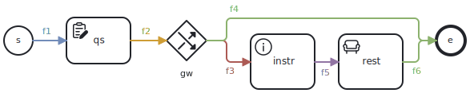

Studyflow is a domain-specific language for specifying scientific processes and their associated data. It extends the BPMN 2.1 standard to fit the specific needs of experimental sciences.

## Formal definition

A studyflow diagram is a $S = (N, E, T, \tau, \lambda)$ tuple, where $N$ is a finite set of elements, $E\subseteq N\times N$ represents sequence flows (edges), $T$ is a set of pre-defined node types (events, activities, gateways, data), $\tau: N \rightarrow T$ is a typing function that assigned types (events, activities, gateways, data) to the nodes, and $\lambda$ is a labeling function that assigns additional attributes to the nodes (e.g., metadata, triggers, gateway logic, implementation). The elements, $N$, are connected by directed edges, $E$, forming a directed graph that represents the flow of the study.

$N$ can be further divided into subsets based on the type of elements ($T$). For example, $N_{E} \subseteq N$ represents the set of events (e.g., start and end events), $N_{A} \subseteq N$ represents the set of activities (e.g., tasks, sub-processes), and $N_{G} \subseteq N$ represents the set of gateways (e.g., randomizer, decision points, parallel splits). $N_{D} \subseteq N$ represents data objects that can be used to store and manipulate data within the studyflow. Each subset has its own specific attributes and behaviors defined by the $\lambda$ function.

The main components of the $S$ tuple are described in the BPMN 2.1 specification, and studyflow extends them with additional types and attributes to better suit the needs of experimental studies. More specifically:

- $N_A$ (activities) is extended with specific activity types relevant to experimental studies, such as cognitive tests, questionnaires, instructions, rest periods, and video games.
- $N_G$ (gateways) is extended with a random gateway type, which allows for random assignment of participants to different branches of the study based on specified probabilities or conditions.
- $N_D$ (data objects) can be used to represent data collected during the study, such as participant responses, physiological measurements, or other relevant data. It also support standard data formats (e.g., BIDS, BDM, Psych-DS) and can include attributes for data validation and preprocessing.
- $\lambda$ (attributes) is extended to include attributes specific to experimental studies or data analysis, such as metadata (e.g., study name, version), event triggers (e.g., temporal, errors), gateway logic (e.g., randomization probabilities, conditional logics), and implementation details (e.g., links to external scripts or software).
- $E$ (edges) can include group assignments, indicating which paths participants should follow based on their assigned group.
- $S$ can also include design patterns commonly used in experimental studies, such as counterbalancing, recruitment, exception handling, and data quality checks.


## Grammar

The grammar below defines the structure of a studyflow diagram using the EBNF notation (included for reference only).

<details>
<summary>**Studyflow EBNF grammar** (click to expand)</summary>

```ebnf

/* ========== Top level ========== */

Definitions       ::= Study*
Study             ::= 'Study' Identifier Attribute* (Element | SequenceFlow)*
SubProcess        ::= 'SubProcess' Identifier Attribute* (Element | SequenceFlow | DataAssociation)*
Element           ::= Event | Activity | Gateway | SubProcess | DataObject | Dataset | DataCatalog | Table

/* ========== Events ========== */

Event             ::= StartEvent | EndEvent
StartEvent        ::= 'StartEvent' Identifier Attribute*
EndEvent          ::= 'EndEvent' Identifier Attribute*

/* ========== Activities ========== */

Activity              ::= 'Activity' Identifier ActivityAttributeList Choreography?
ActivityAttributeList ::= ActivityType ActivityAttribute*
ActivityType          ::= '@type' ('CognitiveTest' | 'Questionnaire' | 'Instruction' |
                                   'Rest' | 'VideoGame' | 'Script' | 'Manual')
ActivityAttribute     ::= Attribute | DataInput | DataOutput | DataOperation

/* ========== Data transformations ========== */

DataOperation      ::= OpClause+
OpClause           ::= '@op' (PrimitiveOp | CompositeOp) DataInput+ DataOutput+
PrimitiveOp        ::= 'Transform' | 'Map' | 'Filter' | 'FlatMap' | 'Reduce' | 'Group'
CompositeOp        ::= 'Compose' PrimitiveOp+

/* ========== Data elements ========== */

DataCatalog        ::= 'DataCatalog' Identifier Attribute*
Dataset            ::= 'Dataset' Identifier Attribute* DataCatalog
Table              ::= 'Table' Identifier Attribute* DatasetRef SchemaRef
DataObject         ::= 'DataObject' Identifier Attribute*
DataStore          ::= 'DataStore' Identifier Attribute*
DataInput          ::= '@in' NodeRef
DataOutput         ::= '@out' NodeRef

/* ========== Choreography ========== */

Choreography     ::= 'Choreography' Attribute* ParticipantRef+ InitiatingParticipant? MessageFlowList
ParticipantRef   ::= ProcessRef
InitiatingParticipant ::= ParticipantRef
MessageFlowList  ::= MessageFlow*
MessageFlow      ::= 'MessageFlow' Identifier Attribute* ParticipantRef '→' ParticipantRef

/* Gateway definitions */
Gateway          ::= 'Gateway' Identifier GatewayAttribute*
GatewayAttribute ::= GatewayType | Attribute
GatewayType      ::= '@type' ('Random' | 'Exclusive' | 'Complex')
SequenceFlow     ::= 'SequenceFlow' Identifier Attribute* NodeRef '→' NodeRef

/* Common definitions */
Attribute             ::= Identifier Value
ProcessRef            ::= Identifier
NodeRef               ::= Identifier

/* Basic value types */
Boolean    ::= 'true' | 'false'
Value      ::= String | Number | Boolean | Identifier
Number     ::= '-'? ( [0-9]+ ('.' [0-9]*)? | '.' [0-9]+ )
String     ::= '"' [^"]* '"'
Identifier ::= [A-Za-z] [A-Za-z0-9_]*
```
</details>


An example studyflow in this formalism is shown below:

<details>
<summary>Example studyflow (click to expand)</summary>

```ini
Study exampleStudy
  StartEvent s

  Activity qs
    @type Questionnaire
    language "en"
    text "What is your age?"

  Gateway gw
    @type Random
    condition "ageGroup"

  Activity instr
    @type Instruction
    text "Follow carefully"

  Activity rest
    @type Rest
    duration 5

  EndEvent e

  SequenceFlow f1 s → qs
  SequenceFlow f2 qs → gw
  SequenceFlow f3 gw → instr
  SequenceFlow f4 gw → e
  SequenceFlow f5 instr → rest
  SequenceFlow f6 rest → e
```
</details>

Which can be visualized as an extended BPMN diagram:

<figure class="centered">
  
  <figcaption>The same studyflow visualized using BPMN notation</figcaption>
</figure>

This diagram can also be represented in machine-readable formats:

<details>
<summary>**XML/BPMN** serialization (click to expand)</summary>

```xml
<?xml version="1.0" encoding="UTF-8"?>
<bpmn2:definitions
  xmlns:bpmn2="http://www.omg.org/spec/BPMN/20100524/MODEL"
  xmlns:studyflow="http://behaverse.org/schema/studyflow"
  id="example-diagram">
  <studyflow:study id="exampleStudy" isExecutable="false">
    <bpmn2:startEvent id="s" name="s">
      <bpmn2:outgoing>f1</bpmn2:outgoing>
    </bpmn2:startEvent>
    <studyflow:questionnaire
        id="qs"
        name="qs"
        type="studyflow:Questionnaire"
        language="en"
        text="What is your age?">
      <bpmn2:incoming>f1</bpmn2:incoming>
      <bpmn2:outgoing>f2</bpmn2:outgoing>
    </studyflow:questionnaire>
    <bpmn2:sequenceFlow id="f1" name="f1" sourceRef="s" targetRef="qs" />
    <studyflow:randomGateway
        id="gw"
        name="gw"
        type="studyflow:RandomGateway"
        condition="ageGroup">
      <bpmn2:incoming>f2</bpmn2:incoming>
      <bpmn2:outgoing>f3</bpmn2:outgoing>
      <bpmn2:outgoing>f4</bpmn2:outgoing>
    </studyflow:randomGateway>
    <bpmn2:sequenceFlow id="f2" name="f2" sourceRef="qs" targetRef="gw" />
    <studyflow:instruction
        id="instr"
        name="instr"
        type="studyflow:Instruction"
        text="Follow carefully">
      <bpmn2:incoming>f3</bpmn2:incoming>
      <bpmn2:outgoing>f5</bpmn2:outgoing>
    </studyflow:instruction>
    <bpmn2:sequenceFlow id="f3" name="f3" sourceRef="gw" targetRef="instr" />
    <studyflow:rest
        id="rest"
        name="rest"
        type="studyflow:Rest"
        duration="5">
      <bpmn2:incoming>f5</bpmn2:incoming>
      <bpmn2:outgoing>f6</bpmn2:outgoing>
    </studyflow:rest>
    <bpmn2:sequenceFlow id="f5" name="f5" sourceRef="instr" targetRef="rest" />
    <bpmn2:endEvent id="e" name="e">
      <bpmn2:incoming>f6</bpmn2:incoming>
      <bpmn2:incoming>f4</bpmn2:incoming>
    </bpmn2:endEvent>
    <bpmn2:sequenceFlow id="f6" name="f6" sourceRef="rest" targetRef="e" />
    <bpmn2:sequenceFlow id="f4" name="f4" sourceRef="gw" targetRef="e" />
  </studyflow:study>
</bpmn2:definitions>
```

</details>


<details>
<summary>**YAML** serialization (click to expand)</summary>

```yaml
study:
  @id: exampleStudy
  elements:
    - @type: bpmn2:StartEvent
      @id: s
      outgoing: [f1]
    - @type: studyflow:Questionnaire
      @id: qs
      attributes:
        - language: en
        - text: What is your age?
      incoming: [f1]
      outgoing: [f2]
    - @type: studyflow:RandomGateway
      @id: gw
      attributes:
        - condition: ageGroup
      incoming: [f2]
      outgoing: [f3, f4]
    - @type: studyflow:Instruction
      @id: instr
      attributes:
        - text: Follow carefully
      incoming: [f3]
      outgoing: [f5]
    - @type: studyflow:Rest
      @id: rest
      attributes:
        - duration: 5
      incoming: [f5]
      outgoing: [f6]
    - @type: bpmn2:EndEvent
      @id: e
      incoming: [f4, f6]
```
</details>
