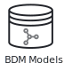

The main element of a studyflow diagram is the *Study*, which serves as a container for all other elements:

<figure className="centered max-w-md">
  
  <figcaption className="text-left">
    **Study** represents the entire research project, including all the processes from experimental design to deployment and publication. It extends `bpmn:Process` and is the top-level container for all elements and workflows.
  </figcaption>
</figure>

Within a *Study* element, you can define various elements. In addition to the standard BPMN elements, Studyflow introduces specialized elements for research workflows in cognitive sciences in four main categories: *events*, *activities*, *gateways*, and *data*.

## Events

  <figure className="centered">
    
    <figcaption className="text-left">
      **Start Event** defines the beginning of the workflow. It can be conditioned on participants giving informed consent, supporting the ethical and legal requirements.
    </figcaption>
  </figure>

  <figure className="centered">
    
    <figcaption className="text-left">
      **End Event** marks the conclusion of the workflow, indicating the completion of all steps within the study. It can redirect to a different workflow or terminate the study, typically after all the data has been collected.
    </figcaption>
  </figure>

## Activities

  <figure className="centered">
    
    <figcaption>
      **Instructions** provide detailed guidelines and information to participants about the study procedures.
    </figcaption>
  </figure>

  <figure className="centered">
    
    <figcaption>
      **Questionnaires** are used to gather self-reported data from participants.
    </figcaption>
  </figure>

  <figure className="centered">
    
    <figcaption>
      **Cognitive Tests** represent various cognitive assessment tests within the experiment.
    </figcaption>
  </figure>

  <figure className="centered">
    
    <figcaption>
      **Video Games** are interactive games as part of the experimental paradigm.
    </figcaption>
  </figure>

  <figure className="centered">
    
    <figcaption>
      **Behaverse Tasks** are standardized cognitive tests covering a range of attentional, perceptual, cognitive and motor abilities. See [Behaverse assessment](https://behaverse.org/projects/cognitive-tests.html) for a list.
    </figcaption>
  </figure>

  <figure className="centered">
    
    <figcaption>
      **Rest** periods are intervals of inactivity or minimal activity within the workflow, often used for baseline measurements or to provide breaks between activities. This element can also be used to record resting-state signals.
    </figcaption>
  </figure>

## Gateways

  <figure className="centered">
    
    <figcaption className="text-left">
      **Random Gateway** represents a randomizer at a decision point in the workflow where only one of several possible paths can be taken.
    </figcaption>
  </figure>

  <figure className="centered max-w-[240px]">
    
    <figcaption>
      Example use of *Random Gateway* to branch a flow.
    </figcaption>
  </figure>

## Data

  <figure className="centered">
    
    <figcaption>
      **Data Store** and **Dataset** persist data (e.g., events, trials, etc) and facilitate the integration of standard data models. See [the **Data** reference page](../reference/3-data.mdx) for more details.
    </figcaption>
  </figure>

  <figure className="centered">
    
    <figcaption>
      **Data Object** represents any data entity within the workflow, such as files, data, or data streams. It can be used to model inputs and outputs of activities and data transformations.
    </figcaption>
  </figure>

The current version studyflow includes built-in support for several data models commonly used in cognitive sciences, including:

  <figure className="centered">
    
    <figcaption>
      Behaverse [Events](https://behaverse.org/data-model/spec/events/index.html) data model
    </figcaption>
  </figure>

  <figure className="centered">
    
    <figcaption>
      Behaverse [Trials](https://behaverse.org/data-model/spec/trials/index.html) data model
    </figcaption>
  </figure>

  <figure className="centered">
    
    <figcaption>
      BDM [Statistics & Models](https://behaverse.org/data-model/spec/#)
    </figcaption>
  </figure>

  <figure className="centered">
    
    <figcaption>
      [Brain Imaging Data Structure](https://bids.neuroimaging.io/)
    </figcaption>
  </figure>

  <figure className="centered">
    
    <figcaption>
      [Psych-DS](https://psych-ds.github.io/) dataset standard
    </figcaption>
  </figure>

  <figure className="centered">
    
    <figcaption>
      [Kedro datasets](https://docs.kedro.org/projects/kedro-datasets/)
    </figcaption>
  </figure>

