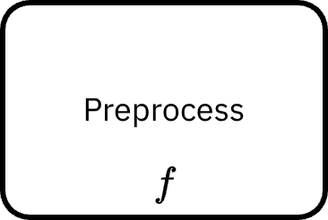

## Data elements in BPMN and Studyflow

The underlying standard for Studyflow, BPMN, is primarily designed for modeling processes, but also includes generic constructs for representing data within workflows. It uses *Data Object* and *Data Store* to represent elements that contain or manage data. These elements can be connected to activities as inputs or outputs using data association edges.

<details className="indigo">
  <summary>`DataStore` <span class="badge float-right">BPMN</span></summary>

  Persistent storage of data that can be accessed across multiple process instances. For example, a database or file system. `DataStoreReference` can be used as a pointer to a `DataStore`.
</details>


<details className="indigo">
  <summary>`DataObject` <span class="badge float-right">BPMN</span></summary>

  Represents data that is used or produced within a process instance. It can be thought of as a document, file, or any other piece of information that flows through the process. 
  
  - `DataObjectReference` can be used as a pointer to a `DataObject`.
  - The state annotations can be used to show the condition of a data object at a specific point in a process. For example, "trial data [raw]", "trial data [processed]".

</details>

<details className="indigo">
  <summary>`DataAssociation` <span class="badge float-right">BPMN</span></summary>

  Connects data to other workflow elements, such as tasks or events. They indicate the flow of data into and out of these elements. Note that it indicated data flow, which is not part of the process flow itself.

</details>

Studyflow refines BPMN to better match common practices in data-centric workflows, including specific data structures and operations commonly used in data processing.

<details className="green">
  <summary>`DataCatalog` <span class="badge float-right">STUDYFLOW</span></summary>

  A persistent repository of datasets that can be referenced across multiple process instances. For example, `openneuro` or `behaverse` catalogs.
</details>

<details className="green">
  <summary>`Dataset` <span class="badge float-right">STUDYFLOW</span></summary>

  A logical collection (possibly multi-table, multi-modal). Dataset attributes may include a schema (column names, types, units) and optional ontology to connect elements to standard vocabularies.
</details>

<details className="green">
  <summary>`Schema` <span class="badge float-right">STUDYFLOW</span></summary>

  A formal description of the structure of a named collection of types. It can be thought of as column definitions for tabular data (column names, data types, units, constraints). For non-tabular data, it can describe dimensions, data types, and other relevant metadata.
</details>


<details className="green">
  <summary>`Table` <span class="badge float-right">STUDYFLOW</span></summary>

  A named tabular structure within a `Dataset`. Tables are explicitly linked to a schema via the `Dataset` or individually via a CSVW schema. Extends `DataObject` and expects a schema. Table schemas can be defined using standards such as CSVW (CSV on the Web) or other relevant formats.
</details>

<details className="green">
  <summary>`Array` <span class="badge float-right">STUDYFLOW</span></summary>

  A multi-dimensional array structure for non-tabular data (e.g., tensors, images, videos, fMRI data). Extends `DataObject` and expects a schema.
</details>

<details className="green">
  <summary>`Snapshot` <span class="badge float-right">STUDYFLOW</span></summary>

  An immutable version of a dataset, a table, or an array. Snapshots are typically associated with a specific point in the workflow or a version control commit.
</details>

In summary, `DataStore` is a physical/persistent store (database, filesystem, S3 bucket, etc.), `DataCatalog` is a registry of datasets (potentially across multiple stores), `Dataset` is a logical collection, and `Table`/`Array` are concrete components of a dataset.

Also note that, while experimental data is generally assumed to be tabular, `Dataset` supports other data types (i.e., `DataObject` or `Array`, including images, videos, brain imaging, and raw sensor recordings).

## Data operators

Data operators are studyflow-specific markers to describe how data is manipulated as it flows through the process. They are designed to facilitate data processing within workflows and inspired by [higher-order functions](https://en.wikipedia.org/wiki/Higher-order_function) in functional programming. An operator could be implemented as usual BPMN tasks, such as script task or service task, and the operator marker serves as a semantic annotation to indicate that the task is performing a specific type of data transformation.

<figure className="centered max-w-2xl">
<div class="max-w-[160px]">
  
</div>
  <figcaption className="italic">
    Data operators are rendered as small markers ($f$) on tasks. The task remains a normal BPMN task and the marker specifies that its logic is a pure data transformation. This keeps Studyflow diagrams close to BPMN while making data-centric behavior explicit through operators.
  </figcaption>
</figure>


Here are the core data operators currently supported:


<details className="green">
  <summary>`transform` <span class="badge float-right">$f$</span></summary>

  Applies a specified transformation to the input data, producing a new dataset as output. This is the generic form of data operations and can be specialized into more specific operators (see below). A transform represents a pure function that takes one or more data as input and produces a data output.
</details>

<details className="green">
  <summary>`map` <span class="badge float-right">$f$</span></summary>

  Applies a element-wise function to each item in the input. used for element-wise operations.
</details>

<details className="green">
  <summary>`filter` <span class="badge float-right">$f$</span></summary>

  Selects a subset of data based on specified criteria. Used for conditional selection (1 -> subset(1)). The different between filtering and data-driven gateways in BPMN is that filtering changes the dataset, but gateways change the control flow. They are complementary.
</details>

<details className="green">
  <summary>`reduce` <span class="badge float-right">$f$</span></summary>

  Aggregates data by applying a function that combines multiple input values into a single output value. Used for summarization or joining operations (N -> 1 per group or for the entire dataset).
</details>

<details className="green">
  <summary>`group` <span class="badge float-right">$f$</span></summary>

  Organizes data into groups based on specified attributes. Used for categorization and clustering (1 -> G groups). It changes the data structure to a grouped format.
</details>

<details className="green">
  <summary>`compose` <span class="badge float-right">$f$</span></summary>

  Combines multiple data operations into a single complex pipeline. Used for modularity and reusability.
</details>

<details className="green">
  <summary>`flatMap` <span class="badge float-right">$f$</span></summary>

  Similar to map, but flattens the resulting data array into a single output array. Used for one-to-many mappings (1 -> N). Relevant to unnesting in data wrangling libraries.
</details>


:::info[**Batch vs. Streaming**]

Some operators are stateless (map, filter) and works best for batch processing, while others are inherently stateful (reduce, group) and may require special handling for streaming data.

:::


## Example

The following example illustrates the use of data elements and operators within a research workflow to collect and analyze response times from a 2AFC cognitive task. The data analysis pipeline is encapsulated within a subprocess for clarity.

<details class="note">
  <summary>View example code</summary>

```{.ini}
Study RTAnalysis

  StartEvent s
  EndEvent e

  DataCatalog behaverse
    url "https://behaverse.org/catalog"

  DataStore ducklake
    kind "duckdb+parquet"
    url "s3://behaverse/rt/ducklake"

  Dataset study_dataset
    catalog behaverse
    store ducklake

  Table trials_raw
    dataset study_dataset
    schema "schema/trials_raw.csvw"

  Table trials_summary
    dataset study_dataset
    schema "schema/trials_summary.csvw"

  Activity CollectTrials
    @type CognitiveTask
    description "Run 2AFC task"

  SubProcess RTAnalysisPipeline
    StartEvent sub_s
    EndEvent sub_e

    # internal data objects (scoped to subprocess)
    DataObject trials_in
    DataObject trials_out

    # outer data associations: connect external tables to internal nodes
    dataInputAssociation
      sourceRef trials_raw          # external
      targetRef trials_in           # internal name
    dataOutputAssociation
      sourceRef trials_out          # internal name
      targetRef trials_summary      # external

    Task t1
      @in trials_in
      @out trials_out
      @op compose
        transformTables
        filter
        map
        group
        reduce

    SequenceFlow sf1 sub_s → t1
    SequenceFlow sf2 t1    → sub_e

  SequenceFlow f1 s                    → CollectTrials
  SequenceFlow f2 CollectTrials        → RTAnalysisPipeline
  SequenceFlow f3 RTAnalysisPipeline   → e
```

</details>

This is roughly equivalent to:

```{.r}
trials_summary <- trials_raw |>
  filter(correct == 1) |>
  mutate(
    log_rt = log(rt),
    rt_z   = (rt - mean(rt)) / sd(rt)
  ) |>
  group_by(agent_id, condition) |>
  summarize(
    rt_mean = mean(rt),
    rt_sd   = sd(rt),
    .groups = "drop"
  )
```


## Planned updates

- `Timeseries`, `Event` data structures for multi-dimensional physiological and behavioral data.
- `transformTables`: Special case of `transform` that applies a series of transformations to tabular data, such as adding, removing, or modifying columns. The result is one or more new tables based on the specified transformations (1+ tables -> 1+ tables).
- `loadData`, `saveData`, `exportData`: storage operations (loading from and saving to catalogs, stores, and files). Note that, data operations are pure and side-effect free. I/O and external systems are handled by dedicated elements.

- `anonymizeData`, `validateData`, `controlAccess`: data governance and regulatory compliance operations (de-identification, validation, data cleaning, and access control).
- Stochastic operations (e.g., sampling, bootstrapping).
- Canonical data-wrangling operations (mirroring tidyverse functionality but expressed at workflow level):
  - `splitData` (e.g., train/validation/test splits).
  - `cleanData` (e.g., handling missing values, outliers).
  - Join/merge operators for relational integration.
  - `sort`, `arrange`, `selectColumns`, `renameColumns`, `pivot`, `select`, `mutate`, `summarize` as specialized `transformTables` variants.
