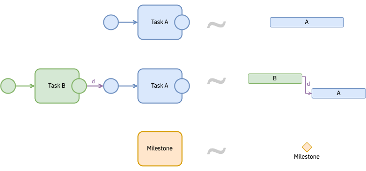
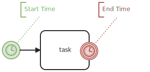

The same studyflow diagram can be viewed in different ways depending on the stakeholder's needs:

- **Study View**: A high-level BPMN-like overview of the study, showing all the components, their relationships, and properties.
- **Timeline View**: A Gantt-like chronological chart of the time-sensitive elements, showing the sequence of tasks and milestones. This view automatically identifies temporal patterns of the workflow, making it easier to manage and report the timeline of the study.
- **Checklist View**: A task-oriented view that lists all the tasks, their corresponding checklist items and status.

## Timelines

Experimental research often involves time-related activities and constraints. The visual representations of activities also require elements along the time axis such as timelines, temporal dependencies, and deadlines. Timelines provide temporal ordering of activities and events (e.g., trial timelines, CONSORT, SPIRIT, etc.) which can be effectively modeled using timer events in BPMN, and visualized as Gantt charts.

BPMN already provides some support for temporal modeling, such as timer events and triggers, which can be used to model the timing of tasks and events within a workflow. However, there is no direct or native way to represent duration of the activities, start and end times, or progress of the tasks in BPMN. This is a significant limitation when modeling scientific workflows where time is a key factor in the design and execution of the study, such as in showing trial timelines, standard flow figures (e.g., SPIRIT), or longitudinal studies.

To address this, Studyflow extends BPMN elements with properties that allow modeling temporal aspects of the activities. These additional properties are not part of the BPMN standard but are essential for scientific workflows. They can be represented as attributes of the activities or as separate elements that are linked to the activities. These properties include:

- Start/end time: The time when specific activity is to begin/end.
- Duration: The total time allocated for an activity, which can be calculated as the difference between the start and end times.
- Progress: The current status of an activity, indicating how much of the activity has been completed. Progress can be represented as a percentage (e.g., 50%) or as a label (e.g., "In Progress", "Completed", etc.).
- Resource allocation: The resources assigned to an activity, such as personnel, equipment, or budget. This is represented as lanes or pools in BPMN.

Here is an example of a Gantt task using BPMN or Studyflow:

