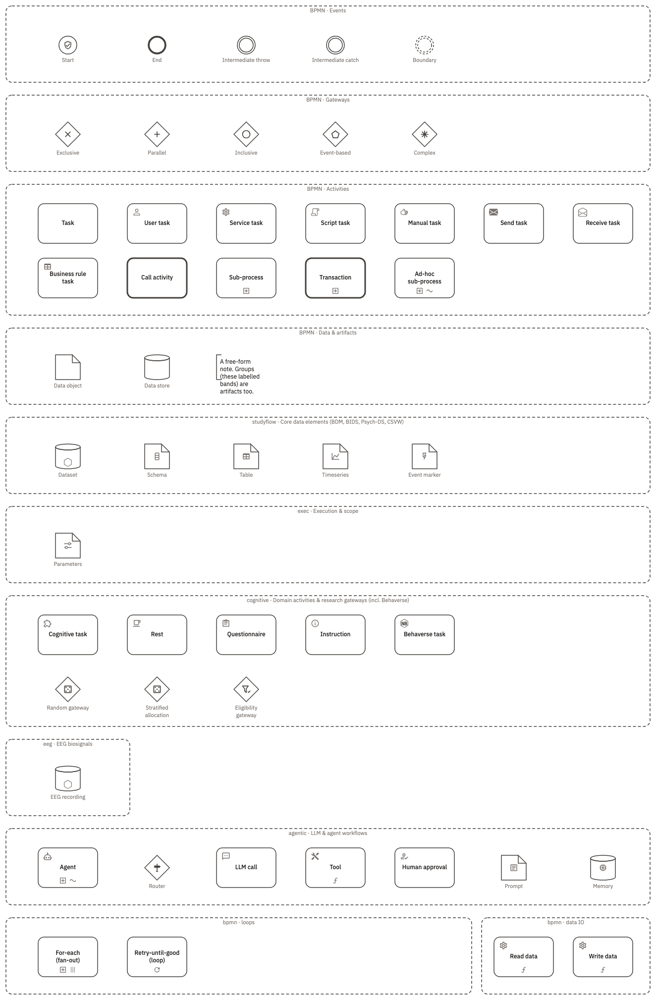
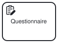
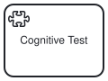
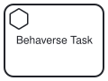
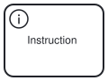
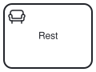

{#fig-catalog fig-alt="A tall diagram of dashed labelled bands, read top to bottom: BPMN events, BPMN gateways, BPMN activities, BPMN data and artifacts, studyflow core data elements, exec execution and scope, cognitive domain activities and research gateways, eeg biosignals, agentic LLM and agent workflows, and BPMN loops beside a smaller band of data IO service tasks. Each band holds one instance of every element it contributes, drawn with its own shape and icon and labelled underneath." .fig-l}

| Set | Declares | Loaded |
|:--|:--|:--|
| `studyflow` | the study itself, its data elements, scheduling and classification attributes | always |
| `prov` | `Activity`, one entry of the record of what ran | always |
| `cognitive` | what a participant meets, and the research gateways | always |
| `agentic` | agents, model calls, tools | on request |
| `eeg` | biosignal sessions and recordings | on request |

# How a studyflow fits together

A studyflow is a graph. The nodes are events, tasks, gateways, and data, and the edges come in two kinds:

- **Sequence flows** (solid arrows) are for control flow, showing what happens after what.
- **Data associations** (dotted arrows) are for data flow, showing what a step reads and what it writes.

{#fig-two-graphs fig-alt="A left-to-right flowchart. Solid arrows walk from start through a pre-test, an allocation diamond splitting into training and no training, a post-test, and a model-fitting step to end. Dotted arrows carry data beside that walk: the pre-test and post-test write into a responses store, which feeds the model-fitting step, which writes a fitted model."}

| Edge | Joins | Meaning |
|:--|:--|:--|
| `bpmn:SequenceFlow` | activity <-> activity | order; optionally a `conditionExpression` deciding whether this branch is taken |
| `bpmn:DataInputAssociation`, `bpmn:DataOutputAssociation` | data <-> step | one value in or out of the activity |
| `bpmn:MessageFlow` | | an exchange of messages between two parties |

A data edge can also describe a binding, written as `slot = selection`. The slot names which argument of the step's call the value fills, and the selection names which value arrives. Two slot names are positional: `self` binds a method's receiver, and `*` appends the value positionally.

## Shape and behavior

Every element is a standard BPMN element, which gives it a shape and a flow behavior, and carries a research type, which gives it its meaning and its own attributes.

```yaml
Survey:
  type: Task                            # the standard element: shape, and flow behaviour
  name: Post-battery survey
  extensionElements:
    - type: cognitive:Questionnaire     # the research type: meaning, and its own attributes
      instrument: phq-9

Done:
  type: EndEvent
  redirectTo: https://example.org/thanks   # a namespaced attribute, straight on the element
```

## Run state

You declare a value as a `bpmn:Property` on a container element, and where you declare it decides how long it lives: on the study, it lasts for the whole diagram; on a sub-process, for one pass through that sub-process. Activities set these values, and gateways and other activities read them. The run state is the set of values at one moment in a run, and the run history is the sequence of those states across the run.

## Well-formed diagrams

A studyflow has to satisfy the usual rules of a BPMN diagram before anything can run it: every `sourceRef` and `targetRef` names an element that exists in the file, every path leaves a start event and reaches an end event, an exclusive gateway either covers every case in its conditions or marks one outgoing edge `default`, and every value a condition or a step reads is declared on the study or on a sub-process containing it.

`studyflow validate` reports what can be checked without running: whether the file parses, whether the sets it depends on loaded, and any name that no loaded set declares. The command reports warnings but does not fail on them unless you pass `--strict`. Everything else shows up when the study runs: a condition that can never hold, a data edge that arrives too late.

## Views

A view is a projection. It keeps some of the elements of the diagram and drops the rest, and it never adds or renames anything, so a view cannot modify the study it came from.

| View | Keeps | Answers |
|:--|:--|:--|
| **Study** | everything | what happens, in what order, where the path splits |
| **Gantt** | elements with `onset`, `duration`, or `progress` | when each part happens, and how long it takes |
| **Checklist** | elements with a checklist entry | what has been reported, and what is still open |
| **Provenance** | the `prov:Activity` entries | what ran, when, by whom, with which seed |
| **Figure** | the elements marked visible | what a reader should see |

# Elements

## The study

| Attribute | Holds |
|:--|:--|
| `authors`, `version` | who wrote it, and which revision this is |
| `runtime` | where it is meant to run: `browser`, `cloud`, `local`, or `hpc` |
| `tags` | short classification labels |
| `seed` | the root seed; set it and every gateway draw replays |
| `documentation`, `checklist` | prose and reporting items, available on **every** element, the study included |

## What a participant meets

::: {layout-ncol=5}
{width="110" fig-alt="A rounded rectangle with a clipboard-and-pencil icon in its top-left corner, labelled Questionnaire."}

{width="110" fig-alt="A rounded rectangle with a jigsaw-piece icon in its top-left corner."}

{width="110" fig-alt="A rounded rectangle with a hexagon icon in its top-left corner, labelled Behaverse Task."}

{width="110" fig-alt="A rounded rectangle with an information icon in its top-left corner, labelled Instruction."}

{width="110" fig-alt="A rounded rectangle with an armchair icon in its top-left corner, labelled Rest."}
:::

| Type | Drawn as | Means | Attributes |
|:--|:--|:--|:--|
| `Questionnaire` | `bpmn:Task` | A self-report form: a standard instrument, or one of your own. | `instrument` |
| `CognitiveTask` | `bpmn:Task` | A cognitive test, delivered by an experiment package. | `instrument`, `construct`, `implementation`, `configurations` |
| `BehaverseTask` | `bpmn:Task` | A test from the Behaverse battery. A `CognitiveTask` whose instrument is fixed. | `behaverseScene`, `configurations`, `agentType`, `botConfigurations` |
| `Instruction` | `bpmn:Task` | Text the participant reads. Nothing is recorded. | `content` |
| `Rest` | `bpmn:Task` | A break, or a resting-state period. | `restDuration`, `eyes` (`open`, `closed`, `alternating`) |

`instrument` names an experiment package (PsychoPy, jsPsych, lab.js, OpenSesame, PsyToolkit, Gorilla, Inquisit, E-Prime, Psychtoolbox, Presentation, Unity, Behaverse), or a scale, or an identifier of your own, and `configurations` is the YAML passed to that instrument. Setting `agentType` to `bot` has the same instrument answered by a model instead of a person, driven by `botConfigurations`. That is how the same file doubles as an AI evaluation.

## Entry and exit

| On | Attribute | Says |
|:--|:--|:--|
| the start event | `consentFormUri` | the consent document that gates entry; unset, entry is not gated |
| the end event | `redirectTo` | where the participant is sent; `{COMPLETION_CODE}` is substituted with the issued code |
| the end event | `completionCodeType` | `none`, `static` (the fixed `completionCode`), or `dynamic` |

## Branching

| Type | Drawn as | Means | Attributes |
|:--|:--|:--|:--|
| `RandomGateway` | `bpmn:ExclusiveGateway` | Allocation: each participant takes one outgoing edge at random, one arm per edge. | `algorithm` (`simple`, `block`, `minimization`, `alternation`), `allocationRatio` (`1:1`, `2:1`), `blockSize`, `stratifyBy`, `strata` |
| `EligibilityGateway` | `bpmn:ExclusiveGateway` | Screening: criteria stated on the gateway, in readable sentences. | `inclusionCriteria`, `exclusionCriteria` |
| A plain gateway | `bpmn:ExclusiveGateway` | A decision written out as one condition per outgoing edge. | `conditionExpression`, on each edge |

Screening and allocation are separate types because they answer to different standards: a reviewer has to be able to read the eligibility criteria, and nobody should be able to predict an allocation draw.

## Who takes part

| Type | Drawn as | Means | Attributes |
|:--|:--|:--|:--|
| `Actor` | `bpmn:Participant` | A pool of participants: human, model, software agent, or instrument. | `actorType` (`human`, `llm`, `agent`, `instrument`), `spec`, `promptTemplate` |

A pool stands for a group, not for one person. If you draw two pools that deal with each other, the file becomes a collaboration, with one choreography task per exchange. That is how you describe a dyadic experiment, or a study where a person and a model work together.

## When each step happens

| Attribute | On | Values |
|:--|:--|:--|
| `onset` | any activity or event | a timestamp, an offset such as `T0+30min`, or a label |
| `duration` | any activity or event | `30min`, or an ISO 8601 duration |
| `progress` | any activity or event | a percentage, or `done`, `blocked`, `in progress` |
| `timeCycle` | a timer start event | a five-field cron expression, or a repeating ISO 8601 interval |
| `timeDuration`, `timeDate` | a timer catch event | a delay, or a fixed moment |
| `condition` | a conditional catch event | wait until this becomes true |
| `loopCondition` | the repeat marker on a step | repeat while this holds |
| `completionCondition` | an ad-hoc sub-process | stop when this holds |

These attributes describe the study's schedule in visits and days, which is what the Timeline view shows. The millisecond clock inside a recording is a different thing, and it lives with the recording.

## Data

| Type | Drawn as | Means | Attributes |
|:--|:--|:--|:--|
| `Dataset` | `bpmn:DataStoreReference` | A collection the study reads or produces, under a declared standard. | `format`, `schema`, `catalog`, `storage`; `bdmDataLevel` or `bidsDataType` |
| `Schema` | `bpmn:DataObjectReference` | How data are laid out: columns, types, requiredness. | `format` (`csvw`, `linkml`, `jsonschema`), `body` |
| `Table` | `bpmn:DataObjectReference` | Rows and columns, with that structure committed to. | `format`, `schema` |
| `Timeseries` | `bpmn:DataObjectReference` | A continuously sampled recording. | `samplingRate`, `channelCount`, `units`, `recordingDuration`, `format` |
| `EventMarker` | `bpmn:DataObjectReference` | Time-stamped occurrences inside a recording. | `eventType`, `eventOnset`, `eventOffset`, `eventCount` |
| `Parameters` | `bpmn:DataObjectReference` | Settings wired into the steps that read them, so a variant of the study is a value change, not a redraw. | `values` |
| `DataCatalog` | not drawn | A listing a dataset is published in; a dataset names one. | `url` |
| any of them | - | Where the value lives. Unset, it only passes between steps. | `uri` |

`format` ties a dataset to a community standard: `bdm` ([Behaverse Data Model](https://behaverse.org/data-model/), which adds `bdmDataLevel`), `bids` ([BIDS](https://bids.neuroimaging.io/), which adds `bidsDataType`), `psych-ds` ([Psych-DS](https://psych-ds.github.io/)), or `nwb` ([NWB](https://www.nwb.org/)).

## What a step runs

| Attribute | On | Holds |
|:--|:--|:--|
| `implementation` | any activity | the software the step runs, as `<scheme>://<ref>[@<version>]` |
| `script` | a script task | code carried in the study itself |
| `additionalArguments` | any activity | literal arguments the drawn data edges do not supply; the reserved `args` key holds positional ones |

The scheme says how the software is found: `python://` is an importable callable, `docker://` a container image pinned by tag or digest, and `https://` or `file://` a script at an address. Anything else is accepted and recorded, and reported as unresolved.

A data step is a plain service task: `implementation` names what runs, and the drawn data edges say what it reads and writes. A step that drops rows drops *data*, while a gateway changes the *path* a run takes, so the two are not interchangeable.

## Agents, biosignals, and the trail

| Type | Drawn as | Means | Attributes |
|:--|:--|:--|:--|
| `Agent` | `bpmn:AdHocSubProcess` | A model calling the tools drawn inside it, in an order it decides. | `model`, `systemPrompt`, `toolChoice`, `temperature`, `maxTurns` |
| `Router` | `bpmn:ExclusiveGateway` | A branch a model picks among the labels on the outgoing edges. | `model`, `instructions` |
| `LLMCall` | `bpmn:ServiceTask` | One model call: a prompt in, a response out. | `model`, `prompt`, `temperature`, `maxTokens` |
| `Tool` | `bpmn:ServiceTask` | Something an agent may call, run like any other step. | `kind`, `purpose`, `implementation` |
| `HumanApproval` | `bpmn:UserTask` | Pauses the run until a person approves, edits, or rejects. | `question` |
| `Prompt` | `bpmn:DataObjectReference` | A prompt kept as data, wired into the calls that read it. | `template` |
| `Memory` | `bpmn:DataStoreReference` | What an agent carries between turns. | `scope` |
| `Session` | `bpmn:Participant` | One acquisition session, carrying the device settings every phase inside it shares. | `device`, `modalities` |
| `Recording` | `bpmn:DataObjectReference` | The biosignal recording a session produces. A narrower `Timeseries`. | `modalities`, `eventChannel`, plus `samplingRate`, `channelCount`, `units`, `recordingDuration`, `format` from `Timeseries` |
| `Activity` | not drawn | One entry of the record of what ran. | `action`, `when`, `who`, `with`, `what`, `run`, `seed`, `note` |

An agent stops at its `completionCondition` and never runs past `maxTurns`. A guardrail, or a model used as a judge, is an `LLMCall` with a strict prompt, and retrieval is a `Tool` whose `kind` is retrieval. An eval harness needs nothing beyond this table and the ordinary elements: gateways for the conditions, data elements for the results, and `HumanApproval` where a person has to sign off. It is the same graph that carries a human experiment, with models in the actor seats. When each `Activity` entry gets written is described on the [Developers](developers.qmd#what-a-run-leaves-behind) page.

# The file

{#fig-round-trip fig-alt="A flowchart. The modeler's diagram saves as .studyflow.yaml and lowers to .bpmn BPMN 2.0 XML, and those two convert into each other losslessly in both directions. The modeler also renders to .studyflow.png and .studyflow.svg, which carry two payloads beside the pixels: the same BPMN XML as embedded source, and a draw.io copy of the drawing. An image reopens in the modeler from its embedded source, never from its pixels. Dotted arrows leave the round trip: the draw.io payload downloads on its own as .drawio, and the modeler exports one way to LinkML, NIDM-Results, and ARTEM-IS."}

| File | Carries | Reopens as a studyflow |
|:--|:--|:--|
| `.studyflow.yaml` | the study itself, in full. **The canonical form. Keep this one in version control.** | yes, also `.studyflow` |
| `.bpmn` | the same study, as standard BPMN 2.0 XML | yes, also `.xml` |
| `.studyflow.png`, `.studyflow.svg` | a picture, and the study inside it | yes |
| `.drawio`, `.linkml.yaml`, `.nidm.ttl`, `.artemis.json` | a document derived for another tool | no |
| `.json` (jsPsych timeline) | an existing timeline, on import only | read only |

The YAML and the XML convert into each other losslessly: a round trip returns the same document, and a version-control diff shows your edits and nothing else. Here is a complete, runnable study:

```yaml
id: minimal_study
definitions:
  targetNamespace: http://bpmn.io/schema/bpmn

Minimal_Study:
  type: Process
  name: Minimal study
  extensionElements:
    - type: studyflow:Study
  flowElements:

    Enrolled:
      type: StartEvent
      name: Enrolled and consented
      consentFormUri: https://example.org/protocols/minimal-study/consent.md

    Flanker:
      type: Task
      name: Flanker
      extensionElements:
        - type: cognitive:CognitiveTask
          instrument: jspsych
          implementation: https://github.com/jspsych/jspsych-contrib@v0.4.0#flanker

    Done:
      type: EndEvent
      name: Done
      redirectTo: https://app.prolific.com/submissions/complete?cc={COMPLETION_CODE}
      completionCodeType: dynamic

    Flow_Enrolled_Flanker: Enrolled -> Flanker
    Flow_Flanker_Done: Flanker -> Done
```

That is [`minimal_study.studyflow.yaml`](assets/examples/minimal_study.studyflow.yaml) in full. It contains no geometry. The layout follows from `sourceRef` and `targetRef`, and the modeler only saves geometry once you rearrange things by hand.

| Rule | In the file |
|:--|:--|
| containment becomes nesting | a study's steps are written inside the study |
| references are written as ids | `sourceRef: Enrolled`, not a second copy of the element |
| anything unrecognized is kept | a key no loaded set declares is preserved and reported, never dropped |
| defaults and inferable types are omitted | restored on read; `type:` appears only where the element is not already expected there, and a BPMN type is spelled without its prefix: `Task`, `StartEvent`, `SubProcess` (`cognitive:Questionnaire` keeps its prefix); a sequence flow under `flowElements`, an association or a text annotation under `artifacts`, a message flow under `messageFlows` and a data association under its activity need no `type:` at all, because where they sit and what keys they carry already say what they are |
| what the flows already say is omitted | `incoming` and `outgoing` are rebuilt from the sequence flows, and namespace declarations from the element sets in use |
| `id`, `definitions`, then one key per root element | a file with no `definitions` is not read as a studyflow; the format version is the version segment of the core namespace |

Short forms collapse the long structure where nothing is lost, and the long form is always still accepted: a YAML mapping instead of a quoted string under `additionalArguments`, `values`, `configurations`, or a schema `body`; a plain list under `extensionElements`; geometry written on the element it positions, one line each (`bounds: 100 80 100 80` is x, y, width, height; `waypoint: 200,118 260,118` is the route; `label: 90 170 120 14` is the box of a caption placed by hand); one `fill` and one `stroke` for an element's colours; elements keyed by id under `flowElements`; a flow of any kind with nothing but its two ends written as `Flow_1: Enrolled -> Flanker`; an expression written as a plain string; and `documentation` carrying `checklist` for the checklist entry.

Two things to keep in mind about images. An exported image carries the whole study, but not the element sets it depends on, and not any data the study produced. And an image that has been through a screenshot tool or a vector editor keeps its pixels and loses the study inside it, so always keep the `.studyflow.yaml` as well.
