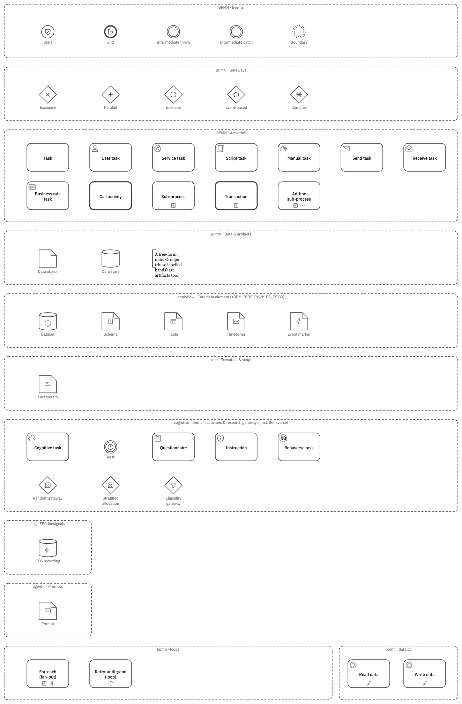
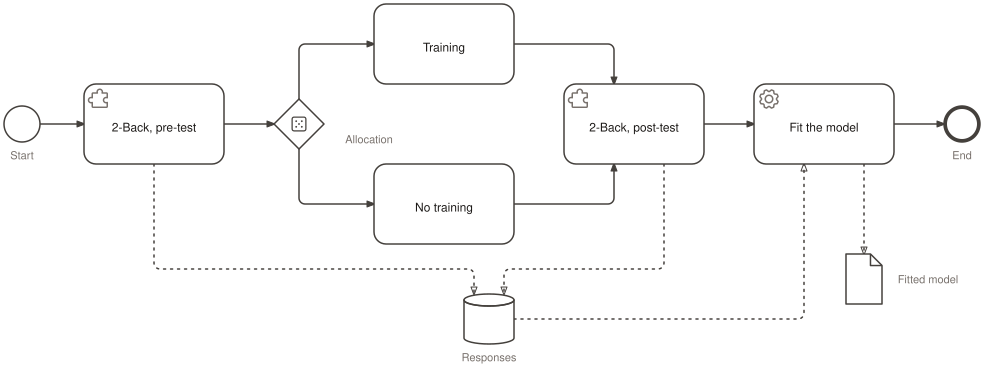
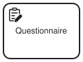
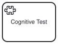
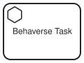
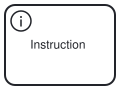
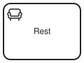
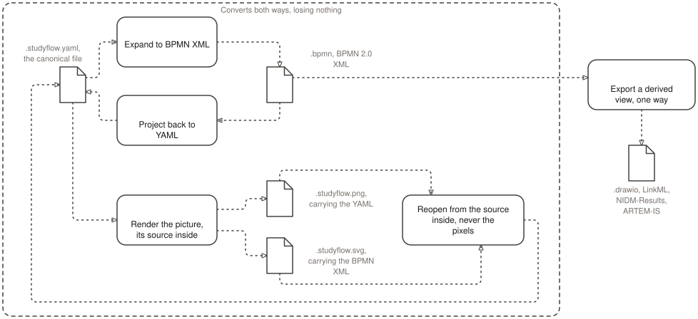

{#fig-catalog fig-alt="A tall diagram of dashed labelled bands, read top to bottom: BPMN events, BPMN gateways, BPMN activities, BPMN data and artifacts, studyflow core data elements, exec execution and scope, cognitive domain activities and research gateways, eeg biosignals, agentic prompts, and BPMN loops beside a smaller band of data IO service tasks. Each band holds one instance of every element it contributes, drawn with its own shape and icon and labelled underneath." .fig-l}

| Set | Declares | Loaded |
|:--|:--|:--|
| `studyflow` | the study itself, its data elements, scheduling and classification attributes | always |
| `prov` | `Activity`, one record of what ran; the document-level list lives in `state._meta.prov` | always |
| `cognitive` | what a participant meets, and the research gateways | always |
| `agentic` | models as actors, and prompts | on request |
| `eeg` | biosignal sessions and recordings | on request |

# How a studyflow fits together

A studyflow is a graph. The nodes are events, tasks, gateways, and data, and the edges come in two kinds:

- **Sequence flows** (solid arrows) are for control flow, showing what happens after what.
- **Data associations** (dotted arrows) are for data flow, showing what a step reads and what it writes.

{#fig-two-graphs fig-alt="A left-to-right Studyflow diagram. Solid arrows walk from start through a 2-Back pre-test, a random allocation gateway splitting into training and no training, a 2-Back post-test, and a model-fitting step to end. Dotted arrows carry data beside that walk: the pre-test and post-test write into a responses store, which feeds the model-fitting step, which writes a fitted model."}

| Edge | Joins | Meaning |
|:--|:--|:--|
| `bpmn:SequenceFlow` | activity <-> activity | order; optionally a `conditionExpression` deciding whether this branch is taken |
| `bpmn:DataInputAssociation`, `bpmn:DataOutputAssociation` | data <-> step | one value in or out of the activity |
| `bpmn:MessageFlow` | step <-> step, or a pool | an exchange of messages between two parties; `messageRef` names the `Message` it carries, whose `itemRef` names the `ItemDefinition` saying what that message is (`structureRef`) |

A data edge can also describe a binding, written as `slot = selection`. The slot names which argument of the step's call the value fills, and the selection names which value arrives. Two slot names are positional: `self` binds a method's receiver, and `*` appends the value positionally.

## Shape and behavior

Every element is a standard BPMN element, which gives it a shape and a flow behavior, and carries a research type, which gives it its meaning and its own attributes.

```yaml
Survey:
  type: Task                            # the standard element: shape, and flow behaviour
  name: Post-battery survey
  extensionElements:
    - type: cognitive:Questionnaire     # the research type: meaning, and its own attributes
      instrument: phq-9

Done:
  type: EndEvent
  redirectTo: https://example.org/thanks   # a namespaced attribute, straight on the element
```

## Run state

You declare a value as a `bpmn:Property` on a container element, and where you declare it decides how long it lives: on the study, it lasts for the whole diagram; on a sub-process, for one pass through that sub-process. A `Parameters` object wired into a sub-process declares its keys the same way, as properties of that sub-process, except that they are read-only: nothing inside the sub-process writes them, and a name it also declares itself is an error. Activities set these values, and gateways and other activities read them. The run state is the set of values at one moment in a run, and the run history is the sequence of those states across the run.

A property may carry an initial `value`; after that only a data edge targeting it changes it. After a run the file holds the values under `state`, keyed by element id. The runner keeps its own entries under `state._meta`: `_meta.prov`, the run records, `_meta.reached.<element_id>`, how many times a token reached each element or followed each sequence flow, never reset, and `_meta.instance.<element_id>`, which pass a repeating activity is on while it runs, 1-based, so a step inside a cohort of four subjects knows which subject it is serving (`{state._meta.instance.Subject}`). Names starting with `_` cannot be declared. Conditions test these values directly, as `state._meta.reached.Gate < 4`; text cites them with placeholders.

## Placeholders

Any string attribute may cite a value as `{name}`, or a field of it as `{name.field}`. A name starts with a letter, in any script, or `_`, and holds letters, digits, `_` and `-`; a dot starts a field. So the braces of YAML or JSON in a value are left alone. Every reader looks the name up in the same order and takes the first value it finds:

1. `state`: the run state from its root, as in `{state._meta.reached.Excluded_Pre}`.
2. The nearest scope that holds the name, from the element outward to the study: a property's value (`{count}`).
3. An element, by its id or by a name no other element has: the value it produced in this run (`{Play.trials}`).
4. A lone `{reached}`, the runner's counter for the element citing it — never a container's: how often a token reached it (for a sequence flow, how often a token followed it), and 0 when none did, so a preregistered exit nobody took reads `n=0` in a file no run has touched.

A placeholder that finds nothing stays as written, for whoever reads it later: the end event fills `{COMPLETION_CODE}` when it redirects. Each reader resolves what it knows when it reads. The canvas and exported figures show the last run's state, else the value the file declares (a property's initial `value`, or a key of the Parameters wired into a sub-process), so a label that cites `{max_unanswered}` shows it before any run; the file and the inspector keep the placeholder. In a local run, the walk resolves them in a step's attributes as it hands the step to its runner, which also gets them as written; the shell and python runners resolve them in their arguments too, and reachy in the lines it speaks. The browser runner resolves a placeholder once, before the walk, from the properties in scope, the file's values with the link's over the study's own (`/run/?diagram=…&n_trials=40`). A link binds a declared property of the study, an attribute of the study, or a key of a `studyflow:Parameters` object wired into a step (a dotted name, `Bot.Speed`, reaches one value inside it; a whole mapping or list is never replaced). The Parameters wired into a task are its settings and fill no placeholder; the ones wired into a sub-process are its properties. A key or an attribute the link leaves out keeps the value the file gives it. A placeholder that cites a declared name with no value blocks the run; any other stays as written.

In a label, a placeholder may end in `:%`, which draws a number as a percentage: with `max_unanswered` at 0.2, `> {max_unanswered:%} unanswered` reads `> 20% unanswered`. So a label states a threshold without writing it a second time. Only the views read the format; a runner leaves such a placeholder as written.

When an argument of a `python://` call is one placeholder and nothing else, the call gets the value itself, a table or a model, rather than its text. Quote it or not: `model: "{pipeline}"` and `model: {pipeline}` pass the same value.

## Expressions

Every expression a study writes is FEEL, the Friendly Enough Expression Language of the OMG's DMN standard, BPMN's sibling: a flow's condition, a loop's condition or count, a conditional event's condition, and a data edge's selection. Both runtimes and the modeler evaluate it the same way, so a study means one thing wherever it runs. An expression reads the names the placeholder rule finds, as FEEL names and paths (`accuracy >= 0.8`, `congruency_test.pvalue < alpha`, `state._meta.reached.Gate < 8`), and a condition holds only when it evaluates to `true`; `null` never takes a branch. Strings are double-quoted, equality is `=`, and text has functions of its own (`contains(upper case(answer), "READY")`, `substring after(reply, "Answer:")`). A study writes the FEEL both evaluators run, the subset `packages/runtime-local/python/feel.py` lists: literals, names and paths, `list[n]`, arithmetic, comparisons, `and`, `or`, `not(x)`, `x in [a, b]`, `if … then … else`, and the functions `contains`, `starts with`, `ends with`, `substring after`, `substring before`, `upper case`, `lower case`, `string length`, `count`, `sum`, `min`, `max`, `mean`, `abs` and `is defined`. `studyflow validate` refuses an expression that is not FEEL, one beyond the subset (a filter, `for`, `some`, `between`, a range, a date), and a BPMN `language` other than FEEL, before any run, and so does the walk; `tests/fixtures/feel.json` holds the two evaluators to the same answers.

## Well-formed diagrams

A studyflow has to satisfy the usual rules of a BPMN diagram before anything can run it: every `sourceRef` and `targetRef` names an element that exists in the file, every path leaves a start event and reaches an end event, an exclusive gateway covers every case in its conditions, marks one outgoing edge `default`, or leaves exactly one outgoing edge without a condition, and every value a condition or a step reads is declared on the study or on a sub-process containing it.

`studyflow validate` reports what can be checked without running. For any file: whether it parses, whether the sets it depends on loaded, and any name that no loaded set declares; that every id names one element, even across scopes; that every sequence flow joins two flow nodes of the process or sub-process holding it, every data association joins a data element to its step, and a step reads or writes a property only inside the scope that declares it; that every process and sub-process with sequence flows has a start and an end event, and every flow node lies on a path from one to the other; that no complex gateway splits, whose activation rule the walk does not read, no parallel gateway carries conditions on its flows, which it never reads, and no event is a signal, escalation, compensation, link or cancel event, which it does not read either; that a standard loop has a `loopCondition`, a `loopMaximum` or a boundary event to end it; that no two steps on paths that run at once write one property or data element (a warning: the one that finishes last sets it); that every expression is the FEEL both runtimes run; that an exclusive gateway's conditions on one number neither overlap (a warning: the file's order would choose) nor leave a value no flow takes when there is no default flow; that an attribute holds a value of the type its schema gives it: one of an enumeration's values (unless the attribute also takes free text), a whole number, a number, or true or false; that a start event's `consentFormUri` is an address or a path from the site's root, which a page can fetch, and that an end event has a code to hand: a `completionCode` when its `completionCodeType` is `static`, and a type other than `none` when its `redirectTo` carries `{COMPLETION_CODE}`; that every `implementation` names a scheme some loaded skill runs (a warning); that no label writes as a number a value the file declares and its element's conditions read, or, for a gateway, the conditions on the flows out of it (a warning naming the placeholder to write: `> {max_unanswered:%} unanswered` for `> 20% unanswered`); and that every column an operation reading a schema-bound dataset names under `index`, `columns`, `values`, `subset`, `by`, `key`, `column`, `on` or `usecols` is a column of that schema; and that the study, written as BPMN XML, is valid against the OMG's BPMN 2.0 schema (checked with libxml2's `xmllint`, a warning when the machine has none). It then explores every way the study can go, each decision a gateway, a loop or a boundary event makes taken as a free choice, walked dry, and warns about a pool left waiting for a message none will send (the pools waiting for each other, or the sender ended), a parallel join one of whose tokens can never come, and a message sent that nothing takes, naming the choices that lead there; the OK line says how many ways it explored. This is soundness in the sense of workflow nets, for the study's control flow: a condition that never holds is still the data's to show. For an executed copy it also checks the record: that the counts balance, every node reached as often as its flows brought tokens in, and as often as its flows and boundary events took them out; and that the protocol still matches the digest its last run recorded as `plan` (the study without its state, its provenance, its drawing, and its checklist ticks). When its run's record, `events.jsonl`, sits beside it (an executed copy in its run repository), the state the file keeps is also checked against the state the record says, the timeline aside, so a count or a property changed after the run is found. `studyflow run` applies the checks that need no run before it starts, and refuses a study that fails one. The command reports warnings but does not fail on them unless you pass `--strict`. The rest shows up when the study runs: a condition that can never hold, a data edge that arrives too late.

## Views

A view is a projection. It keeps some of the elements of the diagram and drops the rest, and it never adds or renames anything, so a view cannot modify the study it came from.

| View | Keeps | Answers |
|:--|:--|:--|
| **Study** | everything | what happens, in what order, where the path splits |
| **Gantt** | elements with `onset`, `duration`, or `progress` | when each part happens, and how long it takes |
| **Checklist** | elements with a checklist entry | what has been reported, and what is still open |
| **Provenance** | the `prov:Activity` entries | what ran, when, by whom, with which seed |
| **Figure** | the elements marked visible | what a reader should see |

# Elements

## The study

| Attribute | Holds |
|:--|:--|
| `authors`, `version` | who wrote it, and which revision this is |
| `runtime` | where it is meant to run: `local` (unless set) or `browser`; a skill may add another |
| `dependencies` | the software its steps call, one package per entry in the ecosystem's own spelling (`pandas>=2.0`); a local run installs them into every runner's environment |
| `tags` | short classification labels |
| `seed` | the root seed; set it and every gateway draw replays |
| `documentation`, `checklist` | prose and reporting items, available on **every** element, the study included |

## What a participant meets

::: {layout-ncol=5}
{width="110" fig-alt="A rounded rectangle with a clipboard-and-pencil icon in its top-left corner, labelled Questionnaire."}

{width="110" fig-alt="A rounded rectangle with a jigsaw-piece icon in its top-left corner."}

{width="110" fig-alt="A rounded rectangle with a hexagon icon in its top-left corner, labelled Behaverse Task."}

{width="110" fig-alt="A rounded rectangle with an information icon in its top-left corner, labelled Instruction."}

{width="110" fig-alt="A rounded rectangle with an armchair icon in its top-left corner, labelled Rest."}
:::

| Type | Drawn as | Means | Attributes |
|:--|:--|:--|:--|
| `Questionnaire` | `bpmn:Task` | A self-report form: a standard instrument, or one of your own. | `instrument` |
| `CognitiveTask` | `bpmn:ChoreographyTask` | A cognitive test: an exchange between the software that presents it (upper band, initiating) and the actor who takes it (lower band). With no actor named it is drawn as a plain task and the study's own participant takes it. | `platform`, `construct`, `implementation` |
| `behaverse:Task` | `bpmn:ChoreographyTask` | A test from the Behaverse battery. A `CognitiveTask` whose platform is fixed. | `instrument` (which test: `NB`, `DS`), `timeline` (the one that runs: shipped with the build for that instrument, or defined under the Parameters' `Timelines`) |

Who takes a cognitive task is what the diagram draws, and a run follows it in this order, most explicit first: the participant on the task's receiving band; else the participant at the other end of a message flow touching the task, a pool itself or the pool of the step the flow ends at (a flow naming its message outranks one that does not, only a flow carrying the task's own messages counts, and two partners left is an error, not a draw); else the participant of the pool the task sits in. The participant's type says what kind of actor it is: a human, a program, a device, or a model (`Actor`, whose `implementation` names the program, device, or model as `<scheme>://<ref>`), or a robot (`reachy:Robot`). A cognitive task presents itself: its upper band reads from the task (the Behaverse instrument, or the platform), so the task holds one reference, the actor who takes it, and names no participant for its own side. In the inspector every band of a choreography-shaped task is the same editable field, "Participant": its dropdown offers every participant the file declares, a drawn pool or an actor that only takes bands, "None" clears it, and typed text either names one of them or names a new actor for this task. What kind of actor a band holds comes from the participant it references. A drawn pool is typed through its own settings; an actor that only takes bands has no shape to select, so its kind (a person, a program, a device, a model) and the settings of that kind (`implementation`) are edited on the band itself. An actor no task refers to any more is dropped from the file, and renaming a pool renames it on every band that shows it. A `Prompt` data object wired into the task is that task's instructions for a model on its band, and a cognitive task reads and writes data through data edges like any activity (`studyflow:ChoreographyData` lends a choreography task that ability).

When the task is drawn in one pool and its taker has steps of its own in another, message flows join the task to those steps: each trial goes to a receive task, and the answer comes back from a send task, as described under "Who takes part". A robot takes a task this way, since its steps are its body and a model decides for it: `reachy_pools` draws the task, the robot, and the model as three pools.
| `Instruction` | `bpmn:Task` | Text the participant reads. Nothing is recorded. | `content` |
| `Rest` | `bpmn:IntermediateCatchEvent` | A break, or a resting-state period: a timer event, as long as its timer says (a new one waits a minute). A runner that records during it (an EEG's resting state) claims it, and what it records goes out along its data outputs. | `eyes` (`open`, `closed`, `alternating`) |

A cognitive task's `platform` names the experiment package that delivers it (PsychoPy, jsPsych, lab.js, OpenSesame, PsyToolkit, Gorilla, Inquisit, E-Prime, Psychtoolbox, Presentation, Unity, Behaverse), a questionnaire's `instrument` a scale or an identifier of your own, and the `Parameters` wired into the task are what that platform reads (a Behaverse task's GameConfig: its timelines and blocks). Two wired into one task merge key by key; a value both set is an error, since nothing drawn orders them. A key that names one of the task's own attributes (`instrument: WO`) sets that attribute instead: the canvas draws the value it sets, and the inspector shows the attribute locked, naming the Parameters object to edit. Only a wire makes a Parameters object set anything. Naming a model, an agent, or a robot as the task's participant has the same task answered by it instead of a person, driven by the `Bot:` entry of those Parameters. That is how the same file doubles as an AI evaluation.

## Entry and exit

| On | Attribute | Says |
|:--|:--|:--|
| the start event | `consentFormUri` | the consent document that gates entry; unset, entry is not gated |
| the end event | `redirectTo` | where the participant is sent; `{COMPLETION_CODE}` is substituted with the issued code |
| the end event | `completionCodeType` | `none`, `static` (the fixed `completionCode`), or `dynamic` |

## Branching

| Type | Drawn as | Means | Attributes |
|:--|:--|:--|:--|
| `RandomGateway` | `bpmn:ExclusiveGateway` | Allocation: each participant takes one outgoing edge at random, one arm per edge. | `algorithm` (`simple`, `block`, `minimization`, `alternation`), `allocationRatio` (`1:1`, `2:1`), `blockSize`, `stratifyBy`, `strata`, `seedDigest` |
| `EligibilityGateway` | `bpmn:ExclusiveGateway` | Screening: criteria stated on the gateway, in readable sentences. | `inclusionCriteria`, `exclusionCriteria` |
| A plain gateway | `bpmn:ExclusiveGateway` | A decision written out as one condition per outgoing edge. | `conditionExpression`, on each edge |

Screening and allocation are separate types because they answer to different standards: a reviewer has to be able to read the eligibility criteria, and nobody should be able to predict an allocation draw.

A `RandomGateway` draws for one participant: from the study's `seed`, the gateway's id, the participant's number (which instance of its pool it is, 1-based) and that participant's visit to the gateway, so each turn of a loop draws again, a participant draws the same whatever the others drew, a re-run draws what the run it redoes drew, and both runtimes draw the same arm for the same participant. A run honours `allocationRatio` as weights, and `algorithm: block` as permuted blocks of `blockSize` dealt over the participants by number, each shuffled from the seed, the gateway and the block; a gateway a participant passes more than once, inside a loop, deals that participant's visits in blocks of their own. It warns at its start about what it does not apply (`minimization`, `stratifyBy`). A browser session is one participant, the one its link's `participant` names (1 without it).

Anyone who holds the file can redo those draws, so whoever enrols the participants could foresee each one's arm. A `RandomGateway` with `seedDigest` conceals its allocation, as CONSORT and SPIRIT ask of a trial: it draws from a seed of its own instead of the study's, and the file holds only that seed's SHA-256, `sha256:` and 64 hex digits. The file then commits to the allocation sequence without showing it. Make the seed long enough that nobody can find it by trying seeds against the digest (at least 32 characters, `openssl rand -hex 16`), keep it away from whoever enrols, and write its digest on the gateway (`printf %s "$seed" | shasum -a 256`). A local run is given it as `--allocation-seed <gateway>=<seed>`, or `<gateway>=@<file>` to keep it out of the shell history, and refuses to start without it or with a seed whose digest differs. Once the run has drawn, the gateway's record in the executed copy reveals the seed as `allocationSeed`, a re-run of that copy reads it back, and `studyflow validate` checks it against `seedDigest`, so anyone can then redo every draw. A browser session cannot conceal an allocation, since its link would carry the seed to whoever hands the link out; it refuses one. A simulation in the modeler draws at random.

What a hidden seed conceals depends on the algorithm. Under `simple`, every draw. Under `block`, the order within each block, but not the block size, which the file states: whoever sees the arms of the participants before can tell the last arm of a block. Alternation is foreseeable whatever the seed, so `validate` refuses `seedDigest` on it.

## Who takes part

| Type | Drawn as | Means | Attributes |
|:--|:--|:--|:--|
| `Actor` | `bpmn:Participant` | Who or what takes part: a human, a program, or a device; the agentic skill adds the language model. A pool when it has steps of its own, a band on a cognitive task when it only takes that task. | `actorType` (`human`, `software`, `hardware`; `llm` with agentic), `implementation` (`claude://claude-haiku-4-5`, `ollama://gemma4`), `memory` (`none`, `conversation`) |

A pool stands for a group, not for one person. If you draw two pools that deal with each other, the file becomes a collaboration, with one choreography task per exchange. That is how you describe a dyadic experiment, or a study where a person and a model work together.

Lanes divide a container into roles. A `laneSets` mapping on a process gives its pool the bands you know from a protocol figure, and the same mapping on an expanded sub-process divides that sub-process instead, since BPMN puts lane sets on any container of flow elements. Each lane has a `name`, its own bounds, and a `flowNodeRef` list naming the steps that sit in it; a step drawn inside a lane's bounds joins it on its own. A lane is a partition of the drawing, not a step: nothing waits on it, and a run walks straight through it.

A pool may also stand for several instances of itself. `participantMultiplicity` on the participant — `minimum` and `maximum` — says how many instances of its process take part, and the pool draws BPMN's three-bar parallel marker, the one a multi-instance step carries, at the foot of its own title band — the strip the rotated name runs up — rather than at the bottom centre BPMN names, where it sits under the bottom lane and reads as that lane's: the band is the pool's and no lane reaches into it, so the marker is unmistakably the pool's. Under the bars it writes the count, `×4`, so the drawing says how many instances without a word of the name; that count is `maximum`, which is what a run takes, so a pool whose `minimum` is lower still reads as its fullest. A run takes `maximum` instances, one after another, re-entering the pool's scope each time; `state._meta.instance.<pool id>` is the instance it is on, so the steps inside, and the pools they talk to, know which subject they are serving. A message flow drawn on the participant belongs to the whole pool, not to any one instance: a step inside with no flow of its own exchanges along it, instance by instance, while a flow to a step in another pool is the pool's own message, sent once, carrying null, when the last instance has ended — which is how a message start event named "All subjects complete" starts a pool that must wait for the cohort.

```yaml
Cohort:
  type: Collaboration
  participants:
    Subjects:
      name: Subjects
      participantMultiplicity: { minimum: 4, maximum: 4 }
      processRef: Session
Session:
  type: Process
  laneSets:
    LaneSet_1:
      lanes:
        Lane_Screen: { name: Screen, flowNodeRef: [Play] }
```

When the pools have processes of their own, a run walks them all at once, each on its own token, and they talk only along message flows. The run carries each message. A send task sends its data inputs, a receive task waits for the next message, and a task with flows both ways to one pool asks it and takes the answer as its result. A catch event waits for its message and a throw or end event sends one, which is how a pool waits until another is ready. A pool with no process of its own, a model for instance, answers through the skill that plays it. A message at a boundary event ends the step it sits on, so a looping step can repeat until another pool says it is over; an event-based gateway waits for whichever message comes first, a branch starting at each catch event or receive task, so a cycle drawn back to it can take trials until the task's end arrives instead. A message flow drawn on a sub-process is the one inside it that talks: a step with no message flow of its own exchanges along the nearest enclosing sub-process's, else along its pool's, which is what lets a collapsed sub-process, or a pool, carry the exchange its steps make. The runners read the edges, so no step carries a setting for the exchange. What a flow carries is its `messageRef`: a `Message` whose `itemRef` names an `ItemDefinition`, and that item's `structureRef` is the name a runner recognises (`behaverse:Trial` out of a Behaverse task, `behaverse:Response` back into it; `agentic:Request` to a model's pool, `agentic:Reply` back). A flow that names no message is taken for either, which is enough with one partner; with several, name the messages. In the inspector a message flow has one field, "Message", offering the structures the loaded schemas declare.

```yaml
Collab:
  type: Collaboration
  messageFlows:
    Msg_Trial: { sourceRef: Play, targetRef: Receive, messageRef: Trial }
    Msg_Answer: { sourceRef: Answer, targetRef: Play, messageRef: Response }
Trial:
  type: Message
  itemRef: Trial_Item
Trial_Item:
  type: ItemDefinition
  structureRef: behaverse:Trial
```

## When each step happens

| Attribute | On | Values |
|:--|:--|:--|
| `onset` | any activity or event | a timestamp, an offset such as `T0+30min`, or a label |
| `duration` | any activity or event | `30min`, or an ISO 8601 duration |
| `progress` | any activity or event | a percentage, or `done`, `blocked`, `in progress` |
| `timeCycle` | a timer start event | a five-field cron expression, or a repeating ISO 8601 interval (`R3/PT10M`); a run waits for an interval's first firing, and passes a cron schedule at once |
| `timeDuration`, `timeDate` | a timer start, catch or boundary event | an ISO 8601 delay (`PT5M`, `P21D`), or a fixed moment; a run waits for it, and at a boundary event it ends the step it sits on when it runs out |
| `condition` | a conditional catch or boundary event | wait until this becomes true; on a boundary event, leave the step when it does |
| `loopCondition` | the repeat marker on a step | repeat while this holds |
| `loopCardinality` | the multi-instance marker on a step | run this many instances of the step |
| `loopDataInputRef`, `inputDataItem` | the multi-instance marker on a step | run one instance per item of this list, the item bound under the input's name; `loopDataOutputRef` and `outputDataItem` collect what each instance leaves under the output's name into a list |
| `participantMultiplicity` | a pool | run this many instances of the pool's process, one after another |
| `completionCondition` | an ad-hoc sub-process | stop when this holds |

These attributes describe the study's schedule in visits and days, which is what the Timeline view shows. The millisecond clock inside a recording is a different thing, and it lives with the recording.

## Data

| Type | Drawn as | Means | Attributes |
|:--|:--|:--|:--|
| `Dataset` | `bpmn:DataStoreReference` | A collection the study reads or produces, under a declared standard. | `format`, `schema`, `uri`, `catalog` |
| `Schema` | `bpmn:DataObjectReference` | How data are laid out: columns, types, requiredness. | `format` (`csvw`, `linkml`, `jsonschema`, `frictionless`; the column editor edits the first two, and the others as text), `body` |
| `Table` | `bpmn:DataObjectReference` | Rows and columns, with that structure committed to. | `format`, `schema` |
| `Parameters` | `bpmn:DataObjectReference` | Settings wired into the steps that read them, so a variant of the study is a value change, not a redraw. Wired into a sub-process, its keys are that sub-process's read-only properties. One wired into nothing does nothing. | `values` |
| `DataCatalog` | not drawn | A registry a dataset is published in; the dataset's `catalog` names it. | `uri` |
| any of them | - | Where the value lives. Unset, it only passes between steps. | `uri` |

`format` ties a dataset to a community standard, each from the skill whose domain keeps data in it: `bdm` ([Behaverse Data Model](https://behaverse.org/data-model/), from the behaverse skill, whose `behaverse:BDMDataset` adds `dataLevel`), `psych-ds` ([Psych-DS](https://psych-ds.github.io/), from the cognitive skill), or, from the eeg skill, `bids` ([BIDS](https://bids.neuroimaging.io/); its `eeg:BIDSDataset` adds `dataType`) and `nwb` ([NWB](https://www.nwb.org/)).

## What a step runs

| Attribute | On | Holds |
|:--|:--|:--|
| `implementation` | any activity | the software the step runs, as `<scheme>://<ref>[@<version>][#<fragment>]` |
| `script` | a script task | code carried in the study itself |
| `additionalArguments` | any activity | literal arguments the drawn data edges do not supply; the reserved `args` key holds positional ones |

The scheme says how the software is found: `python://` is an importable callable, `docker://` a container image pinned by tag (`docker://nipreps/fmriprep:23.2.0`, Docker's own spelling) or by digest after `@`, and `https://` or `file://` a script at an address. A `#` after the version names a part of what the reference holds, such as one plugin in a repository at a release (`https://github.com/jspsych/jspsych-contrib@v0.4.0#flanker`). A version after `@` is checked against what is installed before the step runs, component by component (`python://sklearn.svm.SVC@1.7` runs on scikit-learn 1.7.2, not on 1.8), and the step's record names the version it ran. A skill adds its own, such as the shell skill's `shell://`: which runner takes a step is settled when the study runs, by what the runners claim.

A data step is a plain service task: `implementation` names what runs, and the drawn data edges say what it reads and writes. A step that drops rows drops *data*, while a gateway changes the *path* a run takes, so the two are not interchangeable.

A step that fails goes on from the error boundary event drawn on it, if it carries one, with the failure kept in its record and the run itself not failed; without one, the failure ends the run. An error end event inside a sub-process ends that sub-process at its own error boundary event the same way, so a participant who cannot go on leaves the loop instead of stopping the study. A step that finishes takes the same path out when a conditional boundary event drawn on it holds: its `condition` is read once the step's result is in, written like a `conditionExpression` and citing values with the same placeholders (`{Play.failedTrialRate} > 0.2` reads the step's own result), and the walk goes on from that event instead of from the step. That is how a run leaves a task on a quality threshold the study itself sets, rather than on one the notation invents.

## Models, biosignals, and the trail

| Type | Drawn as | Means | Attributes |
|:--|:--|:--|:--|
| `Prompt` | `bpmn:DataObjectReference` | A prompt kept as data, wired into the steps that send it to a model. | `template` |
| `Session` | `bpmn:Participant` | One acquisition session, carrying the device settings every phase inside it shares. | `device`, `modalities` |
| `Timeseries` | `bpmn:DataObjectReference` | A continuously sampled signal. | `samplingRate`, `channelCount`, `units`, `recordingDuration`, `format` |
| `EventMarker` | `bpmn:DataObjectReference` | Time-stamped occurrences inside a recording (BIDS `events.tsv`). | `eventTypes`, `timeUnit`, `format`, `schema` |
| `Recording` | `bpmn:DataObjectReference` | The biosignal recording a session produces. A narrower `Timeseries`. | `modalities`, `eventChannel`, plus `samplingRate`, `channelCount`, `units`, `recordingDuration`, `format` from `Timeseries` |
| `Activity` | not drawn | One entry of the record of what ran. | `action`, `when`, `who`, `with`, `what`, `run`, `seed`, `plan`, `commit`, `note` |

A model takes part as an actor, never as a setting on a step. It is a pool of its own, an `Actor` whose `actorType` is `llm` and which has no process, and the study's steps ask it along message flows; or it is the band of a task it takes. A model call is a task with a message flow to the model's pool and one back, and a guardrail or a judge is such a call with a strict prompt. A tool is a service task with an `implementation`, an agent loop an ad-hoc sub-process that stops at its `completionCondition`, and a person's sign-off a user task with a timer on it (no runtime executes a `completionCondition` yet). A model answers each message on its own unless its actor's `memory` is `conversation`: then it sees the earlier messages from the same instance of the pool asking it, and its answers, so a model answering one subject remembers that subject's earlier trials and no other subject's. Every exchange with a model is recorded with the run: the model's digest and quantization level, its default sampling parameters and the options sent, the server's version, and the request as sent, beside the reply. An eval harness needs nothing beyond these and the ordinary elements, gateways for the conditions and data elements for the results. It is the same graph that carries a human experiment, with models in the actor seats. When each `Activity` entry gets written is described on the [Developers](developers.qmd#what-a-run-leaves-behind) page.

# The file

{#fig-round-trip fig-alt="A Studyflow diagram of files and conversions. Inside a dashed group labelled converts both ways, losing nothing: .studyflow.yaml, the canonical file, expands to .bpmn BPMN 2.0 XML, which projects back to YAML; rendering the picture writes .studyflow.png, carrying the YAML, and .studyflow.svg, carrying the BPMN XML; and reopening from the source inside, never the pixels, gives the YAML back. Outside the group, exporting a derived view writes .drawio, LinkML, NIDM-Results and ARTEM-IS, one way."}

| File | Carries | Reopens as a studyflow |
|:--|:--|:--|
| `.studyflow.yaml` | the study itself, in full. **The canonical form. Keep this one in version control.** | yes, also `.studyflow` |
| `.bpmn` | the same study, as standard BPMN 2.0 XML | yes, also `.xml` |
| `.studyflow.png` | a picture, and the study's `.studyflow.yaml` inside it | yes |
| `.studyflow.svg` | a picture, and the study's BPMN XML nested in its metadata | yes |
| `.svg`, `.png` (Manuscript view) | the figure, carrying the study it shows (the `.png` its YAML, the `.svg` its BPMN), and the `.svg` also the draw.io file that redraws it | yes |
| `.drawio`, `.linkml.yaml`, `.nidm.ttl`, `.artemis.json` | a document derived for another tool | no |
| `.json` (jsPsych timeline) | an existing timeline, on import only | read only |

The YAML and the XML convert into each other losslessly: a round trip returns the same document, and a version-control diff shows your edits and nothing else. Here is a complete, runnable study:

```yaml
id: minimal_study
definitions:
  targetNamespace: http://bpmn.io/schema/bpmn

Minimal_Study:
  type: Process
  name: Minimal study
  extensionElements:
    - type: studyflow:Study
  flowElements:

    Enrolled:
      type: StartEvent
      name: Enrolled and consented
      consentFormUri: https://example.org/protocols/minimal-study/consent.md

    Flanker:
      type: Task
      name: Flanker
      extensionElements:
        - type: cognitive:CognitiveTask
          platform: jspsych
          implementation: https://github.com/jspsych/jspsych-contrib@v0.4.0#flanker

    Done:
      type: EndEvent
      name: Done
      redirectTo: https://app.prolific.com/submissions/complete?cc={COMPLETION_CODE}
      completionCodeType: dynamic

    Flow_Enrolled_Flanker: Enrolled -> Flanker
    Flow_Flanker_Done: Flanker -> Done
```

That is [`minimal_study.studyflow.yaml`](assets/examples/minimal_study.studyflow.yaml) in full. It contains no geometry. The layout follows from `sourceRef` and `targetRef`, and the modeler only saves geometry once you rearrange things by hand.

| Rule | In the file |
|:--|:--|
| containment becomes nesting | a study's steps are written inside the study |
| references are written as ids | `sourceRef: Enrolled`, not a second copy of the element |
| anything unrecognized is kept | a key no loaded set declares is preserved and reported, never dropped |
| defaults and inferable types are omitted | restored on read; `type:` appears only where the element is not already expected there, and a BPMN type is spelled without its prefix: `Task`, `StartEvent`, `SubProcess` (`cognitive:Questionnaire` keeps its prefix); a sequence flow under `flowElements`, an association or a text annotation under `artifacts`, a message flow under `messageFlows` and a data association under its activity need no `type:` at all, because where they sit and what keys they carry already say what they are |
| what the flows already say is omitted | `incoming` and `outgoing` are rebuilt from the sequence flows, and namespace declarations from the element sets in use |
| `id`, `definitions`, then one key per root element | a file with no `definitions` is not read as a studyflow; the format version is the version segment of the core namespace |

Short forms collapse the long structure where nothing is lost, and the long form is always still accepted: a YAML mapping instead of a quoted string under `additionalArguments` or `values`; a typed element named by its schema type, with that type's attributes beside its own (`Survey: {type: cognitive:Questionnaire, instrument: phq-9}` is a `bpmn:Task` carrying a `cognitive:Questionnaire` entry, and the study's process reads `type: studyflow:Study`), whenever the element is the BPMN type the schema attaches it to and no key could belong to both; a plain list under `extensionElements` otherwise; the drawing as one `layout:` map at the end of the file, keyed by element id, one line per value (`bounds: 100 80 100 80` is x, y, width, height; `waypoint: 200,118 260,118` is the route; `label: 90 170 120 14` is the box of a caption placed by hand; one `fill` and one `stroke` for an element's colours, and one `font` for its caption's look: `bold`, `italic`, `left`/`center`/`right`, a `#rrggbb` ink, in any mix), so an edit to the protocol and an edit to its drawing are diffs of different parts of the file (the same keys written on the element they position still load); elements keyed by id under `flowElements`; a flow of any kind with nothing but its two ends written as `Flow_1: Enrolled -> Flanker`; and an expression written as a plain string. Its BPMN XML differs in one place: a choreography task in a process, which BPMN defines only in a choreography, is written as the `bpmn:task` it is, marked `studyflow:exchange`, with its bands as `studyflow:participants` and `studyflow:initiator`, so every file the tools write is valid against the OMG's BPMN 2.0 schema.

Two things to keep in mind about images. An exported image carries the whole study, but not the element sets it depends on, and not any data the study produced. And an image that has been through a screenshot tool or a vector editor keeps its pixels and loses the study inside it, so always keep the `.studyflow.yaml` as well.
