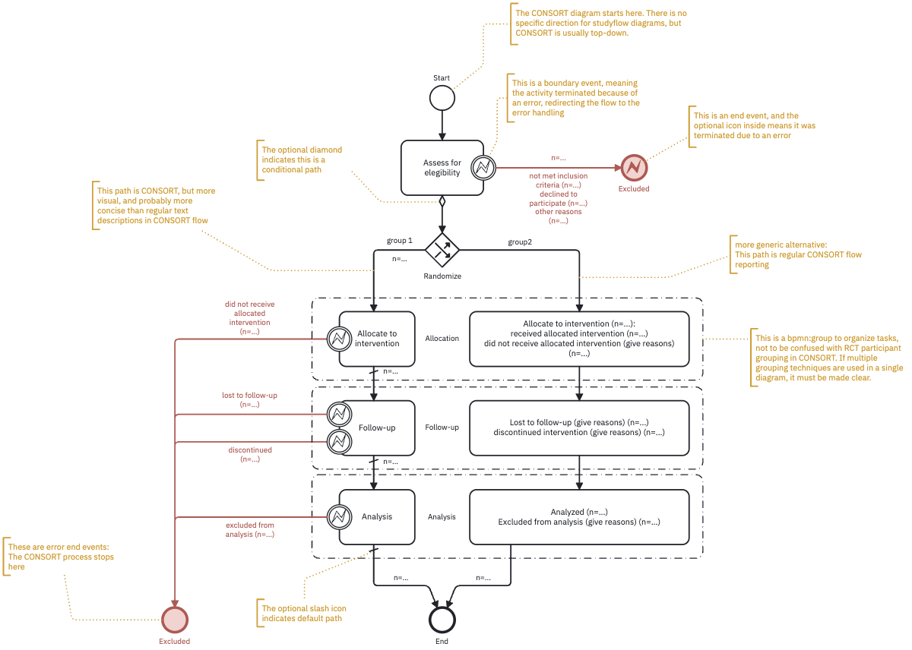
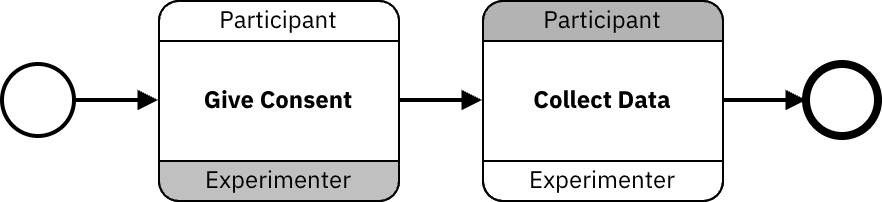

```{=html}
<style>
/* Shape icons live in table cells, so they miss the `figure img` mat that dark mode
   puts behind dark-ink diagrams. Give them the same mat. */
.shapes img {
  background-color: var(--doc-figure-mat);
  border-radius: .25rem;
  padding: .15rem;
}
</style>
```

[BPMN 2.0](https://www.omg.org/spec/BPMN/2.0/) (ISO/IEC 19510) is a standard notation for drawing processes, used for two decades in software with nothing to do with research.

A studyflow is a BPMN diagram whose shapes also carry a research meaning. Five shapes cover it; everything else is a variation.

::: {.callout-tip appearance="simple"}
Already know BPMN? Skip to [What Studyflow adds](#what-studyflow-adds) for the delta.
:::

## The five shapes

::: {.shapes}

| Shape | BPMN name | What it is in a study |
|:--:|---|---|
| {width="40px"} {width="40px"} | **Event** | Something that happens, rather than something that is done. The thin circle is where a participant enters the study; the thick ring is where they leave it. |
| {width="105px"} | **Activity** (task) | One thing that gets done: a task block, a questionnaire, an analysis step, a manual step at the bench. Drawn as a rounded rectangle. |
| {width="82px"} | **Gateway** | A point where the path splits or comes back together: randomize here, screen out here, run two things at once here. Drawn as a diamond. |
| {width="165px"} | **Sequence flow** | What happens next, drawn as a solid arrow. A label on it is the condition under which that branch is taken. |
| {width="55px"} {width="55px"} | **Data object** | What a step reads or writes. A document is data handed from one step to the next; a cylinder is data that persists. Data always reaches a step over a *dashed* arrow, never a solid one. |

:::

**Solid arrows carry control** — what happens next. **Dashed arrows carry data**, and a step's inputs and outputs are exactly its dashed arrows, nothing more.

## Which diamond to use

All three gateways are diamonds; the marker inside says how many branches are taken.

| Gateway | Marker | How many branches it takes | Reach for it when |
|---|:--:|---|---|
| **Exclusive** | × | Exactly one — the branch whose condition holds, otherwise the `default` flow | A screen-out, an if/else, one arm per condition |
| **Parallel** | + | All of them, at once; the matching join waits for every one | A task and a recording that run together |
| **Inclusive** | ○ | Every branch whose condition holds — one, several, or all | Optional follow-up modules a participant may qualify for several of |

An exclusive gateway whose conditions all fail and has no `default` runs out of path. Mark one flow as the default; it is drawn with a small slash across its tail.

## Boundary events {#boundary-events}

A **boundary event** is a small circle sitting *on* an activity's border rather than in the flow: a timer firing when the activity outlasts its deadline, an error mark when it fails. A solid ring is **interrupting** — the activity stops and the path continues out of the circle; a dashed ring starts a side path while the activity carries on.

Attrition is the pattern worth memorizing. A dropout is not a branch at some gateway upstream; it is an interrupting error boundary event on the activity the participant actually left, with its own arrow to an error end event. That is what lets the diagram say where each person left and why, which is what CONSORT asks a trial to report.

{#fig-attrition fig-alt="Annotated CONSORT studyflow. Small circles on the border of each activity carry participants who left at that step out to a shared error end event." .fig-l}

## Sub-processes

A **sub-process** is an activity with a whole flow inside it — a session, a block, a battery. Collapsed it shows a **+** marker; expanding or collapsing changes only the drawing, and the steps are in the file either way.

## Studies with more than one party

Each party is a **pool** (`bpmn:Participant`, which `cognitive:Actor` tags as `human`, `llm`, `agent`, or `instrument`). Messages between pools are **message flows**, drawn as dashed arrows.

A **choreography** diagram drops the pools and draws only the interactions, each task banded by the parties it involves. The unshaded band marks who starts the exchange.

{#fig-choreography fig-alt="A choreography: Give Consent is initiated by the Participant, Collect Data by the Experimenter, with the initiating band unshaded in each." .fig-l}

## What Studyflow adds {#what-studyflow-adds}

The split is clean:

| | Comes from | Covering |
|:--|:--|:--|
| Control flow and structure | BPMN 2.0, unchanged | start, end, intermediate, boundary, timer and error events; tasks, sub-processes, and call activities; exclusive, parallel, inclusive, event-based, and complex gateways; sequence and message flows; data objects and stores with their associations; pools and lanes; choreography |
| Research meaning | Studyflow | the study itself, tasks and questionnaires, participant pools, random assignment, screening, research data types, data operations, scheduling, checklists, provenance |

Every Studyflow element is an ordinary BPMN element carrying a research label. The BPMN element fixes the shape and how the path moves through it; the label fixes what it means and which attributes it carries.

```yaml
Survey:
  type: bpmn:Task                       # the process element -> shape and flow behaviour
  name: Post-battery survey
  extensionElements:
    - type: cognitive:Questionnaire     # the research label -> meaning and attributes
      instrument: phq-9
```

A generic BPMN tool reads the first part and ignores the second, so a studyflow exported as BPMN 2.0 XML opens as a well-formed process.

| Studyflow element | BPMN base | What it adds |
|---|---|---|
| `studyflow:Study` | `bpmn:Process` | `runtime` (`browser`/`cloud`/`local`/`hpc`), `authors`, `version`, `isExecutable` |
| `cognitive:CognitiveTask` | `bpmn:Task` | `instrument` (PsychoPy, jsPsych, lab.js, OpenSesame, Behaverse, or your own), `implementation`, `configurations` as YAML |
| `cognitive:Questionnaire` | `bpmn:Task` | `instrument` — a standard scale (PHQ-9, GAD-7, BDI-II, STAI, PSS, WHO-5, BFI, DASS-21, PANAS) or a name of your own |
| `cognitive:Instruction` | `bpmn:Task` | `content`: the markdown the participant reads |
| `cognitive:Rest` | `bpmn:Task`, as a kind of `CognitiveTask` | `configurations` for a break or a resting-state recording (duration, eyes open or closed) |
| `cognitive:BehaverseTask` | `bpmn:Task`, as a kind of `CognitiveTask` | `behaverseScene` (`NB`, `DS`, `UFOV`, …), `agentType` (`human`/`bot`), `botConfigurations` |
| `cognitive:RandomGateway` | `bpmn:ExclusiveGateway` | `algorithm` (`probabilistic`/`round-robin`), `probabilityFunction`, and `stratifyBy` + `strata` to keep arms balanced on a covariate |
| `cognitive:EligibilityGateway` | `bpmn:ExclusiveGateway` | `inclusionCriteria` and `exclusionCriteria`, each a markdown list |
| `studyflow:Dataset` | `bpmn:DataStoreReference` | `format` (`bdm`/`bids`/`psych-ds`/`kedro`), `catalog`, `storage`, `schema`, plus `bdmDataLevel` and `bidsDataType` |
| `studyflow:Schema` | `bpmn:DataObjectReference` | `format` (csvw, linkml, jsonschema) and `body` — the layout itself, or a path to it |
| `functional:Transform` | `bpmn:ServiceTask` | `operationType: transform` — apply a function to data |
| `functional:Map` | `bpmn:ServiceTask`, as a kind of `Transform` | `operationType: map` — apply the function to every item in a stream |
| `functional:Reduce` | `bpmn:ServiceTask`, as a kind of `Transform` | `operationType: reduce` — combine a stream into one value |
| `functional:Filter` | `bpmn:ServiceTask`, as a kind of `Transform` | `operationType: filter` — keep only the items matching a condition |

Full attribute lists: [Elements](elements.qmd).

::: {.callout-tip}
Not every palette entry is its own element type: stratified allocation is a `RandomGateway` with `stratifyBy` and `strata` set.
:::

## What Studyflow leaves alone

BPMN's semantics and serialization are untouched: namespaces, element ids, and `extensionElements` work as the standard specifies. The everyday file is YAML, mapping one-to-one onto the BPMN 2.0 XML the modeler writes on demand ([File format](file-format.qmd)).

## When plain BPMN is enough

If generic BPMN already describes your work — a clinical operations workflow with no cognitive tasks, no specialised data, no random assignment — you do not need Studyflow. It earns its place when any of these holds:

| | |
|:--|:--|
| the study involves cognitive tests or questionnaires | the diagram has to describe data flow, and what each step does to it |
| the study carries reporting checklists | one diagram should drive a participant-facing session *and* an analysis pipeline |
| the study involves randomization or counterbalancing | the diagram has to answer CONSORT, SPIRIT, or STROBE |
