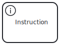
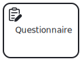
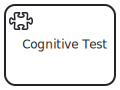
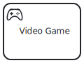
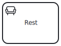
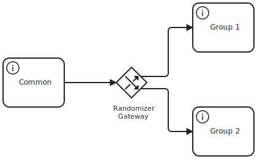

The main element of a studyflow diagram is the *Study*, which serves as a container for all other elements:

::: {layout-ncol=1}

:::

Within a *Study* element, you can define various elements. In addition to the standard BPMN elements, Studyflow introduces specialized elements for research workflows in cognitive sciences in four main categories: *events*, *activities*, *gateways*, and *data*.

## Events

::: {layout-ncol=2}

:::

## Activities

::: {layout-ncol=2}

 for a list.](../assets/img/elements/behaverse_task.svg)

:::

## Element-to-schema mapping

Each visual element in the modeler maps to a type definition in the Studyflow moddle schemas.

- Event elements map to types such as `StartEvent` and `EndEvent`, then to moddle entries for BPMN event types.
- Activity elements (e.g., `Instruction`, `Questionnaire`, `CognitiveTask`) map to types with domain-specific attributes shown in the inspector.
- Gateway elements map to types like `RandomGateway`, with control-flow attributes encoded in schema properties.
- Data elements map to types such as `Dataset`, `Table`, and `DataCatalog`.

## Gateways

::: {layout-ncol=2}

:::

## Data

::: {layout-ncol=2}
 for more details.](../assets/img/elements/dataset.svg)

:::

The current version studyflow includes built-in support for several data models commonly used in cognitive sciences, including:

::: {layout-ncol=2}
 data model](../assets/img/elements/bdm_events.svg)

 data model](../assets/img/elements/bdm_trials.svg)

](../assets/img/elements/bdm_models.svg)

](../assets/img/elements/bids.svg)

 dataset standard](../assets/img/elements/psych-ds.svg)

](../assets/img/elements/dataset.svg)
:::
