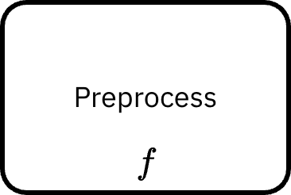

| What you want to express | What you draw | What you fill in |
|:--|:--|:--|
| Ask participants something | A `Questionnaire` box | `instrument` --- PHQ-9, GAD-7, or a name of your own |
| Run a cognitive test | A `CognitiveTask` box | `instrument`, `configurations` |
| Run one of the Behaverse assessments | A `BehaverseTask` box | `behaverseScene`, `configurations` |
| Tell participants what to do | An `Instruction` box | `content`, in markdown |
| Give them a break | A `Rest` box | `configurations` |
| Gate entry on informed consent | The start event | `consentFormUri` |
| Send people somewhere when they finish | The end event | `redirectTo`, `completionCodeType`, `completionCode` |
| Assign an arm at random | A `RandomGateway`, one arrow per arm | `algorithm`, `probabilityFunction`, `stratifyBy`, `strata` |
| Screen people in or out | An `EligibilityGateway` | `inclusionCriteria`, `exclusionCriteria` |
| Take a path only when something holds | The arrow itself | `conditionExpression` |
| Represent a group of participants --- human, model, or instrument | An `Actor` pool | `actorType`, `spec`, `promptTemplate` |
| Record what the study collects | A `Dataset` cylinder, or a `Table`, `Timeseries`, `EventMarker` | `format`, `schema`, `uri` |
| Describe the shape of that data | A `Schema` | `format`, `body` |
| Vary the study by settings instead of by redrawing | A `Parameters` element, wired into the steps that read it | `values` |
| Say what software a step runs | Any task, or a `Transform`, `Map`, `Reduce`, `Filter` | `implementation`, `additionalArguments` |
| Carry the code in the study itself | A script task | `script` |
| Repeat a step | The repeat marker on that step | `loopCondition` |
| Wait for a moment in time | A timer event | `timeCycle`, `timeDuration`, `timeDate` |
| Wait until something becomes true | A conditional catch event | `condition` |
| Place a step on the study schedule | Any step or event | `onset`, `duration`, `progress` |
| Say who wrote the study, and when it can be replayed | The empty canvas | `authors`, `version`, `runtime`, `tags`, `seed` |

Every shape here is a BPMN 2.0 (ISO/IEC 19510) shape first; Studyflow adds the research meaning.

## What a participant meets

::: {layout-ncol=5}
{width="110" fig-alt="A rounded rectangle with a clipboard-and-pencil icon in its top-left corner, labelled Questionnaire."}

{width="110" fig-alt="A rounded rectangle with a jigsaw-piece icon in its top-left corner."}

{width="110" fig-alt="A rounded rectangle with a hexagon icon in its top-left corner, labelled Behaverse Task."}

{width="110" fig-alt="A rounded rectangle with an information icon in its top-left corner, labelled Instruction."}

{width="110" fig-alt="A rounded rectangle with an armchair icon in its top-left corner, labelled Rest."}
:::

| Element | Drawn as | What it means in the study | What you fill in |
|:--|:--|:--|:--|
| `Questionnaire` | `bpmn:Task` | A self-report form: a standard instrument such as PHQ-9 or GAD-7, or one of your own. | `instrument` |
| `CognitiveTask` | `bpmn:Task` | A cognitive test, delivered by an experiment package such as PsychoPy, jsPsych, lab.js, or OpenSesame. | `instrument`, `implementation`, `configurations` |
| `BehaverseTask` | `bpmn:Task` | A test from the Behaverse assessment battery, named by a short scene code. A `CognitiveTask` whose instrument is fixed. | `behaverseScene`, `configurations`, `agentType`, `botConfigurations` |
| `Instruction` | `bpmn:Task` | Text for the participant to read, written in markdown. Nothing is recorded. | `content` |
| `Rest` | `bpmn:Task` | A break between activities, or a resting-state recording. A narrower `CognitiveTask`. | `configurations` |

| Field | What goes in it |
|:--|:--|
| `instrument` | the experiment packages in common use, or an identifier of your own |
| `configurations` | YAML that instrument reads: trial counts, stimulus durations, block structure |
| `botConfigurations` | appears once `agentType` is `bot`, and is how a model plays a task a human would otherwise take |
| Ready-made | **Video Game**, a `CognitiveTask` on a game engine; two N-Back presets on `BehaverseTask` |

{#fig-battery fig-alt="A left-to-right diagram. A thin circle marked with a shield, labelled Participant arrives, leads through Instructions and practice, Working memory (N-Back), Verbal span (Digit Span), a circle marked with a clock labelled Self-paced break, Sustained attention (SART), Visual WM (Which One), and Post-battery survey, ending at a heavy circle labelled Session complete. Dotted arrows drop from the last two boxes into a cylinder labelled Battery trial data."}

## Entry and exit

| On | What it lets you say | What you fill in |
|:--|:--|:--|
| The start event | Consent gates entry. Leave it unset and the study starts without a consent step. | `consentFormUri` |
| The end event | Where the participant is sent when the study ends, and the code they take with them. | `redirectTo`, `completionCodeType`, `completionCode` |

| `completionCodeType` | The code the participant leaves with |
|:--|:--|
| `none` | none |
| `static` | a fixed code you choose |
| `dynamic` | read from the URL pattern a panel provider such as Prolific hands back |

`{COMPLETION_CODE}` in `redirectTo` is replaced with the code when the run ends.

## Deciding who goes where

| Element | Drawn as | What it means in the study | What you fill in |
|:--|:--|:--|:--|
| `RandomGateway` | `bpmn:ExclusiveGateway` | Sends each participant down one outgoing branch at random --- one arm per arrow. | `algorithm`, `probabilityFunction`, `stratifyBy`, `strata` |
| `EligibilityGateway` | `bpmn:ExclusiveGateway` | A screening gate: eligible participants carry on, everyone else is screened out. | `inclusionCriteria`, `exclusionCriteria` |
| A plain gateway | `bpmn:ExclusiveGateway` | A decision you write out yourself, as one condition per outgoing arrow. | `conditionExpression`, on each arrow |

| Field | Values |
|:--|:--|
| `algorithm` | `probabilistic`, `round-robin` |
| `probabilityFunction` | `uniform`, `normal`, `exponential`, `poisson` |
| `stratifyBy`, `strata` | the variable to balance on, and one entry per stratum |
| `inclusionCriteria`, `exclusionCriteria` | one criterion per entry, in your own words |
| Ready-made | **Stratified allocation**, a `RandomGateway` with `stratifyBy` filled in --- not a second kind of gateway |

::: {layout-ncol=2}
{width="300" fig-alt="A diamond with a dice icon, fed by one incoming arrow, with two arrows leaving it toward two separate boxes."}

{width="90" fig-alt="A diamond with a dice icon inside, labelled Random Gateway."}
:::

::: {.callout-note}
## How an arm is drawn

The browser runner draws one outgoing branch with equal probability. For allocation balanced across a cohort, allocate outside the study and pass the arm in ([Randomize and counterbalance](../design/randomization.qmd)).
:::

## Who takes part

| Element | Drawn as | What it means in the study | What you fill in |
|:--|:--|:--|:--|
| `Actor` | `bpmn:Participant` | A pool of participants --- human, LLM, software agent, or instrument. | `actorType`, `spec`, `promptTemplate` |

| Field | Values |
|:--|:--|
| `actorType` | `human`, `llm`, `agent`, `instrument` |
| `spec` | the model, checkpoint, or device the pool stands for; shown once `actorType` is not `human` |
| `promptTemplate` | the prompt sent each turn, with `{{stimulus}}`-style placeholders filled in as the run goes |

A pool stands for a group rather than one person, and drawing one turns the file into a collaboration.

Two pools that deal with each other are joined by choreography tasks — one box per interaction. Those boxes carry no fields of their own.

## When each step happens

| What you want to say | Where you say it | What you fill in |
|:--|:--|:--|
| Where this sits on the study schedule --- what the Timeline view draws | Any activity or event | `onset`, `duration`, `progress` |
| Launch runs on a schedule, such as a follow-up visit every Monday | A timer start event | `timeCycle` |
| Wait a fixed time, or until a fixed date | A timer catch event | `timeDuration`, `timeDate` |
| Wait until something about the run becomes true | A conditional catch event | `condition` |
| Retry a step until it clears a bar | The repeat marker on that step | `loopCondition` |
| Stop a step that decides its own order when it is done | An ad-hoc sub-process | `completionCondition` |

| Field | Values |
|:--|:--|
| `onset` | a timestamp, an offset such as `T0+30min`, or a label |
| `duration` | `30min`, or `PT1H` |
| `progress` | a percentage, or `done`, `blocked`, `in progress` |
| `timeCycle` | a five-field cron expression, or an ISO 8601 repeating interval |

These are the *study's* schedule, in visits and days, not a recording's own clock; [Data](data.qmd) keeps the two apart. Timers and multi-instance markers are drawn and exported, and executed by neither runner.

## What the study collects

The dashed lines around a step are its inputs and outputs; [Data](data.qmd) covers them.

| Element | Drawn as | What it means in the study | What you fill in |
|:--|:--|:--|:--|
| `Dataset` | `bpmn:DataStoreReference` | A collection the study reads or produces, in a declared standard. | `format`, `schema`, `catalog`, `storage`; `bdmDataLevel` with `format: bdm`, `bidsDataType` with `format: bids` |
| `Schema` | `bpmn:DataObjectReference` | How some data is laid out --- the columns of a table, the dimensions of an array. | `format`, `body` |
| `Table` | `bpmn:DataObjectReference` | Rows and columns: a trial table, a participant list, a score sheet. | `format`, `schema`, `rowCount` |
| `Timeseries` | `bpmn:DataObjectReference` | A recording sampled continuously --- EEG, eye tracking, an accelerometer stream. | `samplingRate`, `channelCount`, `units`, `recordingDuration`, `format` |
| `EventMarker` | `bpmn:DataObjectReference` | Time-stamped occurrences inside a recording: trial markers, stimulus onsets, button presses. | `eventType`, `eventOnset`, `eventOffset`, `eventCount` |
| `Parameters` | `bpmn:DataObjectReference` | A named group of settings, wired into the steps that read it, so a study varies by editing values rather than the flow. | `values` |
| `DataCatalog` | not a shape | A public listing a dataset is published in, such as OpenNeuro. A dataset names one; you never draw one. | `url` |
| every one of them | any of the above | Where the value lives. Unset, it only passes from step to step in memory. | `uri` |

## What a step runs

| What you want to say | Where you say it | What you fill in |
|:--|:--|:--|
| This step calls that software | A service, user, send, receive, or business-rule task | `implementation`, as `scheme://ref@version` |
| The code lives in the study itself | A script task | `script` |
| The call still needs these literal arguments | Any activity | `additionalArguments`, as YAML; the reserved `args` key lists positional ones |

Four generic operations say what *shape* the work has.

| Element | Drawn as | What it means in the study | What you fill in |
|:--|:--|:--|:--|
| `Transform` | `bpmn:ServiceTask` | Applies a function to data. The general case the other three narrow. | `implementation`, `additionalArguments` |
| `Map` | `bpmn:ServiceTask` | Applies a function to every item in a stream --- every trial, every participant. | `implementation`, `additionalArguments` |
| `Reduce` | `bpmn:ServiceTask` | Combines a stream into a single value: a mean, a fitted model, a report. | `implementation`, `additionalArguments` |
| `Filter` | `bpmn:ServiceTask` | Keeps only the items that match a condition --- the sessions that passed quality control. | `implementation`, `additionalArguments` |

| Ready-made | What it is |
|:--|:--|
| **For each** | a sub-process that runs once per item |
| **Read data**, **Write data**, **Anonymize Data** | filled-in steps over those four operations |
| **Group** | splitting a stream by participant --- a preset over `Map`, not an operation of its own |

There is no fifth. Each pins its own `operationType`, which the inspector shows but does not offer for editing.

{#fig-function-marker width="220" fig-alt="A rounded rectangle labelled Preprocess with a small italic f centred at its bottom edge."}

A step shows the *ƒ* marker when it names an `operationType`, or an `implementation` and no `instrument`.

### Ready-made analysis steps

Every step here is one of the four operations, pointed at a function you can repoint at your own code.

| Ready-made step | Drawn as | Pointed at |
|:--|:--|:--|
| Load sample dataset | `functional:Transform` | `sklearn.datasets.load_digits` |
| Train/test split | `functional:Transform` | `sklearn.model_selection.GroupShuffleSplit` |
| Reduce dimensions | `functional:Map` | `sklearn.decomposition.PCA` |
| Build estimator | `functional:Transform` | `sklearn.pipeline.make_pipeline` |
| Fit estimator | `functional:Reduce` | `sklearn.pipeline.Pipeline.fit` |
| Formula model | `functional:Transform` | `statsmodels.formula.api.mixedlm` |
| Evaluate | `functional:Reduce` | `sklearn.metrics.classification_report` |
| Cross-validate | `functional:Reduce` | `sklearn.model_selection.cross_validate` |
| Grid search | `functional:Transform` | `sklearn.model_selection.GridSearchCV` |
| Save model | `functional:Transform` | `joblib.dump` |
| `Model` | `bpmn:DataObjectReference` | a fitted model; set `uri` to keep it on disk |
| `Metric` | `bpmn:DataObjectReference` | a measured value, named after the measure |

## Agents and model calls

| Element | Drawn as | What it means in the study | What you fill in |
|:--|:--|:--|:--|
| `Agent` | `bpmn:AdHocSubProcess` | A model that calls the tools drawn inside it, in an order it decides. | `model`, `systemPrompt`, `toolChoice`, `temperature`, `maxTurns` |
| `Router` | `bpmn:ExclusiveGateway` | A branch a model picks, choosing among the labels on the outgoing arrows. | `model`, `instructions` |
| `LLMCall` | `bpmn:ServiceTask` | One model call: a prompt in, a response out. | `model`, `prompt`, `temperature`, `maxTokens` |
| `Tool` | `bpmn:ServiceTask` | Something the agent may call, run like any other step. | `kind`, `purpose`, `implementation` |
| `HumanApproval` | `bpmn:UserTask` | Pauses the run until a person approves, edits, or rejects. | `question` |
| `Prompt` | `bpmn:DataObjectReference` | A prompt kept as data, wired into the calls that read it. | `template` |
| `Memory` | `bpmn:DataStoreReference` | What an agent carries from one turn to the next. | `scope` |

An agent stops at its `completionCondition`, and never runs past `maxTurns`. A guardrail or an LLM-as-judge is an `LLMCall` with a strict prompt; retrieval is a `Tool` whose `kind` is `retrieval`.

::: {.callout-note}
For a branch the runner decides, use an ordinary gateway with a condition on each arrow, or a `RandomGateway`.
:::

## Recording biosignals

| Element | Drawn as | What it means in the study | What you fill in |
|:--|:--|:--|:--|
| `Session` | `bpmn:Participant` | One acquisition session, carrying the device settings every phase inside it shares. | `device`, `modalities` |
| `Recording` | `bpmn:DataStoreReference` | The biosignal data a session produces. A narrower `Dataset`. | `modalities`, `channels`, `samplingRateHz` |

| Field | Values |
|:--|:--|
| `device` | **Cyton** (8-channel), **Cyton + Daisy** (16-channel), **Ganglion** (4-channel), **Galea** (a VR headset with built-in sensors), or an identifier of your own |
| `modalities` | EEG, EMG, ECG, EOG, EDA, PPG, eye tracking, head motion, audio |
| Ready-made | **EEG session**, which fills in the phases of a session; **EEGPrep** and **fMRIPrep** |

## The study itself

The study *is* the diagram: click the empty canvas to edit it.

| What you want to say | What you fill in |
|:--|:--|
| Who wrote it, and which version this is | `authors`, `version` |
| Where it is meant to run --- browser, cloud, local, or HPC | `runtime` |
| What kind of study it is, as short labels | `tags` |
| That runs of it can be replayed exactly | `seed`, the run's root seed |
| What a reader needs to know about any element | `documentation`, in markdown |
| What a reviewer should tick off | `checklist`, as markdown task items |

`documentation` and `checklist` sit on every element, not only on the study. Pin `seed` to make runs replayable; unset, each run draws one and records it on its archived copy.

## The provenance trail

| Element | What it means in the study | What you fill in |
|:--|:--|:--|
| `Activity` | One entry of the trail, oldest first: something that happened to this studyflow, and when. | `action` --- `created`, `modified`, `imported`, `executed`, `invalidated`, `reused` --- plus `when`, `who`, `with`, `what`, `run`, `seed`, `note` |

Which program writes which `action` is in the [Views and the record](../run/provenance.qmd#which-tool-writes-what) view; none of the trail is drawn.

## In the file

```yaml
Survey:
  type: bpmn:Task                     # the BPMN shape, and how the flow treats it
  name: Post-battery survey
  extensionElements:
    - type: cognitive:Questionnaire   # what this box is in the study, plus its own fields
      instrument: phq-9

Done:
  type: bpmn:EndEvent
  redirectTo: https://example.org/thanks   # an added field, straight on the element
```

[minimal_study.studyflow.yaml](../assets/examples/minimal_study.studyflow.yaml) is a complete study in this form.

## The seven element sets

Some elements are a box of their own; others only add fields to a shape BPMN already has, which is how a start event carries a consent link.

| Set | Ships | Switched on |
|:--|:--|:--|
| `studyflow`, `prov`, `functional`, `cognitive` | the study, its trail, the four operations, and what a participant meets | always |
| `agentic` | agents, model calls, tools | *Settings &rarr; Extensions*, then reload |
| `ml` | ready-made analysis steps, and no new types | *Settings &rarr; Extensions*, then reload |
| `eeg` | biosignal sessions and recordings | *Settings &rarr; Extensions*, then reload |

A set that is off is missing from the palette, and not recognised in a file you open.

| Then read | For |
|:--|:--|
| [Data](data.qmd) | what a study collected, and what each step reads and writes |
| [File format](file-format.qmd) | the file these elements are written in |
| [What a study has to coordinate](../design/relations.qmd) | why this list is the one it is |
| [BPMN mapping](bpmn.qmd) | what is standard here, and what is new |
| [Formal model](formal-model.qmd) | which page answers which question about the notation |
| [Authoring schemas](../develop/authoring-schemas.qmd) | adding element types rather than using them |
