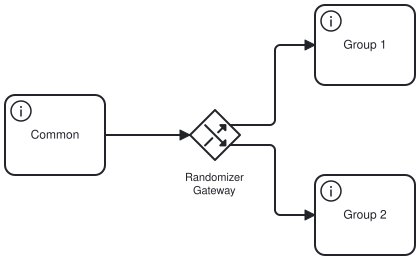

This page is a reference catalog. For deeper concept material, see [Why Studyflow](why-studyflow.qmd) and [Studyflow vs BPMN](studyflow-vs-bpmn.qmd). For worked examples that use these elements in context, see:

- [Cognitive tasks](../examples/cognitive-tasks.qmd) -- `CognitiveTask`, timer events, trial-level structure.
- [CONSORT](../examples/consort.qmd) -- boundary error events, dropout handling.
- [Data collection](../examples/data-collection.qmd) -- questionnaires, parallel gateways, consent.
- [Analysis pipelines](../examples/analysis.qmd) -- data operations, schemas, exclusive gateways.
- [MLOps](../examples/mlops.qmd) -- snapshots, monitoring sub-processes, boundary events.
- [Multi-agent collaboration](../examples/multi-agent.qmd) -- choreography.

The main element of a studyflow diagram is the *Study*, which serves as a container for all other elements:

::: {layout-ncol=1}

:::

Within a *Study* element, you can define various elements. In addition to the standard BPMN elements, Studyflow introduces specialized elements for research workflows in cognitive sciences in four main categories: *events*, *activities*, *gateways*, and *data*. Every element also carries the core `BaseElement` `documentation` (markdown, stored as BPMN's own documentation entries); a checklist is a `studyflow:checklist`-marked documentation entry, so its items stay visible in any BPMN tool.

## Schemas

Studyflow elements ship in a layered set of moddle schemas:

- **`studyflow`** (always loaded): `Study`, `StartEvent`, `EndEvent`, `SequenceFlow`, `Arguments`, plus the data-infrastructure types (`Dataset`, `DataCatalog`, `Schema`, `Table`, `Timeseries`, `EventMarker`, `Parameters`).
- **`functional`** (always loaded): the generic data verbs `Transform`, `Map`, `Reduce`, `Filter`.
- **`prov`** (always loaded): `Activity`, the provenance trail left by a run.
- **`cognitive`** (always loaded): cognitive and behavioral elements (`CognitiveTask`, `Rest`, `Questionnaire`, `Instruction`, `BehaverseTask`, `RandomGateway`, `EligibilityGateway`, `Actor`). `BehaverseTask` (formerly the separate `behaverse` schema) is a `CognitiveTask` whose `instrument` is pinned to `behaverse`, delivered by the Behaverse Unity build.
- **`agentic`**, **`ml`**, **`eeg`** (optional): domain extensions enabled from the modeler's schema palette.

See [Extensions](extensions.qmd) for the element catalogs of the optional extensions, and [Authoring schemas](authoring-schemas.qmd) for how to author your own schema.

## Events

::: {layout-ncol=2}

:::

## Activities

::: {layout-ncol=2}

 for the catalog. Provided by the always-loaded `cognitive` schema.](../assets/img/elements/behaverse_task.svg)

:::

In addition, the abstract `Arguments` trait augments any BPMN activity with the `additionalArguments` mapping. An activity's inputs and outputs are not listed anywhere: they are detected from the data associations drawn on the canvas (connect a data element to a task and it is an input; the association's `parameter`/`result` refine the binding). Whether a step is a *data operation* is derived the same way, not stored: it names a data verb (`operationType`) or runs software (`implementation`) without being a participant-facing instrument.

## Gateways

::: {layout-ncol=2}

:::

The `cognitive` schema adds one further gateway type, plus a preset over `RandomGateway` (no dedicated icons -- they render as exclusive gateways with distinguishing markers in the modeler):

- Stratified random assignment is a `RandomGateway` with `stratifyBy` set (e.g. `age_band`, `sex`, `baseline_score`): the cohort is partitioned by that variable and allocation runs independently within each stratum. Useful when the design requires balanced allocation across covariates; preset as the `Stratified allocation` palette template.
- **`EligibilityGateway`** -- encodes inclusion/exclusion criteria. Participants meeting `inclusionCriteria` (and none of `exclusionCriteria`) proceed; others are routed to a screen-out branch. Criteria are markdown lists.

For control-flow gateways, Studyflow also uses standard BPMN gateways (`ExclusiveGateway`, `ParallelGateway`, `InclusiveGateway`).

## Data

::: {layout-ncol=2}

![**Data Object** represents data flowing through the process (a file, message, or stream). State annotations (e.g. `[raw]`, `[processed]`) capture lifecycle.](../assets/img/elements/data_object.svg)
:::

The full data-element vocabulary (with definitions, attributes, and operations) lives in the dedicated [Data reference](data.qmd):

- **`DataCatalog`** -- persistent registry of datasets (e.g. `openneuro`, `behaverse`).
- **`Schema`** -- formal structure for a named collection of types (CSVW columns for tables; dimensions/types otherwise). Carries `format` and inline `body`.
- **`Table`** -- tabular data. Carries `format` (`csv`, `tsv`, `parquet`, `arrow`, `jsonl`), a `schema`, and `rowCount`.
- **`Timeseries`** -- continuous recording (EEG, eye-tracking, accelerometer). Carries `samplingRate`, `channelCount`, `units`, `recordingDuration`, `format`.
- **`EventMarker`** -- sparse time-stamped occurrences over a recording. Carries `eventType`, `eventOnset`, `eventOffset`, `eventCount`.

Persistent physical storage has no studyflow element: it is BPMN's own `DataStore`/`DataStoreReference`, named by `Dataset#storage`.

The current version of Studyflow includes built-in support for several data models commonly used in cognitive sciences:

::: {layout-ncol=2}
 data model](../assets/img/elements/bdm_events.svg)

 data model](../assets/img/elements/bdm_trials.svg)

](../assets/img/elements/bdm_models.svg)

](../assets/img/elements/bids.svg)

 dataset standard](../assets/img/elements/psych-ds.svg)

](../assets/img/elements/dataset.svg)
:::

## Element-to-schema mapping

Each visual element in the modeler maps to a type definition in one of the Studyflow moddle schemas under `assets/schemas/`:

- Event elements (`StartEvent`, `EndEvent`) live in `studyflow.moddle.yaml` and extend the corresponding BPMN event types.
- Activity elements (`Instruction`, `Questionnaire`, `CognitiveTask`, `Rest`) live in `cognitive.moddle.yaml` and map to `bpmn:Task` with domain attributes shown in the inspector.
- Gateway elements (`RandomGateway`, `EligibilityGateway`) live in `cognitive.moddle.yaml` and map to `bpmn:ExclusiveGateway`.
- Data elements (`Dataset`, `DataCatalog`, `Schema`, `Table`, `Timeseries`, `EventMarker`) live in `studyflow.moddle.yaml`; each maps onto a BPMN data reference.
