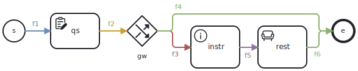

Studyflow is a domain-specific language for specifying scientific processes and their associated data. It extends the BPMN 2.1 standard to fit the specific needs of experimental sciences.

## Formal definition

A studyflow diagram is a $S = (N, E, T, \tau, \lambda)$ tuple, where $N$ is a finite set of elements, $E\subseteq N\times N$ represents sequence flows (edges), $T$ is a set of pre-defined node types (events, activities, gateways, data), $\tau: N \rightarrow T$ is a typing function that assigned types (events, activities, gateways, data) to the nodes, and $\lambda$ is a labeling function that assigns additional attributes to the nodes (e.g., metadata, triggers, gateway logic, implementation). The elements, $N$, are connected by directed edges, $E$, forming a directed graph that represents the flow of the study.

$N$ can be further divided into subsets based on the type of elements ($T$). For example, $N_{E} \subseteq N$ represents the set of events (e.g., start and end events), $N_{A} \subseteq N$ represents the set of activities (e.g., tasks, sub-processes), and $N_{G} \subseteq N$ represents the set of gateways (e.g., randomizer, decision points, parallel splits). $N_{D} \subseteq N$ represents data objects that can be used to store and manipulate data within the studyflow. Each subset has its own specific attributes and behaviors defined by the $\lambda$ function.

The main components of the $S$ tuple are described in the BPMN 2.1 specification, and studyflow extends them with additional types and attributes to better suit the needs of experimental studies. More specifically:

- $N_A$ (activities) is extended with specific activity types relevant to experimental studies, such as cognitive tests, questionnaires, instructions, rest periods, video games, and standardized Behaverse tasks. The abstract `DataOperationActivity` augments any BPMN activity with the data-operation marker and input/output variable lists.
- $N_G$ (gateways) is extended with a random gateway type (`RandomGateway`) for random assignment, a stratified variant (`StratifiedAllocationGateway`) that balances allocation across covariate strata, and an eligibility decision gateway (`EligibilityGateway`) that encodes inclusion/exclusion criteria.
- $N_D$ (data objects) can be used to represent data collected during the study, such as participant responses, physiological measurements, or other relevant data. It also supports standard data formats (e.g., BIDS, BDM, Psych-DS, Kedro) and the related infrastructure types: `DataCatalog`, `DataStorage`, `Dataset`, `Schema`, `Array`, and `Snapshot`.
- $\lambda$ (attributes) is extended to include attributes specific to experimental studies or data analysis, such as metadata (e.g., study name, version), event triggers (e.g., temporal, errors), gateway logic (e.g., randomization probabilities, conditional logics), and implementation details (e.g., links to external scripts or software). The studyflow `BaseElement` augments every element with `documentation` (markdown) and a `checklist`.
- $E$ (edges) can include group assignments, indicating which paths participants should follow based on their assigned group. `SequenceFlow` carries an optional `conditionExpression` for gated branches.
- $S$ can also include design patterns commonly used in experimental studies, such as counterbalancing, recruitment, exception handling, and data quality checks.


## Grammar

The grammar below defines the structure of a studyflow diagram using the EBNF notation (included for reference only).

<details>
<summary>**Studyflow EBNF grammar** (click to expand)</summary>

```ebnf

/* ========== Top level ========== */

Definitions       ::= Study*
Study             ::= 'Study' Identifier Attribute* (Element | SequenceFlow)*
SubProcess        ::= 'SubProcess' Identifier Attribute* (Element | SequenceFlow | DataAssociation)*
Element           ::= Event | Activity | Gateway | SubProcess
                    | DataObject | DataCatalog | DataStorage | Dataset
                    | Schema | Array | Snapshot

/* ========== Events ========== */

Event             ::= StartEvent | EndEvent
StartEvent        ::= 'StartEvent' Identifier Attribute*    /* may carry consentFormUri */
EndEvent          ::= 'EndEvent' Identifier Attribute*      /* may carry redirectTo, completionCodeType, completionCode */

/* ========== Activities ========== */

Activity              ::= 'Activity' Identifier ActivityAttributeList Choreography?
ActivityAttributeList ::= ActivityType ActivityAttribute*
ActivityType          ::= '@type' ('CognitiveTask' | 'Questionnaire' | 'Instruction' |
                                   'Rest' | 'VideoGame' | 'BehaverseTask' |
                                   'Script' | 'Manual')
ActivityAttribute     ::= Attribute | DataInput | DataOutput | DataOperation

/* ========== Data transformations ========== */

DataOperation      ::= OpClause+
OpClause           ::= '@op' (PrimitiveOp | CompositeOp) DataInput+ DataOutput+
PrimitiveOp        ::= 'Transform' | 'Map' | 'Filter' | 'FlatMap' | 'Reduce' | 'Group'
CompositeOp        ::= 'Compose' PrimitiveOp+

/* ========== Data elements ========== */

DataCatalog        ::= 'DataCatalog' Identifier Attribute*               /* url */
DataStorage        ::= 'DataStorage' Identifier Attribute*               /* persistent physical store */
Dataset            ::= 'Dataset' Identifier Attribute*                   /* catalog, storage, schema, format */
Schema             ::= 'Schema' Identifier Attribute*                    /* format, body */
Array              ::= 'Array' Identifier Attribute*                     /* dataset, schema */
Snapshot           ::= 'Snapshot' Identifier Attribute*                  /* source, version */
DataObject         ::= 'DataObject' Identifier Attribute*                /* may carry state */
DataInput          ::= '@in' NodeRef
DataOutput         ::= '@out' NodeRef

/* ========== Choreography ========== */

Choreography     ::= 'Choreography' Attribute* ParticipantRef+ InitiatingParticipant? MessageFlowList
ParticipantRef   ::= ProcessRef
InitiatingParticipant ::= ParticipantRef
MessageFlowList  ::= MessageFlow*
MessageFlow      ::= 'MessageFlow' Identifier Attribute* ParticipantRef '->' ParticipantRef

/* Gateway definitions */
Gateway          ::= 'Gateway' Identifier GatewayAttribute*
GatewayAttribute ::= GatewayType | Attribute
GatewayType      ::= '@type' ('Random' | 'StratifiedAllocation' | 'Eligibility' |
                              'Exclusive' | 'Parallel' | 'Inclusive' | 'Complex')
SequenceFlow     ::= 'SequenceFlow' Identifier Attribute* NodeRef '->' NodeRef
                                                            /* optional conditionExpression */

/* Common definitions */
Attribute             ::= Identifier Value
ProcessRef            ::= Identifier
NodeRef               ::= Identifier

/* Basic value types */
Boolean    ::= 'true' | 'false'
Value      ::= String | Number | Boolean | Identifier
Number     ::= '-'? ( [0-9]+ ('.' [0-9]*)? | '.' [0-9]+ )
String     ::= '"' [^"]* '"'
Identifier ::= [A-Za-z] [A-Za-z0-9_]*
```
</details>


An example studyflow in this formalism is shown below:

<details>
<summary>Example studyflow (click to expand)</summary>

```ini
Study exampleStudy

  StartEvent s
    consentFormUri "https://example.org/consent.pdf"

  Activity qs
    @type Questionnaire
    instrument phq-9

  Gateway gw
    @type Random
    algorithm probabilistic
    probabilityFunction uniform

  Activity instr
    @type Instruction
    content "Follow carefully"

  Activity rest
    @type Rest
    configurations "duration: 5"

  EndEvent e
    redirectTo "https://app.prolific.com/submissions/complete?cc={COMPLETION_CODE}"
    completionCodeType static
    completionCode "ABCD1234"

  SequenceFlow f1 s -> qs
  SequenceFlow f2 qs -> gw
  SequenceFlow f3 gw -> instr
  SequenceFlow f4 gw -> e
  SequenceFlow f5 instr -> rest
  SequenceFlow f6 rest -> e
```
</details>

Which can be visualized as an extended BPMN diagram:

:::{layout-ncol=1}



:::

This diagram can also be represented in machine-readable formats. Cognitive elements (`Questionnaire`, `Instruction`, `Rest`, `CognitiveTask`, `VideoGame`, `RandomGateway`, ...) live in the `cognitive` namespace; data infrastructure and the `Study`/`StartEvent`/`EndEvent` extensions stay in `studyflow`. Concrete cognitive activities are serialized as a standard `bpmn2:task` with the schema-specific extension element nested inside `extensionElements`:

<details>
<summary>**XML/BPMN** serialization (click to expand)</summary>

```xml
<?xml version="1.0" encoding="UTF-8"?>
<bpmn2:definitions
  xmlns:bpmn2="http://www.omg.org/spec/BPMN/20100524/MODEL"
  xmlns:studyflow="http://behaverse.org/schemas/studyflow"
  xmlns:cognitive="http://behaverse.org/schemas/studyflow/cognitive"
  id="example-diagram">
  <bpmn2:process id="exampleStudy" isExecutable="true">
    <bpmn2:extensionElements>
      <studyflow:study />
    </bpmn2:extensionElements>
    <bpmn2:startEvent id="s" name="s">
      <bpmn2:extensionElements>
        <studyflow:startEvent consentFormUri="https://example.org/consent.pdf" />
      </bpmn2:extensionElements>
      <bpmn2:outgoing>f1</bpmn2:outgoing>
    </bpmn2:startEvent>
    <bpmn2:task id="qs" name="qs">
      <bpmn2:extensionElements>
        <cognitive:questionnaire instrument="phq-9" />
      </bpmn2:extensionElements>
      <bpmn2:incoming>f1</bpmn2:incoming>
      <bpmn2:outgoing>f2</bpmn2:outgoing>
    </bpmn2:task>
    <bpmn2:sequenceFlow id="f1" sourceRef="s" targetRef="qs" />
    <bpmn2:exclusiveGateway id="gw" name="gw">
      <bpmn2:extensionElements>
        <cognitive:randomGateway algorithm="probabilistic" probabilityFunction="uniform" />
      </bpmn2:extensionElements>
      <bpmn2:incoming>f2</bpmn2:incoming>
      <bpmn2:outgoing>f3</bpmn2:outgoing>
      <bpmn2:outgoing>f4</bpmn2:outgoing>
    </bpmn2:exclusiveGateway>
    <bpmn2:sequenceFlow id="f2" sourceRef="qs" targetRef="gw" />
    <bpmn2:task id="instr" name="instr">
      <bpmn2:extensionElements>
        <cognitive:instruction content="Follow carefully" />
      </bpmn2:extensionElements>
      <bpmn2:incoming>f3</bpmn2:incoming>
      <bpmn2:outgoing>f5</bpmn2:outgoing>
    </bpmn2:task>
    <bpmn2:sequenceFlow id="f3" sourceRef="gw" targetRef="instr" />
    <bpmn2:task id="rest" name="rest">
      <bpmn2:extensionElements>
        <cognitive:rest>duration: 5</cognitive:rest>
      </bpmn2:extensionElements>
      <bpmn2:incoming>f5</bpmn2:incoming>
      <bpmn2:outgoing>f6</bpmn2:outgoing>
    </bpmn2:task>
    <bpmn2:sequenceFlow id="f5" sourceRef="instr" targetRef="rest" />
    <bpmn2:endEvent id="e" name="e">
      <bpmn2:extensionElements>
        <studyflow:endEvent
          redirectTo="https://app.prolific.com/submissions/complete?cc={COMPLETION_CODE}"
          completionCodeType="static"
          completionCode="ABCD1234" />
      </bpmn2:extensionElements>
      <bpmn2:incoming>f6</bpmn2:incoming>
      <bpmn2:incoming>f4</bpmn2:incoming>
    </bpmn2:endEvent>
    <bpmn2:sequenceFlow id="f6" sourceRef="rest" targetRef="e" />
    <bpmn2:sequenceFlow id="f4" sourceRef="gw" targetRef="e" />
  </bpmn2:process>
</bpmn2:definitions>
```

</details>


<details>
<summary>**YAML** serialization (click to expand)</summary>

```yaml
study:
  '@id': exampleStudy
  isExecutable: true
  elements:
    - '@type': bpmn2:StartEvent
      '@id': s
      consentFormUri: https://example.org/consent.pdf
      outgoing: [f1]
    - '@type': cognitive:Questionnaire
      '@id': qs
      instrument: phq-9
      incoming: [f1]
      outgoing: [f2]
    - '@type': cognitive:RandomGateway
      '@id': gw
      algorithm: probabilistic
      probabilityFunction: uniform
      incoming: [f2]
      outgoing: [f3, f4]
    - '@type': cognitive:Instruction
      '@id': instr
      content: Follow carefully
      incoming: [f3]
      outgoing: [f5]
    - '@type': cognitive:Rest
      '@id': rest
      configurations: "duration: 5"
      incoming: [f5]
      outgoing: [f6]
    - '@type': bpmn2:EndEvent
      '@id': e
      redirectTo: "https://app.prolific.com/submissions/complete?cc={COMPLETION_CODE}"
      completionCodeType: static
      completionCode: ABCD1234
      incoming: [f4, f6]
```
</details>
