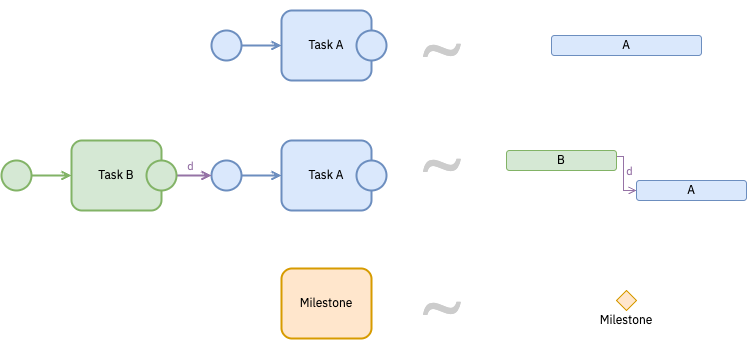
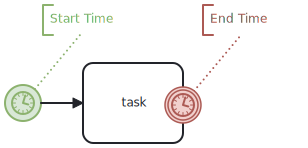

The same `.studyflow` file can be rendered in several ways depending on the stakeholder's needs. Studyflow defines three primary views over the underlying diagram.

## Study view

The default rendering: a BPMN-like graph showing every element and connection. This is what the modeler displays and what most readers see in a paper.

The Study view is **structural**. It shows what happens and in what order, but does not commit to when each activity runs in wall-clock time. It is the canonical view for:

- Methods sections that need to describe procedure.
- Reviewers checking the logical structure of a study.
- Pipeline authors wiring up data flow.

## Timeline view

A Gantt-like rendering that places time-sensitive elements along a temporal axis. Useful for studies where the *timing* of activities matters as much as their order: longitudinal studies, trial timelines, SPIRIT-style schedules of enrolment and assessment.

Experimental research often involves activities with durations, deadlines, and dependencies in wall-clock time. BPMN already supports timer events and triggers but has no native way to represent duration, start/end times, or progress on a regular activity. Studyflow extends BPMN elements with optional temporal attributes:

- **Start/end time** — when an activity is scheduled to begin and end.
- **Duration** — the time allocated for an activity (or the difference between start and end).
- **Progress** — completion status, as a percentage or label.
- **Resource allocation** — personnel, equipment, or budget assigned to the activity, expressed as lanes or pools in BPMN.

When these attributes are present, the Timeline view can render the diagram as a Gantt chart automatically. Trial-level timing (stimulus duration, ITI, response window) and study-level timing (visit schedule, follow-ups) use the same mechanism at different zoom levels.

## Checklist view

A task-oriented view that flattens the diagram into a list of activities with their associated checklist items and status. Useful for:

- Running studies day-to-day (what's next, what's done).
- Adhering to reporting guidelines (CONSORT, SPIRIT, STROBE) — the checklist view maps elements to the items the guideline requires. See [Reporting guidelines](../examples/reporting-guidelines.qmd).
- Generating supplementary materials and protocol annexes.

## Choosing a view

| If you need to communicate… | Use |
|---|---|
| Procedural structure, branching, data flow | Study view |
| Wall-clock timing, schedules, durations | Timeline view |
| Coverage against a reporting checklist or protocol | Checklist view |

The three views read the same source file, so changes in one are reflected in the others.
