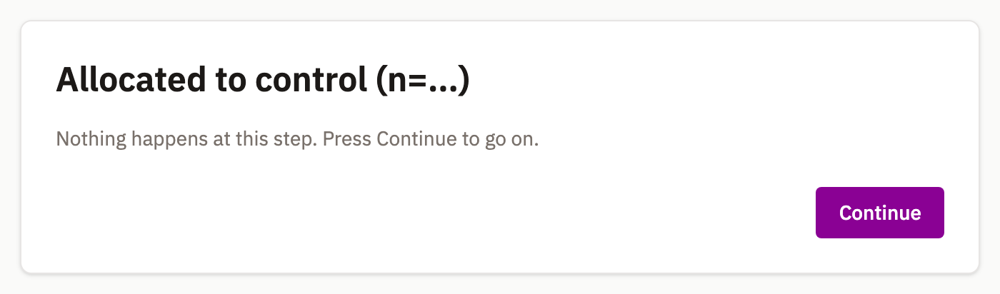

{#fig-consent fig-alt="A runner screen headed Enrollment with the subtitle Informed consent, a scrollable consent form describing voluntary participation and data handling, and Decline and I consent buttons."}

The browser runner takes one participant through one study, a screen at a time, from `run/` beside the modeler. Nothing to install.

## Open it

| Way in | What you do | The address it opens |
|---|---|---|
| From the modeler | Press *Run* in the toolbar, or `4` in the command palette | `run/?diagram=8f3c1a92&seed=42` |
| From a URL | Point `diagram` at a hosted file | `run/?diagram=/assets/my-study.studyflow.yaml&seed=42` |
| From a shipped demo | Name a demo that ships with the app | `run/?diagram=behaverse&task=BCS&timeline=XCIT_BCS_02` |
| From a file on your machine | Open `run/` with no `diagram` and choose a file -- every type the modeler writes | `run/` |

: Four ways in. {#tbl-ways-in}

::: {.callout-warning}
## A hand-off link is not a recruitment link

*Run* stashes the study in this browser and opens a new tab. That copy is deleted when the run ends, and expires after an hour — so the link works once, in that browser only.

To reach a participant, [publish](share.qmd#publish-to-the-behaverse-data-server) the study and point `diagram` at its address.
:::

## Give each participant their own link

| In the link | What it does |
|---|---|
| `diagram` | which study to run: a shipped demo's name, an address to fetch, or a hand-off from the modeler |
| `seed` | the run's root seed, overriding the one pinned in the file |
| anything else | a parameter of the study itself -- `task`, `timeline`, any name the study declares -- replacing the value the file carries |

: One parameter names the study; every other value in the link is a parameter of it. {#tbl-parameters}

```
run/?diagram=behaverse&task=BCS&timeline=XCIT_BCS_02
run/?diagram=behaverse&task=NB&timeline=XCIT_NB_01&seed=42
```

*Run* always attaches `seed=42`, so everyone opening that link lands in the same arm: give each participant their own seed and keep the record. A link that leaves a value unbound stops the session and names what is missing. [Execution](execution.qmd#seeds-what-replays-and-what-does-not) says what a seed fixes; [Randomize and counterbalance](../design/randomization.qmd) covers allocation.

## What a participant sees

Each screen fills the window; the corner *Logs* button is the only chrome. Which elements get a screen at all is one table in [Execution](execution.qmd#what-each-program-actually-runs).

{#fig-instruction fig-alt="A card headed Welcome showing instruction text describing two questionnaires, a one-back warm-up and one randomly assigned N-back arm lasting about fifteen minutes, above a Continue button."}

{#fig-questionnaire fig-alt="The PHQ-9 rendered as nine numbered prompts, each with four response buttons from Not at all to Nearly every day, and a Submit button at the bottom right."}

{#fig-questionnaire-freetext fig-alt="A card headed Screening assessment with the line Please respond in your own words, a text box holding a typed answer, and a Continue button."}

{#fig-generic-task fig-alt="A card headed Allocated to control with the line Nothing happens at this step. Press Continue to go on, and a Continue button."}

| Screen | Worth knowing before you draw it |
|---|---|
| `cognitive:Instruction` | Shows `content` as written, verbatim: a `#` or `**` reaches the participant literally. |
| `cognitive:Questionnaire` | Renders the item set named by `instrument`. `phq-9`, `gad-7`, and `bdi-ii` (a short form) ship built in, and answers are written into the session's state under the instrument's name, so a later gate can route on the score. Any other name gets a free-text box. |
| Plain task, `CognitiveTask`, `Rest` | Its name and a *Continue* button. A task naming an `implementation` shows the call it names; the Python runner executes those, as [Data in and out](../design/data.qmd) describes. |
| `cognitive:BehaverseTask` | Runs the Behaverse assessment named by `behaverseScene` inside the page. The same step can be played by a model instead -- see [Models as participants](../design/agents.qmd). |

: What each screen does beyond showing the step. {#tbl-screens}

## Consent and completion

{#fig-completion fig-alt="A card headed Study complete showing a completion code in a highlighted box, a five-second countdown to a Prolific submission URL, and a Go back now button."}

| Attribute | On | What it does |
|---|---|---|
| `consentFormUri` | start event | Fetches that document and shows it as the consent screen; declining stops the session immediately. Must be an `https://` address or a path starting with `/`. Unset, the first screen is the study's name and a *Begin* button. |
| `completionCodeType` | end event | `none` issues no code; `static` hands out the fixed `completionCode`; `dynamic` reuses the code the recruitment link carried -- read from `cc`, `completion_code`, `COMPLETION_CODE`, or `PROLIFIC_PID` -- or generates an eight-character one. |
| `completionCode` | end event | The code itself, when the type is `static`. |
| `redirectTo` | end event | Where the participant lands. `{COMPLETION_CODE}` in the address is replaced with the issued code, after a five-second countdown. |

: What the participant is given at the end, and where they go next. {#tbl-completion}

Both events are optional: the study then starts at the one step nothing flows into, and ends when nothing flows out.

## What a session leaves behind

Recording is **off by default**: open *Logs* and tick *Record events*, and the choice holds for every later session in this browser.

| When | What goes to the Behaverse data server |
|---|---|
| Start of the run | a session, identified by the `Study` element's id and authorized with the API key from the modeler's *Settings* |
| During the run | events from a Behaverse task, in batches, each carrying the study id, the session id, and a fingerprint of the exact study that produced it |
| End of the run | the final status, the session's variables -- questionnaire responses among them -- and the completion code |

: With *Record events* ticked. {#tbl-recording}

A log line early in the run says whether recording is on.

## When something looks wrong

*Logs* shows the study's name, the session's phase, the seed in force, and every check and per-step message.

| Phase | What it means |
|---|---|
| `invalid` | The check before the run found something that would break the session. It refuses to start, and lists each problem beside its step. |
| `error` | The study never loaded at all. |

Warnings are reported and the session continues.
