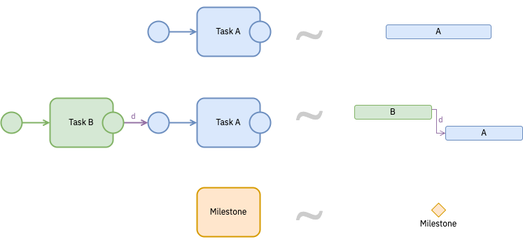

A **view** shows the parts of the study file that answer one question and hides the rest. There are four.

| Who is reading | What they need to see | The view |
|---|---|---|
| A colleague, a reviewer, a replicator | what happens, in what order, where the path splits | **Study view** — the diagram itself |
| A protocol reviewer, an ethics board, a trial manager | visits and blocks on a calendar, with durations and progress | **Timeline view** |
| An auditor working through CONSORT, SPIRIT, or STROBE | which reporting item each step covers, and what is still open | **Checklist view** |
| Anyone asking what actually happened | which steps ran, when, by whom, with which seed | **Provenance view** |

The Study view is the canvas you author on. The other three open from the command palette: *View as Gantt…*, *View as Checklist…*, *View Provenance…*.

Each view filters: it drops the elements that do not answer its question and shows whatever remains exactly as the file holds it. A view can be incomplete, but it cannot be wrong — a step missing from the Timeline view is a step carrying no `onset` or `duration`.

## Timeline view

{#fig-timeline-view fig-alt="A Gantt View dialog. Rows grouped under Enrolment, Post-allocation, and Close-out headings; each row is a labelled bar placed along a shared horizontal time axis, and some bars are part-filled to show progress." .fig-l}

For a longitudinal design or a SPIRIT schedule the question is *when*. Any element carrying one of three optional attributes becomes a row here.

| Attribute | What it says |
|---|---|
| `onset` | when this starts |
| `duration` | how long it lasts |
| `progress` | how far along it is |

{#fig-timeline-patterns fig-alt="Three pairs, each joined by a tilde. A task after a start event equals one bar. A task followed after a delay d by a second task equals two bars, the second offset by d. A milestone activity equals a diamond marker on the schedule."}

[Elements](../reference/elements.qmd#when-each-step-happens) gives the values each attribute accepts.

## Checklist view

{#fig-checklist-view fig-alt="A Checklist View dialog reading zero of 52 items complete, with cards for Screening visit, Baseline visit, Intervention, and Control, each listing unchecked SPIRIT reporting items." .fig-l}

One card per step, listing the reporting items that step covers, ticked where the file marks them done, with a running count at the top. Items attach *to* the steps rather than to a separate list, so coverage follows a step when you move it ([Reporting checklists](../design/protocols.qmd#reporting-checklists)).

## Provenance view

{#fig-provenance-view fig-alt="A dialog titled Provenance View listing 55 entries across 3 runs and 1 repository. Rows read created, executed, imported, and invalidated, each with an element name, an actor, a tool, a run name, and a timestamp; two rows are highlighted and one struck through." .fig-l}

A studyflow file holds two things. The **plan** is the diagram, stating what should happen. The **record** is a growing list of entries stating what did. Every edit or run appends one; nothing is overwritten or removed.

### What one entry says

| Attribute | What it holds |
|---|---|
| `action` | what happened, in one word |
| `when` | an ISO 8601 timestamp, to the second — ties break by order in the list, not by chance |
| `who` | who acted: a name, an email, or an ORCID |
| `with` | the tool that acted, as `name/version` (`studyflow-modeler/26.0731`) |
| `what` | what the action touched: element ids, or — for `invalidated` and `reused` — the `when` of the entry it refers to |
| `run` | for `executed`, the run id: the name of the run's own directory |
| `seed` | for `executed`, the root seed the run used |

An eighth attribute, `note`, holds one line of free text.

| Action | What it records |
|---|---|
| `created`, `modified` | the file was authored, or edited and exported again |
| `imported` | a data element's artifact was staged into the run from outside |
| `executed` | the document ran, or one element did |
| `invalidated` | a marker voiding a named `executed` record |
| `reused` | a step was skipped and an earlier record trusted instead |

This vocabulary is a recommendation, not a closed list. An action of your own — `reviewed`, say — is kept and displayed like any other.

### Where the record lives

| Place | What it holds |
|---|---|
| The document trail | one line per event in the file's life, stored on the study itself |
| Per-element records | each visited element's own `executed` / `created` / `imported` / `reused` entry, stamped on the archived copy |
| The run's version history | for a Python-runner run: one entry per checkpoint, plus that step's detail — durations, the values in and out, and the error if there was one |

A **checkpoint** is a step finishing, a gateway deciding, or the run opening or closing.

The modeler stamps `created` on a fresh diagram's first export and `modified` on later ones, once per batch of edits rather than once per download; it never writes `executed`. The Python runner stamps `executed` on the copy it archives, never on the file you pointed it at.

### Re-running part of an analysis

A step is skipped when three things hold: its record still stands, nothing it reads was re-made during this run, and its outputs are still on disk. The skip leaves a `reused` line naming the record it trusted.

| What you do | What happens |
|---|---|
| Delete the output file | the run records it as `changed outside a run`, and the step that produced it re-runs **in place**, on the same line of history |
| Click ✕ in the Provenance view, or pass `--from` to the runner | a **new branch** opens just before that step first ran, so both histories survive |

Invalidation cascades: anything that reads a re-made output re-runs too. Passing `--fresh` ignores every record and re-runs the whole flow in the same run directory. Nothing is ever deleted — the ✕ appends a marker naming the record it voids, and the voided record stays in the list, struck through.

::: {.callout-important}
Per-step detail — durations, the values in and out, error detail — is written to the run's git repository, so `git` on the machine is what records it. The outputs, log, stamped plan, document trail, and per-element records are written either way.
:::

::: {.callout-note collapse="true"}
## Under the hood

A run's outputs live in a directory that is also a git repository, with one commit per checkpoint. Ordinary git tools therefore work on a run:

```bash
$ git -C runs/sklearn-demo log --graph --oneline --all
* fbc8eca (HEAD -> run/20260814T111022Z) finished sklearn_pipeline (ok)
* 3ed6b27 executed evaluate_and_report
* 43e3899 skipped select_features (run sklearn-demo)
* 93ea94b started sklearn_pipeline (20260814T111022Z)
| * 5ac22bc (run/20260814T105349Z) finished sklearn_pipeline (ok)
| * 3f34d62 executed plot_confusion
| * d14f30a skipped write_test_report (run sklearn-demo)
|/
* 611bc4e executed score_test
```
:::
