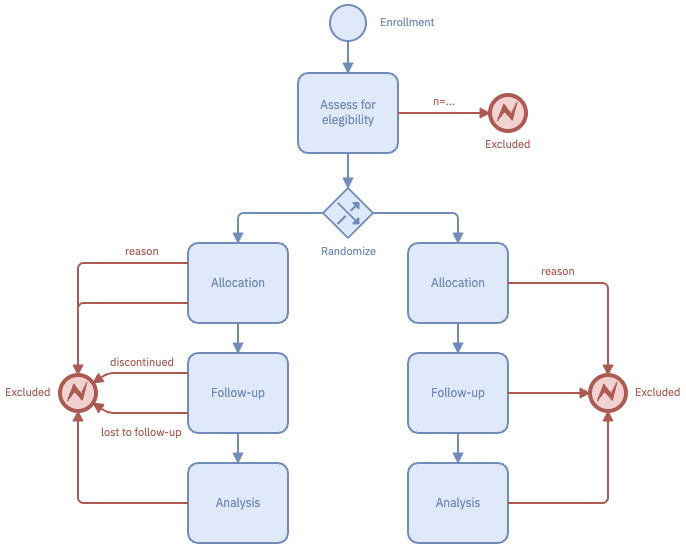

{#fig-self-contained fig-alt="A studyflow diagram of a two-arm trial. Enrollment leads to an eligibility assessment, which sends some participants to an Excluded end event. The rest reach a diamond gateway labelled Randomize whose two outgoing flows each run Allocation, then Follow-up, then Analysis, with side flows to Excluded for participants who discontinue or are lost to follow-up."}

## Choose what to hand someone

| Export | File |
|---|---|
| Studyflow (YAML) | `.studyflow.yaml` |
| BPMN 2.0 XML | `.bpmn` |
| SVG | `.studyflow.svg` |
| PNG | `.studyflow.png` |

: The four exports that carry the whole study; [File format](../reference/file-format.qmd#everything-the-modeler-reads-and-writes) has the rest. {#tbl-formats}

- **A collaborator or a reviewer.** Send the `.studyflow.png`: a figure anywhere, an editable study in the modeler.
- **A manuscript.** Export SVG: it scales at any size and still carries the study, so the figure you deposit *is* the runnable study. A reader who reopens it sees every parameter as you set it, plus who exported it and when ([Views and the record](provenance.qmd#which-tool-writes-what)).
- **A run or a pipeline.** Reference the file by path or URL; the [browser runner](participants.qmd) takes a study from an address in the run link.

An exported image also opens in draw.io, one way only ([File format](../reference/file-format.qmd#images-that-carry-the-study)).

::: {.callout-tip}
## Deposit the file the modeler wrote

Not a re-rendered copy. A figure that has passed through a screenshot tool or a vector editor keeps the picture and loses the study inside it.
:::

A paper usually needs a methods figure, a protocol schedule, and a checklist against a reporting guideline. All three come off this one file as [views](provenance.qmd) — so they cannot disagree with each other.

## Know what the app keeps {#what-the-app-keeps}

{#fig-export fig-alt="The modeler's Export dialog, showing a Format dropdown set to Studyflow (.studyflow.yaml), the filename Minimal study.studyflow.yaml, and an Export button."}

The modeler writes nothing to disk on its own. *Auto-save* keeps a single copy in this browser's storage, and the next study you open replaces it. Open the modeler in a different browser, or clear your site data, and that copy is gone.

::: {.callout-warning appearance="simple"}
## Exporting is what keeps a study
Auto-save is a crash guard. Export the file.
:::

```
project/
├── studyflow/
│   ├── study.studyflow.yaml   # the source; this is what you diff
│   ├── study.studyflow.png    # the same study as a figure
│   └── README.md              # two or three lines on what the study is
├── data/
└── analysis/
```

The `.studyflow.yaml` diffs line by line. When you duplicate an element, rename its id to something pronounceable — later diffs then name what changed instead of showing `Task_1a2b3c`. Commit the `.studyflow.png` beside it to get a rendered picture of each change.

`studyflow:version` is a free-text label on the `Study` element. Your history is git, plus the record each export appends ([Views and the record](provenance.qmd)).

## Publish to the Behaverse Data Server

{#fig-publish fig-alt="The modeler's Publish dialog with a Study name field containing minimal-study, a note that only lower-case letters, numbers and hyphens are allowed, an empty Behaverse API key field, and a Publish button."}

Publishing hosts the study at an address a participant can open.

Sign in with *Login with Google* under *Settings &rarr; Account*, which stores an API key in this browser; there is no anonymous publish. *Publish* makes one request, and the address that comes back becomes a *Preview* link.

Run the study yourself before publishing, and keep your own record of which name holds which study. A name is a slot: publishing again under the same name replaces what is there. Only the study travels, so host stimulus images, audio, and scripts yourself and reference them by URL.

| What happened | What the dialog says |
|---|---|
| The key was rejected | The API key was rejected. Sign in again from Settings &gt; Account, then retry. |
| Anything else the server refused | Publishing failed (HTTP *status*). Check the study name and your connection, then retry. |

: Every publish error; anything else surfaces as the browser's own network error. {#tbl-publish-errors}
